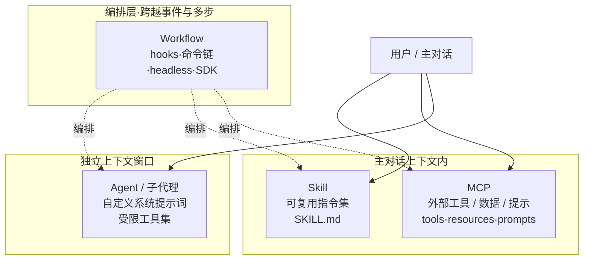
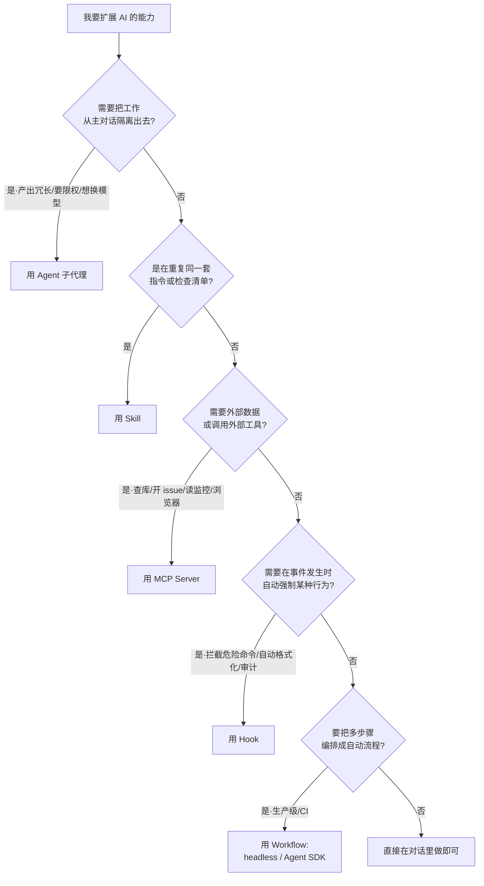

# Agent / Skill / MCP / Workflow Guide

理清 AI 编码工具里 Agent、Skill、MCP、Workflow 四个概念的区别与适用场景，对比 Claude Code、OpenAI Codex、GitHub Copilot 的实现方式，并给出可照做的开发步骤。

> 知识截止 **2026-06-18**。本文事实均来自官方文档实际核查（来源见文末「参考资料」）。无法从官方页核实的点已显式标注「**未核实**」，不臆造。

---

## 一、概念总览

先用一句话区分这四个概念——它们解决的是**完全不同**层次的问题：

| 概念 | 一句话定义 | 它回答的问题 |
|------|-----------|-------------|
| **Agent（子代理）** | 在**独立上下文窗口**里、用自定义系统提示词和受限工具集执行某类任务的 AI 助手 | "把这类活儿交给一个专门的、隔离的小号去干" |
| **Skill（技能）** | 一份可复用的指令集（`SKILL.md`），在**主对话内联**加载，告诉 AI"做某件事时该怎么做" | "把我反复粘贴的提示词/清单/流程固化下来" |
| **MCP（模型上下文协议）** | 一个**开放标准**，让 AI 应用以统一方式连接外部工具、数据源和提示模板 | "让 AI 能查数据库、开 issue、读监控、调外部 API" |
| **Workflow（工作流编排）** | 把上述能力按多步骤、带判断地**串起来**自动执行（hooks / 命令链 / SDK） | "让一连串步骤自动跑完，而不是每步都手动驱动" |

最关键的一条分界线是**上下文模型**：Agent 把工作**隔离**到独立窗口（产出不污染主对话），而 Skill 和 MCP 都在**主对话内**展开。下图按这条线把四者归位：



---

## 二、四者区别详解

### 2.1 Agent（子代理）

- **是什么**：一个跑在**独立上下文窗口**里的专门助手。它有自己的系统提示词、可被限制只用某些工具、可指定不同模型。适合"产出冗长、之后不会再引用"的副任务（搜索结果、日志、大段文件内容），避免污染主对话。
- **上下文模型**：**隔离**。子代理看不到主对话历史、看不到你已加载的 Skill、看不到主会话已读过的文件——它只收到一段任务委派说明。完成后把**结论**返回主对话。
- **如何定义（Claude Code）**：`.claude/agents/<name>.md`，YAML frontmatter + Markdown 正文（正文即该代理的系统提示词）。
- **如何触发**：自动委派（任务匹配 `description`）、`@name` 显式点名、或 `claude --agent <name>` 整会话指定。

### 2.2 Skill（技能）

- **是什么**：一份 Markdown 指令集（`SKILL.md`），把"做某件事的标准步骤/检查清单/参考资料"固化下来。它遵循开放标准 [agentskills.io](https://agentskills.io)，多家工具通用。
- **上下文模型**：**内联**到主对话。一旦被调用，其内容会留在上下文里、跨轮次消耗 token。
- **渐进式披露（progressive disclosure）**：只有 Skill 的 `description` 常驻上下文（让 AI 知道有哪些 Skill 可用）；完整正文仅在被调用时才加载；附带的参考文件按需再读。这样长文档在用到之前几乎不占成本。
- **如何触发**：手动 `/skill-name`，或 AI 根据 `description` 自动加载。

### 2.3 MCP（Model Context Protocol）

- **是什么**：Anthropic 于 **2024 年底**开源的协议标准，被官方比喻为"AI 应用的 USB-C 接口"。它不属于某一家工具，而是让任意 AI 客户端用统一方式接外部系统。
- **提供三类能力**：
  - **Tools（工具）**：AI 可调用的函数（查数据库、建 PR、读监控等）。
  - **Resources（资源）**：AI 可引用的数据（文件、配置、文档），通常通过 `@` 引用。
  - **Prompts（提示模板）**：服务端定义的提示模板，在客户端表现为命令。
- **上下文模型**：能力在主对话内按需调用；工具通常按需发现、延迟加载。
- **传输方式**：本地进程用 `stdio`；远程服务用 HTTP（streamable HTTP，推荐）；另有已弃用的 `sse` 与部分客户端支持的 `ws`。

### 2.4 Workflow（工作流编排）

截至 2026-06，**没有一个叫"Workflow"的正式原语**。"工作流"是用下列机制**组合**出来的：

- **Hooks（钩子）**：在生命周期事件（如 `PreToolUse`、`PostToolUse`、`SessionStart`、`Stop`）上触发脚本/HTTP/提示，可拦截或改写行为——常用于强制安全规则、自动格式化、注入上下文、审计。
- **Slash command / Skill 链**：把显式步骤写进 Skill，由用户或 AI 按序执行。
- **Subagent 链**：让多个子代理串行或并行协作，由主代理汇总。
- **Headless 模式**：`claude -p "..."` 非交互运行，嵌进脚本 / CI / 构建流水线，可要求结构化输出。
- **Agent SDK**：Python / TypeScript 包，用于生产级多轮代理、会话管理、工具审批回调、结构化输出。

### 汇总对比

| 维度 | Agent | Skill | MCP | Workflow |
|------|-------|-------|-----|----------|
| 解决什么 | 隔离一类任务 | 复用指令/流程 | 连接外部工具与数据 | 多步骤自动编排 |
| 何时用 | 产出冗长、需限权或换模型 | 重复的提示词/清单 | 需查库、开 issue、调 API | 复杂序列、CI/CD 集成 |
| 上下文 | **独立窗口（隔离）** | 主对话内联 | 主对话内联 | 视实现而定 |
| 系统提示词 | 每个代理自定义 | 不是系统提示词，调用时加载正文 | 服务端提供说明 | 每个工作流自定义 |
| 主要载体 | `.claude/agents/*.md` | `SKILL.md` | `.mcp.json` / `config.toml` | hooks / SDK / 命令链 |

---

## 三、如何选型（决策指南）

按"你到底想干什么"顺着下面这棵树走：



一句话口诀：**隔离任务找 Agent，复用指令找 Skill，接外部找 MCP，管事件找 Hook，串流程找 Workflow/SDK。**

---

## 四、三家实现方式对比（截至 2026-06）

下表把同一概念在三家工具里的落地方式并排放。所有路径与字段均来自官方文档原文。

| 机制 | Claude Code | OpenAI Codex | GitHub Copilot |
|------|-------------|--------------|----------------|
| **项目约定文件** | `CLAUDE.md`（项目根/全局） | `AGENTS.md`（就近覆盖，全局 `~/.codex/AGENTS.md`，无 frontmatter） | `.github/copilot-instructions.md`（仓库级）；也兼容 `AGENTS.md` / `CLAUDE.md` / `GEMINI.md` |
| **路径级指令** | 由 Skill 的 `paths` 字段实现 | `AGENTS.md` 按目录就近生效 | `.github/instructions/NAME.instructions.md`，frontmatter `applyTo`（glob，必填）、`excludeAgent`（可选） |
| **Skill / 可复用指令** | `.claude/skills/<name>/SKILL.md`，遵循 agentskills.io，渐进式披露，`/skill-name` 调用 | `SKILL.md`（必含 `name`+`description`），放 `.agents/skills` 等多级 scope，`$skill` 或 `/skills` 调用；`agents/openai.yaml` 控制隐式调用 | "Agent skills"（官方列为特性）；prompt files `.github/prompts/*.prompt.md`，frontmatter `description`/`name`/`agent`/`model`/`tools`，`/name` 调用 |
| **Agent / 子代理** | `.claude/agents/<name>.md`，独立上下文窗口 | 有 Subagents 概念，**文件格式官方页未取到（未核实）** | "Custom agents"、agent mode、autonomous coding agent（官方列为特性） |
| **MCP 支持** | `.mcp.json` 或 `claude mcp add`；transport：`http`/`sse`(弃用)/`stdio`/`ws` | `~/.codex/config.toml` 的 `[mcp_servers.<name>]`，或 `codex mcp add`；transport：`stdio`、streamable HTTP | 官方支持配置 MCP servers（VS Code / 各客户端） |
| **工作流编排** | hooks + slash command + subagent 链 + headless(`claude -p`) + Agent SDK | config / hooks / 自定义命令 / Agents SDK / GitHub Action / 非交互模式 | agent mode、coding agent、Actions 集成 |

**三家共同点**：

1. 都支持 **MCP**——这是 Anthropic 2024 年底开源、如今被 Claude、ChatGPT/Codex、VS Code、Cursor 等广泛采用的开放标准。
2. 都采用 **`AGENTS.md` 或等价的项目约定文件**承载工程规范（Copilot、Codex 直接用 `AGENTS.md`，Claude Code 用 `CLAUDE.md` 且 Copilot 兼容读取）。
3. 都走 **"渐进式披露 / 按需加载"**：描述常驻、完整内容用到才加载，以节省上下文。

---

## 五、实操：照步骤开发 Skill / Agent / MCP

以下以 **Claude Code** 为主线（其官方事实最完整、可逐字核对），关键处标注 Codex / Copilot 差异。

### 5.1 开发一个 Skill

**第 1 步**：建目录（项目级放 `.claude/skills/`，用户级放 `~/.claude/skills/`）。

```bash
mkdir -p .claude/skills/release-notes
```

**第 2 步**：写 `SKILL.md`——frontmatter 至少给 `description`（AI 据此判断何时加载），正文写步骤。

```yaml
---
name: release-notes
description: 根据两个 git tag 之间的提交生成发布说明。当用户要写 changelog / release notes 时使用。
argument-hint: [from-tag] [to-tag]
allowed-tools: Bash(git *)
---

## 步骤

1. 取出区间提交：`git log $1..$2 --pretty=format:'- %s (%h)'`
2. 按 feat / fix / docs / chore 分类归并
3. 输出 Markdown，按"新特性 / 修复 / 其他"三段组织
4. 标注版本号 $2 与日期
```

> Codex 差异：同样用 `SKILL.md`、同样必含 `name`+`description`，但目录是 `.agents/skills`（仓库级）或 `~/.agents/skills`（用户级），用 `$skill` / `/skills` 调用，可在 `agents/openai.yaml` 里设 `allow_implicit_invocation: false` 关闭隐式调用。

**第 3 步**：可选地放参考文件（`reference.md`、`scripts/`、`examples/`），并在 `SKILL.md` 里引用它们，供按需加载。

**第 4 步**：触发——`/release-notes v1.0.0 v1.1.0`，或让 AI 在匹配 `description` 时自动加载。

**验证**：在对话里输入 `/` 能看到该 Skill；带参数调用后产出符合正文步骤。

### 5.2 开发一个 Subagent（Claude Code）

**第 1 步**：建文件 `.claude/agents/code-reviewer.md`（项目级）或 `~/.claude/agents/`（用户级）。

**第 2 步**：写 frontmatter——`name` 与 `description` 必填，`tools` 限权、`model` 选模型；正文即系统提示词。

```yaml
---
name: code-reviewer
description: 资深代码审查员。在代码改动后主动调用，检查安全与质量问题。
tools: Read, Glob, Grep, Bash
model: sonnet
---

你是一名资深代码审查员，负责把控质量与安全。

被调用时：
1. 用 git diff 查看最近改动
2. 分析被修改的文件
3. 检查安全隐患、性能问题与最佳实践
4. 按"严重 / 警告 / 建议"分级输出，给出可执行的修复建议
```

> 字段说明：`tools` 省略则继承全部工具；`model` 可填 `sonnet`/`opus`/`haiku`/`fable` 或 `inherit`。Claude Code 还支持 `skills`、`mcpServers`、`hooks`、`memory`、`isolation` 等扩展字段，按需再加，不必一开始堆满。

**第 3 步**：触发——`@code-reviewer` 显式点名，或让主代理在任务匹配 `description` 时自动委派。

**验证**：调用后它在**独立上下文**中工作（看不到主对话历史），只把审查结论返回主对话。

> Codex：有 Subagents 概念，但其独立 agent 文件的确切格式官方页本次未取到（**未核实**）；Copilot 对应的是 "custom agents" 与 agent mode。

### 5.3 开发一个 MCP Server

**第 1 步**：选传输方式——本地工具用 `stdio`（由命令启动的本地进程）；远程服务用 HTTP（streamable HTTP，推荐）。

**第 2 步**：用官方 SDK 实现服务端，暴露 **tools / resources / prompts**。MCP 官方提供多语言 SDK（Python、TypeScript 等），核心是注册工具并处理调用。

**第 3 步**：在 Claude Code 注册——命令行或写配置文件二选一。

```bash
# 远程 HTTP 服务
claude mcp add --transport http github https://api.githubcopilot.com/mcp/

# 本地 stdio 服务
claude mcp add playwright -- npx -y @playwright/mcp@latest
```

或写进项目根 `.mcp.json`（可随仓库共享）：

```json
{
  "mcpServers": {
    "playwright": {
      "type": "stdio",
      "command": "npx",
      "args": ["-y", "@playwright/mcp@latest"]
    },
    "github": {
      "type": "http",
      "url": "https://api.githubcopilot.com/mcp/",
      "headers": { "Authorization": "Bearer ${GITHUB_PAT}" }
    }
  }
}
```

> Codex 差异：写在 `~/.codex/config.toml`，用 TOML 表语法；也可 `codex mcp add`：
>
> ```toml
> [mcp_servers.context7]
> command = "npx"
> args = ["-y", "@upstash/context7-mcp"]
> ```
>
> ```bash
> codex mcp add context7 -- npx -y @upstash/context7-mcp
> ```

**第 4 步**：校验连接——在 Claude Code 里用 `/mcp` 查看服务状态、完成 OAuth 授权；Codex 同样用 `/mcp` 查看活动服务。

**验证**：`/mcp` 显示服务已连接；该服务的工具可被调用、资源可用 `@` 引用、提示模板出现为命令。需要时可在某个 subagent 的 `mcpServers` 字段里按需挂载，缩小工具暴露面。

---

## 六、参考资料

- Claude Code 文档（subagents / skills / mcp / hooks / headless）：<https://code.claude.com/docs>
- Model Context Protocol：<https://modelcontextprotocol.io>
- agentskills.io（Agent Skills 开放标准）：<https://agentskills.io>
- OpenAI Codex 文档（AGENTS.md / skills / mcp / config）：<https://developers.openai.com/codex>
- GitHub Copilot 文档（custom instructions / prompt files / features）：<https://docs.github.com/copilot>
- VS Code Copilot 自定义（prompt files）：<https://code.visualstudio.com/docs/copilot>

> **时效与诚信声明**：本文知识截止 2026-06-18，基于上述官方源实际核查整理。AI 工具迭代很快，frontmatter 字段与命令可能变化，落地前请以最新官方文档为准。文中"未核实"标注处（如 Codex 独立 subagent 文件格式）本次未能从官方页取得，未作猜测。
