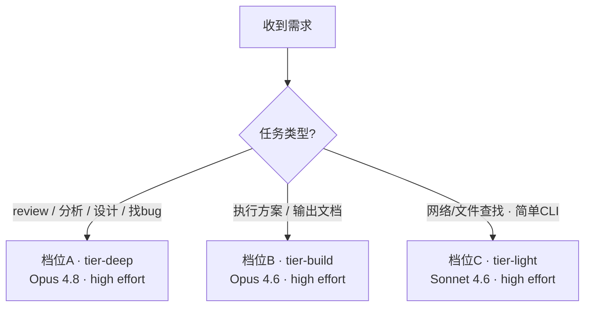

# Task-Based Model Routing for Claude Code and Copilot

按任务类型把工作路由到指定模型与 effort 档位：在 Claude Code 用 subagent、在 GitHub Copilot 用 custom agent，给出可照做的文件、配置与使用方式。

> 知识截止 **2026-06-30**。本文事实均来自 Claude Code 与 VS Code / GitHub Copilot 官方文档实际核查（来源见文末「参考资料」）。无法从官方页核实的点已显式标注「**未核实**」，不臆造。相关概念背景见 [Agent / Skill / MCP / Workflow Guide](agent-skill-mcp-workflow-guide.md)。

---

## 一、需求与目标

希望在执行需求的过程中，按**任务类型**自动切换到指定的模型与 effort 档位，并在 Claude Code、Copilot 两套工具里都能用。三个档位如下：

| 档位 | 任务类型 | Claude 侧模型 | Copilot 侧模型 | effort |
|------|----------|---------------|----------------|--------|
| **A · 深度推理** | code review、问题分析、设计方案、bug 查找 | Opus 4.8 (1M) | GPT-5.5 (1M) | high |
| **B · 执行产出** | 方案执行、文档输出 | Opus 4.6 (1M) | GPT-5.4 (1M) | high |
| **C · 轻量检索** | 网络查找、文件查找、简单 CLI / shell 命令 | Sonnet 4.6 (1M) | GPT-5.4 (1M) | high |

附加诉求：

- Copilot 侧能在 Claude 与 GPT 两个厂商之间**选择**。
- 进入档位 A 这类深度任务前，**提示是否要调整 effort**。

> 目标是"**任务类型 → 模型 + effort**"的稳定路由，而不是每次手动记着去切模型。下面先回答一个关键问题：能不能用一个 agent 文件全部搞定。

---

## 二、能否用一个 `agent.md` 搞定？（结论：不能）

**不能。Claude 和 Copilot 两侧都无法用单个 agent 文件满足全部需求。** 根本原因是 4 条机制限制（均经官方文档核实）：

| # | 机制事实 | 对「单文件」的否决 |
|---|----------|-------------------|
| 1 | `model` 是 frontmatter 里的**单一静态值**，一个 agent 文件只能钉一个模型（Copilot 的 `model` 数组是"可用性兜底"，非多档位） | 三个档位要三个不同模型，单文件承载不了 |
| 2 | Claude subagent **不能调用 `AskUserQuestion`**（官方硬性限制，列进 `tools` 也无效） | "让我选择 / 提示我改 effort"这类交互只能发生在主会话，subagent 内做不到 |
| 3 | 主会话委派 subagent 时，per-invocation 的 `model` 参数只接受家族别名（`opus`/`sonnet`/`haiku`/`fable`），到不了 `opus-4-6` 这种次版本 | 要钉 Opus 4.6，**必须**在某个 subagent 文件里写全量 ID，泛型单文件够不到 |
| 4 | Copilot custom agent 的 frontmatter **没有 effort 字段**；effort 是模型选择器里的手动 UI 动作 | effort 无法写进 agent 文件，"high effort"只能靠 UI 设定 + 文件正文提醒 |

**最小可行结构**：每侧都需要"**每档位一个模型载体文件**"（共 3 个），再加一层**路由 / 询问逻辑**（这层必须在主会话，不能塞进 subagent）。

---

## 三、机制事实速查（先对齐预期）

落地前，有几处需要把预期和官方现实对齐：

- **Opus 4.6 在 Claude Code 可用**（已确认）。因此档位 B 直接钉 `claude-opus-4-6`。
- **"(1M context)" 不是模型名**。
  - Claude Code 侧：1M 是**模型 ID 的变体**（如本机会话解析为 `us.anthropic.claude-opus-4-8[1m]`）。要钉 1M 变体，以 `/model` 里看到的**精确 ID 字符串**为准；裸别名 `opus` 或裸 ID `claude-opus-4-8` 是否解析到 1M 档位**取决于环境，需现场核实**。
  - Copilot 侧：1M 只是部分模型的**能力标注**，模型名就是 `Claude Opus 4.8` / `GPT-5.5`，**没有**叫 "(1M context)" 的独立模型。
- **`GPT-5.5` / `GPT-5.4` 在 Copilot 确认可选**；`GPT-5`、`GPT-5-Codex` 已退役，勿引用。
- **Copilot "Custom chat modes" 已更名为 "Custom agents"**，文件为 `.github/agents/*.agent.md`；旧 `*.chatmode.md` 需重命名迁移。
- **Copilot 无"按任务类型自动路由模型"的官方能力**。选 agent 是手动动作；唯一自动机制是 Auto mode（按复杂度/可用性路由，且不能钉具体模型）。所以"自动切模型"在 Copilot 只能做到**手动选 agent → 模型随之固定**。
- **effort 控制方式两侧不同**：Claude 可在 subagent / skill frontmatter 用 `effort` 字段声明式设定；Copilot 的 Thinking Effort 只能在模型选择器里手动设（None / Low / Medium / High），无法写进 agent 文件。

---

## 四、Claude Code 方案

### 4.1 三个 subagent 文件

在 `.claude/agents/` 下建三个文件，各钉一个模型 + `effort: high`。正文即该 subagent 的系统提示词。

```markdown
<!-- .claude/agents/tier-deep.md  —— 档位A：review / 分析 / 设计 / 找bug -->
---
name: tier-deep
description: >-
  Deep reasoning tasks: code review, problem analysis, solution design,
  and bug hunting. Delegate here whenever the task is to review, diagnose,
  architect, or find the root cause of a bug.
model: claude-opus-4-8
effort: high
---

You are a senior reviewer and analyst. Investigate thoroughly and output
findings, root-cause analysis, or a design with explicit evidence and trade-offs.
```

```markdown
<!-- .claude/agents/tier-build.md  —— 档位B：执行方案 / 输出文档 -->
---
name: tier-build
description: >-
  Execute an approved plan and produce output: implement code changes or
  write documentation. Delegate here only after a plan is confirmed.
model: claude-opus-4-6
effort: high
---

Implement the approved plan precisely. Keep changes surgical and follow
existing project conventions. After editing, state what changed and why.
```

```markdown
<!-- .claude/agents/tier-light.md  —— 档位C：网络/文件查找 / 简单CLI -->
---
name: tier-light
description: >-
  Lightweight retrieval and simple commands: web search, file/code search,
  and simple CLI/shell commands. Delegate here for lookups and quick commands.
model: claude-sonnet-4-6
effort: high
tools: Bash, Glob, Grep, Read, WebSearch, WebFetch
---

Fast retrieval and simple command execution. Do not perform deep design or
large refactors. Return the located facts or command output concisely.
```

> 字段说明（均为官方 subagent frontmatter 字段）：`name`、`description` 必填；`model` 可填家族别名（`opus`/`sonnet`/`haiku`/`fable`）、全量 ID（`claude-opus-4-8` / `claude-opus-4-6` / `claude-sonnet-4-6`）或 `inherit`；`effort` 可填 `low`/`medium`/`high`/`xhigh`/`max`，覆盖会话级 effort；`tools` 省略则继承全部工具。**要钉 Opus 4.6 这种次版本，必须用全量 ID 写在 subagent 文件里**——主会话委派时传的模型参数只认家族别名，到不了次版本。

### 4.2 路由层（写进项目 `CLAUDE.md`）

让主会话依 `description` 自动委派；按"全局规则文件英文优先"的约定，策略用英文写：

```markdown
## Model Routing Policy
- Code review / analysis / design / bug-finding  -> delegate to `tier-deep`.
- Execute an approved plan / write docs          -> delegate to `tier-build`.
- Web/file search / simple CLI or shell commands -> delegate to `tier-light`.
- Before a Tier-A (tier-deep) task, you MAY ask whether to raise effort.
```

路由决策可视化如下：



### 4.3 交互式 effort 确认（可选 `/route` dispatcher skill）

需求里的"**提示我是否要改 effort**"，因为 subagent 不能用 `AskUserQuestion`，必须由**主会话**完成。两种做法：

- **简单做法**：effort 钉死在各 subagent（`high`）。要临时提高，手动 `/effort xhigh`（或 `max`）后再委派。
- **交互做法**：建一个跑在主上下文的 `/route` skill（skill 内联在主对话，可调 `AskUserQuestion`）。流程：归类任务 → 用 `AskUserQuestion` 让你确认档位、并选择是否走"高 effort 变体" → 委派到对应 subagent。

> 注意：没有文档支持"在委派那一刻把 subagent 的 effort 动态改写"。若要让 `/route` 提供"更高 effort"选项，干净做法是**预置一个高 effort 变体 subagent**（如再建 `tier-deep-max.md`，frontmatter 仅把 `effort` 改为 `max`），让 `/route` 在 `tier-deep` 与 `tier-deep-max` 之间二选一。这样既满足"提示是否改 effort"，又不依赖未证实的动态改写。

---

## 五、GitHub Copilot 方案

### 5.1 三个 custom agent 文件

在 `.github/agents/` 下建三个 `*.agent.md`。`model` 用数组形式（前者不可用才退到后者）：

```markdown
<!-- .github/agents/tier-deep.agent.md  —— 档位A -->
---
description: Deep reasoning — code review, problem analysis, solution design, bug hunting.
model: ['Claude Opus 4.8', 'GPT-5.5']
---

Use this agent for review / analysis / design / bug-finding.
Before starting, set Thinking Effort to **High**: open the model picker,
click the ">" next to the model name, then choose Thinking Effort > High.
```

```markdown
<!-- .github/agents/tier-build.agent.md  —— 档位B -->
---
description: Execute an approved plan and produce output — implement code, write docs.
model: ['Claude Opus 4.6', 'GPT-5.4']
---

Implement the approved plan precisely; keep changes surgical.
Set Thinking Effort to **High** in the model picker before starting.
```

```markdown
<!-- .github/agents/tier-light.agent.md  —— 档位C -->
---
description: Lightweight retrieval — web search, file/code search, simple CLI commands.
model: ['Claude Sonnet 4.6', 'GPT-5.4']
---

Fast retrieval and simple commands only; no deep design.
Set Thinking Effort to **High** in the model picker before starting.
```

> 字段说明：custom agent frontmatter 支持 `description`、`name`、`model`、`tools`、`agents`、`mcp-servers`、`handoffs` 等。`model` 接受单个模型名（字符串）或**优先级数组**（逐个尝试直到命中可用模型）。省略 `model` 时使用选择器当前所选模型。**没有 effort 字段**。上例未写 `tools`（省略即继承全部可用工具）；如需限权可加 `tools` 数组，但具体工具标识名以 VS Code 实际可用为准（**未逐字核实**，勿照抄猜测名）。

### 5.2 "在 Claude 与 GPT 间选择"的两种实现

frontmatter 的 `model` 数组是**可用性兜底**（前者不可用才退到后者），**不是给你手选**。要真正按厂商选择，二选一：

| 方案 | 做法 | 取舍 |
|------|------|------|
| **3 agent + 选择器手切** | 每档位 1 个 agent，`model` 钉 Claude 优先、GPT 兜底；想换厂商时用模型选择器临时切 | 文件最少、最简单；换厂商是手动动作 |
| **6 agent（各厂商一套）** | 每档位拆两个：`tier-deep-claude`（`model: 'Claude Opus 4.8'`）与 `tier-deep-gpt`（`model: 'GPT-5.5'`），档位 B / C 同理 | 直接选 agent 即定厂商，最直观；文件翻倍 |

> 关于"选了 `model` 是否锁定/覆盖选择器"：官方仅说明"省略时用选择器当前模型"，**未明确说显式 `model` 会覆盖或锁定选择器**（属推断，**未核实**）。

### 5.3 Thinking Effort（只能 UI 设定）

Copilot 的 effort 叫 **Thinking Effort**，无法写进 agent 文件，只能在 VS Code 模型选择器里手动设：打开模型选择器 → 点模型名旁的 **">"** 箭头 → **Thinking Effort** 子菜单 → 选 **High**。档位为 None / Low / Medium / High，按"会话 + 模型"维度记忆；非推理模型（如 GPT-4.1 / GPT-4o）不显示该子菜单。

> GitHub.com 网页端 Chat 是否有等价 effort 开关**未核实**；上述以 **VS Code** 端为准。

---

## 六、两套方案对照

| 维度 | Claude Code | GitHub Copilot (VS Code) |
|------|-------------|--------------------------|
| 载体文件 | `.claude/agents/*.md`（subagent） | `.github/agents/*.agent.md`（custom agent） |
| 模型钉法 | `model` 单值，支持全量次版本 ID（如 `claude-opus-4-6`） | `model` 单值或优先级数组（用显示名，如 `'Claude Opus 4.6'`） |
| effort | frontmatter `effort` 字段声明式（`high` 等） | 无字段，模型选择器里手动设 Thinking Effort |
| 厂商选择 | 单厂商（Claude） | `model` 数组兜底，或拆 6 agent / 选择器手切 |
| 自动路由 | 主会话按 `description` + `CLAUDE.md` 策略自动委派 | 无自动路由，手动选 agent；模型随 agent 固定 |
| 交互确认 effort | `/route` skill 调 `AskUserQuestion`（subagent 本身不能） | 无程序化确认，靠 UI 手动调 |

---

## 七、配置与使用说明

### Claude Code

1. 新建 `.claude/agents/tier-deep.md`、`tier-build.md`、`tier-light.md`（内容见 4.1）。
2. 用 `/model` 核对 `claude-opus-4-8` / `claude-opus-4-6` / `claude-sonnet-4-6` 的精确 ID；若要 1M 变体，确认 `/model` 中 1M 条目的实际标识并据此填写。
3. 把 4.2 的 "Model Routing Policy" 追加进项目 `CLAUDE.md`。
4. （可选）若要交互式确认 effort，建 `/route` skill 并按需预置 `tier-deep-max.md`（见 4.3）。
5. **使用**：正常提需求，主会话依 `description` / 策略自动委派；也可显式 `@tier-deep …` / `@tier-build …` / `@tier-light …` 指定。

### GitHub Copilot（VS Code）

1. 新建 `.github/agents/tier-deep.agent.md`、`tier-build.agent.md`、`tier-light.agent.md`（内容见 5.1）。若选 6-agent 方案，则按 5.2 拆成 `*-claude` / `*-gpt`。
2. 旧的 `*.chatmode.md` 若存在，重命名为 `*.agent.md` 迁移。
3. **使用**：在 Chat 的 **agents 选择器**里选对应 agent → 模型随之固定。
4. 每个模型首次使用时，在模型选择器里把 **Thinking Effort 设为 High**（之后按会话+模型记忆）。
5. 想临时换厂商：用**模型选择器**手动切（或采用 6-agent 方案直接选对应 agent）。

---

## 八、已知限制与待核实项

- **subagent 不能用 `AskUserQuestion`**：所有"让我选择 / 确认 effort"的交互必须在主会话（或 `/route` skill）里做。
- **委派时动态改 effort 无文档支持**：effort 钉在 frontmatter；要变档需手动 `/effort` 或预置高 effort 变体 subagent。
- **Copilot `model` 数组 = 兜底而非手选**；真正按厂商选择需选择器手切或拆 6 agent。
- **Copilot 显式 `model` 是否覆盖/锁定选择器**：官方未明说，属推断（**未核实**）。
- **1M 变体精确 ID**：Claude Code 侧需以 `/model` 实际显示为准；裸别名是否映射到 1M **需现场核实**。
- **Copilot agent 的 `tools` 工具标识名**：未逐字核实，配置时以 VS Code 实际可用列表为准。
- **GitHub.com 网页端是否有 Thinking Effort**：**未核实**，本文以 VS Code 端为准。

---

## 九、参考资料

- Claude Code 文档（subagents / model-config / skills）：<https://code.claude.com/docs>
- VS Code Copilot 自定义（custom agents / language models / custom instructions）：<https://code.visualstudio.com/docs/copilot>
- GitHub Copilot 文档（custom agents / supported models / response customization）：<https://docs.github.com/copilot>

> **时效与诚信声明**：本文知识截止 2026-06-30，基于上述官方源实际核查整理。AI 工具迭代很快，frontmatter 字段、模型清单与命令可能变化，落地前请以最新官方文档为准。文中标注「未核实」处本次未能从官方页逐字取得，未作猜测。本文为方案设计文档，未实际创建任何 agent 文件。
