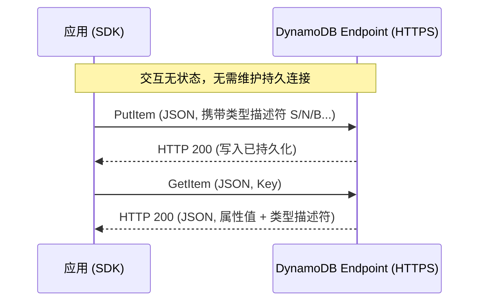
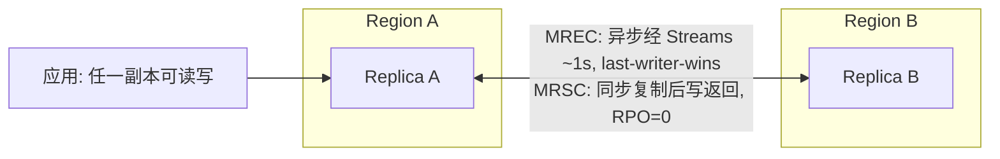
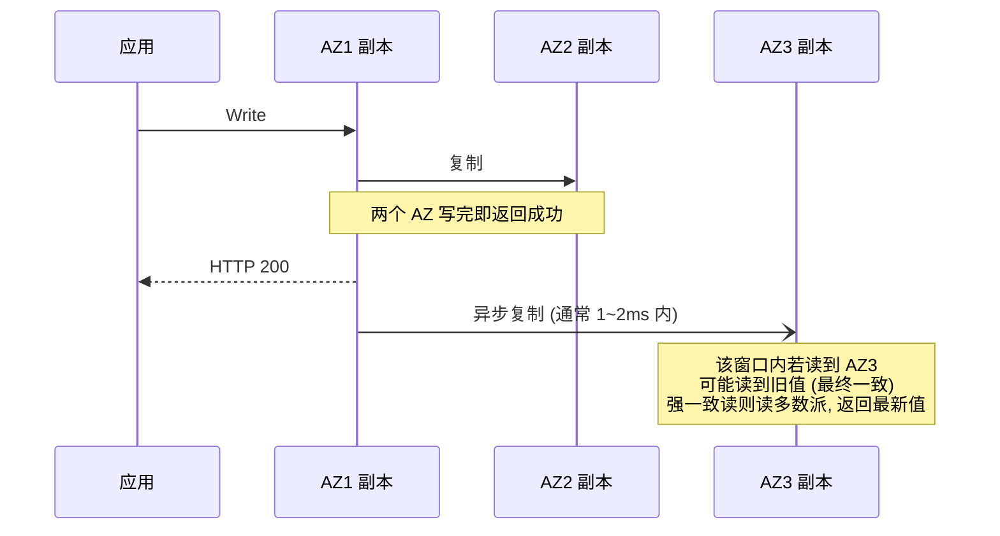
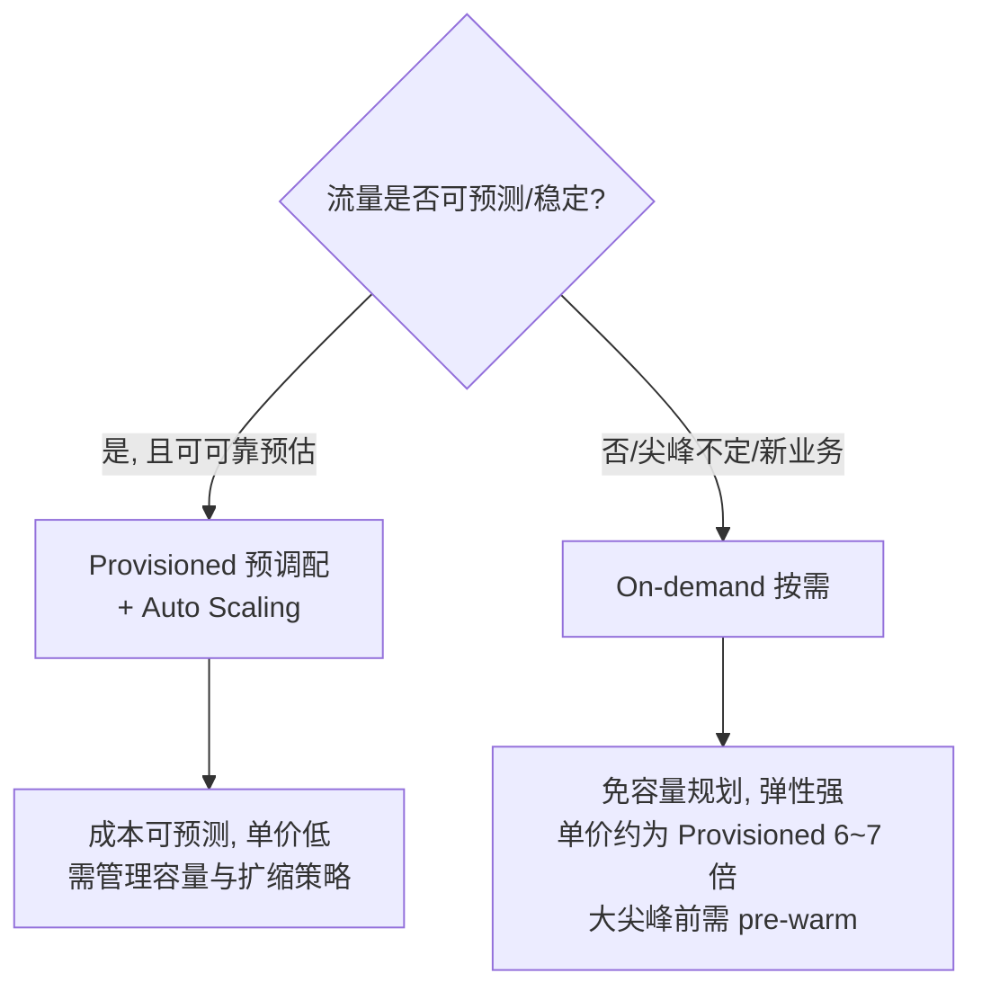

# Amazon DynamoDB Complete Guide

DynamoDB 核心概念、容量模式、TTL、全局表（MREC/MRSC）、API 限额与最佳实践完整参考，所有数字均基于 AWS 官方文档（2026-07-20）核实。

> 定价与配额随 AWS 调整会变化，使用前请以 [AWS 官方文档](https://docs.aws.amazon.com/amazondynamodb/latest/developerguide/Introduction.html) 与 [Pricing](https://aws.amazon.com/dynamodb/pricing/) 页为最终依据。

---

## 目录

1. [与 MySQL 对比](#1-与-mysql-对比)
2. [核心组件](#2-核心组件)
3. [TTL（Time to Live）](#3-ttltime-to-live)
4. [容量模式](#4-容量模式)
5. [Limits 与配额](#5-limits-与配额)
6. [Cost（成本）](#6-cost成本)
7. [DynamoDB API](#7-dynamodb-api)
8. [本地测试](#8-本地测试)
9. [Best Practices](#9-best-practices)
10. [DynamoDB vs DocumentDB](#10-dynamodb-vs-documentdb)
11. [Q&A](#11-qa)
12. [参考资料](#12-参考资料)

---

## 1. 与 MySQL 对比

| 维度 | MySQL | DynamoDB | 选型建议 |
| --- | --- | --- | --- |
| 数据模型与查询能力 | 通过表和列定义结构，支持复杂 SQL 查询、Join、聚合 | NoSQL，可灵活存储非结构化数据。用 Primary Key（Partition Key + Sort Key）唯一标识 Item，用二级索引提供灵活查询 | 需要高度灵活性 → DynamoDB；需要严格数据结构与完整性约束 → MySQL |
| 可扩展性与可用性 | 需手动配置集群、备份，需额外硬件支撑高可用与扩展 | 自动将数据与流量分布到足够数量的服务器，处理指定请求容量与数据量，保持一致且快速的性能 | 需要快速弹性扩缩、降低运维成本 → DynamoDB；需要更严格的控制与配置 → MySQL |
| 性能与可靠性 | 一般场景性能可靠，但海量数据下受限，需额外配置管理 | SSD + 分布式架构，高吞吐、低延迟；数据自动复制到某 AWS Region 的多个可用区（AZ）。稳定的**个位数毫秒级**读写延迟 | — |
| 复杂性 | 传统关系型数据库，管理使用相对直观 | 分布式数据库，需理解分区、复制与一致性模型 | — |
| 安全与数据保护 | 提供安全功能，但需手动配置管理 | 提供身份验证、授权、静态加密（默认开启）等多种安全能力 | — |
| 数据一致性 | 默认 REPEATABLE READ：事务不读其他事务未提交修改；事务内多次读取一致 | 默认**最终一致**，隔离级别为 **read-committed**：只读已提交数据；同一读操作中途若被事务写入，可能读到新提交值（`Query`/`Scan`）。事务型操作（`TransactWriteItems`/`TransactGetItems`）之间为 **SERIALIZABLE** | 需要强一致事务语义 → MySQL；一致性要求稍弱、追求扩展性 → DynamoDB |
| 数据库连接 | 应用建立并维护与数据库的持久网络连接，完成后终止 | Web Service，交互**无状态**，通过 HTTP(S) 请求/响应进行，无需维护持久连接 | — |

> 一致性的准确表述见 [§2.9 读取一致性](#29-读取一致性)。

参考：<https://docs.aws.amazon.com/amazondynamodb/latest/developerguide/SQLtoNoSQL.WhyDynamoDB.html>

---

## 2. 核心组件

### 2.1 基本概念

- **Table**：类似 MySQL 的表，但**无需建表时定义所有属性**（schemaless）。
- **Item**：表中一条数据，类似 MySQL 一行。必须有唯一主键。
- **Attribute**：Item 的具体属性，类似字段。除主键外的属性可为该 Item 独有。
- **Primary Key**：主键属性只允许 **String / Number / Binary** 三种类型，由以下组成：
  - **Partition Key（分区键）**：其值作为内部散列函数的输入，决定 Item 存入哪个分区。只有分区键的表中，任意两个 Item 不能有相同分区键值。**不能对 Partition Key 做范围查询**。
  - **Sort Key（排序键）**：与 Partition Key 组成**复合主键**。相同 Partition Key 的所有 Item 按 Sort Key 排序存储在一起，它们必须有不同的 Sort Key。
  - **主键键值长度上限**：Partition Key ≤ **2048 字节**，Sort Key ≤ **1024 字节**（String / Binary 主键属性均适用）。

### 2.2 二级索引（Secondary Indexes）

**全局二级索引（GSI, Global Secondary Index）**
- 分区键与排序键可与基表完全不同；可以只指定分区键。
- 可跨所有分区查询整个表；GSI 存储在独立于基表的分区空间，独立扩展。
- 查询只能取回索引中已有的字段（键 + 投影属性）；需要其他字段须将其设为**投影属性（projected attributes）**，会额外占用存储并计费。
- 可对现有表**新增或删除** GSI。
- GSI 读**永远是最终一致**（不支持强一致读）。

**本地二级索引（LSI, Local Secondary Index）**
- 分区键与基表**相同**、排序键不同；索引必须同时具有分区键和排序键。
- 只能查询指定分区键值下的**单个分区**。
- 可请求未投影到索引的属性（会回基表取，额外消耗容量）。
- **不能对现有表新增 LSI，也不能删除已存在的 LSI**；删除表时其 LSI 一并删除。
- LSI 支持强一致读（`ConsistentRead`）。

### 2.3 数据类型（Data Types）

- **Scalar Types**：number, string, binary, Boolean, null
  - **number**：可正、可负、可零，最多 **38 位有效精度**（超出报异常）。系统自动删减开头/结尾无效 0。若精度需求 >38 位，改用 String 传递。大小 ≈（属性名长度）+（每 2 位有效数字 1 字节）+（1 字节）。
  - **string**：UTF-8 编码的 Unicode。大小 =（属性名长度）+（UTF-8 编码字节数），受 Item 400 KB 上限约束。
  - **binary**：受 Item 400 KB 上限约束。应用**必须先 Base64 编码**再发送；DynamoDB 收到后解码为无符号字节数组，**以解码后的原始字节数计入 Item 大小**（见 [§11 Q&A](#11-qa)）。
  - 空属性 / Boolean 属性大小 =（属性名长度）+（1 字节）。
- **Document Types**：list, map
  - 大小 =（属性名长度）+（嵌套元素大小总和）+（3 字节）。空 List/Map =（属性名长度）+（3 字节）。
  - 每个 List/Map 元素额外 1 字节开销。
  - 最深支持 **32 级嵌套**。
- **Set Types**：string set, number set, binary set。集合内元素类型必须一致、值唯一、无序；**不支持空集合**（但 List/Map 内允许空 String / 空 Binary）。

**数据类型描述符（低层 API 协议 token）**：`S` String / `N` Number / `B` Binary / `BOOL` Boolean / `NULL` Null / `M` Map / `L` List / `SS` String Set / `NS` Number Set / `BS` Binary Set。

> 参数与返回值均为 JSON。下图为无状态交互流程：



### 2.4 Table Classes（表类别）

- **DynamoDB Standard**：默认，适合绝大多数工作负载。
- **DynamoDB Standard-IA（Infrequent Access）**：针对存储成本占主导的表优化，**存储费用降低约 60%**（Standard-IA 存储约 $0.10/GB-月 vs Standard $0.25/GB-月），但读写单价略高（约高 25%）。

### 2.5 Global Table（全局表）

全局表是**全托管、多 Region、多活（multi-active）** 的复制特性：任一副本都能读写，DynamoDB 自动跨 Region 复制。可用性 SLA **99.999%**（单区域表为 99.99%）。

**基本概念**
- 由**两个或更多不同 Region 的副本表（replica）** 组成；每个 Region 至多一个副本。所有副本**共享相同的表名、主键 schema、Item 数据**；每个副本存储完整数据集，**不支持部分复制**。
- 应用向任一副本写入，DynamoDB 自动复制到其他所有副本。
- 同步写入消耗写容量：预调配表用 **rWCU（复制写容量单位）**，按需表用 **rWRU（复制写请求单位）**。

**版本**
- **2019.11.21（Current）**：应优先使用。本节内容均基于该版本。
- **2017.11.29（Legacy）**：旧版，不建议新建。

**账户模型**
- **Same-account**：所有副本在同一 AWS 账户内。
- **Multi-account**：副本跨多个账户，共享复制组（适合跨团队/安全边界）。MRSC 仅支持 same-account。

**冲突解决（多活核心语义）**
- 跨 Region 同时修改同一 Item 时，MREC 用 **last-writer-wins（按内部时间戳，逐 Item 判定）** 解决冲突，最终所有副本收敛到"最后一次写"的版本。
- MRSC 下，写入若与另一 Region 正在进行的修改冲突，会返回 `ReplicatedWriteConflictException`，可重试。

#### 一致性模式（MREC vs MRSC）

创建时选择，**创建后不可更改**，且同一全局表所有副本一致模式必须相同。

| 维度 | MREC（默认） | MRSC |
| --- | --- | --- |
| 复制方式 | 异步，经 Streams 复制，通常 ≤1s | **同步**复制到至少一个其他 Region 后写才返回 |
| 强一致读 | 仅当该 Item 最后一次更新发生在读所在 Region 才保证最新，否则可能读到旧值 | **任一副本上强一致读始终返回最新版本** |
| RPO | > 0（≈复制时延，数秒） | **0** |
| 写/读延迟 | 更低 | 更高 |
| Region 数量 | 任意（AWS 分区内所有可用 Region） | **必须恰好 3 个 Region** |
| Streams | 默认开启、不可关（用于复制） | 复制**不依赖 Streams**；Streams 可选开启，且各副本记录完全一致（含顺序） |
| TTL | 支持 | **不支持** |
| LSI | 支持 | **不支持** |
| 事务 | 仅源 Region 内原子，跨区非原子 | **不支持，调用报错** |
| `ReplicationLatency` 指标 | 发布 | 不发布 |

**MRSC 额外约束**
- 拓扑必须为 **3 副本** 或 **2 副本 + 1 witness**。witness 由 DynamoDB 托管、**不可读写**、不出现在你的账户中，仅用于可用性架构。
- 仅限固定 Region set，**不能跨 set**：US（弗吉尼亚北部 / 俄亥俄 / 俄勒冈）、EU（爱尔兰 / 伦敦 / 巴黎 / 法兰克福）、AP（东京 / 首尔 / 大阪）。
- 转换现有单区域表为 MRSC **必须空表**；不能给已存在的 MRSC 表增删单个副本。

**其他重点**
- **TTL 删除复制**：MREC 下 TTL 删除会复制到所有副本；发生删除的 Region 首次删除不耗 WCU，但复制到其他副本 Region 消耗 rWCU/rWRU 并计费。
- **事务**：MREC 全局表事务仅在**发起写入的 Region 内**保证 ACID；跨区复制**非原子**，其他副本可能观察到部分完成的事务。MRSC 完全不支持事务。
- **DAX 陷阱**：对全局表副本的写入**绕过 DAX**，DAX 缓存不会随复制更新而刷新，会 stale，直到 cache TTL 到期。
- **运维约束**：新副本创建后 **24 小时内不能删除用于创建它的源表**；若禁用含副本的 Region，该副本在 **20 小时后永久转为单区域表**。

**设置同步（三类）**
- **始终同步**：容量模式、表/GSI 写容量与写 auto scaling、key schema、GSI 定义、SSE 类型、MREC 的 Streams 定义、TTL、Warm Throughput、按需写上限。
- **同步但可按副本覆盖**：表/GSI 读容量与读 auto scaling、Table Class、按需读上限。
- **从不同步**：删除保护、PITR、Tags、Contributor Insights 开关、Kinesis Data Streams 定义、Resource Policies、MRSC 的 Streams 定义。

> 常规单区域表**不能原地升级**为全局表（需备份→删除→重新配置）；全局表的表名在账户内必须唯一。



### 2.6 Streams（流）

- 捕获 DynamoDB 表的数据修改事件（INSERT / MODIFY / REMOVE）。
- 每条流记录含表名、事件时间戳与元数据；流记录生命周期 **24 小时**。
- **读取 Streams 消耗读容量**（RCU）。

### 2.7 DAX（Amazon DynamoDB Accelerator）

- AWS 为 DynamoDB 提供的高扩展性**缓存集群**。
- 加速**最终一致读**工作负载的响应时间。
- **不处理强一致操作**，强一致操作直接透传至 DynamoDB。
- 保留一个 query 缓存，存 `Query` / `Scan` 结果，直到结果集 TTL 到期才清除；但后续有更新操作时结果集会失效。
- 部署**以 Region 为单位**，多 Region 需部署多个 DAX 集群。
- 按实例规格 + 约定使用时长计费。
- 有维护时段（每周任意 60 分钟窗口），但**不会每周都维护**，仅在底层升级时维护，维护时缓存数据会被清空。
- 事务 API（`TransactWriteItems` / `TransactGetItems`）在 DAX 中同样支持，隔离级别与 DynamoDB 一致；写走透传，写后 DAX 后台调 `TransactGetItems` 回填缓存，会额外消耗 RCU。

### 2.8 静态加密（Encryption at Rest）

- 默认**始终开启**，使用 **AES-256**。可选三种 KMS Key 类型，随时切换：
  - **AWS owned key**：默认，DynamoDB 拥有，不额外收费。
  - **AWS managed key**：存于账户，由 AWS KMS 管理（收 KMS 费用）。
  - **Customer managed key**：存于账户，完全控制（收 KMS 费用）。
- 访问加密表时 DynamoDB 透明解密，**无需改代码**，仍保持个位数毫秒延迟。
- 若表有排序键，标记范围边界的部分排序键会以明文存于表元数据。

### 2.9 读取一致性

- **最终一致读（Eventually Consistent，默认）**：为 read-committed 隔离，始终返回已提交的值；刚完成的写入可能尚未反映，短时间后重试即可读到最新值。**表、LSI、GSI、Streams** 均支持。成本为强一致读的**一半**。
- **强一致读（Strongly Consistent）**：`GetItem` / `Query` / `Scan` 提供可选参数 `ConsistentRead`；设为 `true` 返回最新数据。**仅支持表和 LSI**；**GSI 与 Streams 不支持强一致读**。
- 全局表跨 Region 一致性见 [§2.5](#25-global-table全局表)：默认 MREC，可选 MRSC。

底层机制（帮助理解 1~2ms 的最终一致窗口）：



---

## 3. TTL（Time to Live）

TTL 是一种**按 Item 过期删除**的低成本机制，用于自动清理不再需要的数据。它**不是精确的定时/调度器**（见 [§3.5](#35-ttl-不是定时任务)）。

### 3.1 基本机制

- 为每个 Item 定义一个过期时间戳属性，到期后 DynamoDB 会在**数天内（typically within a few days）尽力（best-effort）** 自动删除该 Item，删除**不消耗写吞吐（WCU）**。
- 删除的滞后是**非确定性**的——**不要依赖 TTL 做精确到某时刻的即时删除**。
- TTL 删除的 Item 与普通删除一致：进入 DynamoDB Streams（标记为 **service deletion**），并从 LSI / GSI 中移除。

### 3.2 TTL 属性要求与取值

- TTL 属性值必须是 **Number 类型的 Unix epoch 时间戳，秒级粒度，UTC**。非 Number 类型（如把毫秒当秒存、或用 String）会被 TTL 进程**忽略**，Item 不会被删除。
- 取值约束：过期时间**不能早于过去 5 年**（否则该 Item 被忽略、不参与删除）；**无最小 TTL 时长**，可设为未来任意时刻（如当前时间 +5 分钟）。
- 常见做法：`createdAt + N 天`；Item 更新时可重算为 `updatedAt + N 天` 以续期。
- 每个表**只能指定一个 TTL 属性**；属性名**大小写敏感**，必须与读写操作中使用的名称完全一致，否则过期项不会被删除。

### 3.3 启用 / 禁用与运维注意

- 可通过 Console / CLI（`update-time-to-live`）/ API（`UpdateTimeToLive`）/ CloudFormation（`TimeToLiveSpecification`）启用。启用需约 **1 小时**在所有分区生效。
- `UpdateTimeToLive` **非幂等**：TTL 已启用时、或同一表 1 小时窗口内多次调用、或用不同属性名重复启用，都会返回 `ValidationException`（HTTP 400）——调用方需处理该异常（可将 "already enabled" 视为已生效）。
- **禁用后 TTL 仍会继续处理删除约 30 分钟**。
- 改 TTL 属性名需先禁用再用新名重新启用。**从备份恢复的表必须重新配置 TTL**。
- 全局表（2019.11.21 版）中，TTL 删除会复制到所有副本：**发生过期的 Region 首次删除不消耗 WCU**，但复制到其他副本 Region 会消耗 rWCU（预调配）/ rWRU（按需）并计费。TTL 删除的 `userIdentity` 只在发生 Region 的 Streams 中标记，复制到其他 Region 的删除不带该标记。

### 3.4 过期项的读写行为（重点）

- **已过期但尚未被后台删除的 Item 仍会出现在 `GetItem` / `Query` / `Scan` 结果中，并继续计入存储与读取成本**，直到后台进程真正删除。
- 读取时若不想包含过期项，用 **filter expression** 过滤（只返回 TTL 值 > 当前 epoch 时间的项），例如：`FilterExpression: "#ea > :now"`（`:now` = 当前 epoch 秒）。
- 过期但未删除的 Item **仍可更新**：将其 TTL 改到未来时刻（或删除 TTL 属性）即可"复活"，使其不再被删除；更新时建议加 condition expression（如 `expireAt > :now`）避免写到已被删除的项。
- **诊断说明**：TTL 属性值会以明文记录在 DynamoDB 诊断日志中（用于调试验证）——敏感数据不应作为 TTL 属性值语义的一部分。

### 3.5 TTL 不是定时任务

DynamoDB **没有内建的 cron / 定时任务 / 延时队列**功能。若需在 Item 到期时触发下游动作（归档、通知等），官方推荐组合 **TTL + DynamoDB Streams + Lambda**：

1. Item 被 TTL 删除后作为 service deletion 进入 Streams，流记录 `userIdentity = { "type": "Service", "principalId": "dynamodb.amazonaws.com" }`；
2. Lambda 通过 event source mapping 的 **filter pattern** 只筛选该模式，避免被普通增删改事件误触发、降低调用成本。


过滤模式（挂在 Lambda event source mapping 的 filter criteria 上）：

```json
{
  "Filters": [
    { "Pattern": "{\"userIdentity\":{\"type\":[\"Service\"],\"principalId\":[\"dynamodb.amazonaws.com\"]}}" }
  ]
}
```

> ⚠️ 该方案仍受 TTL 删除滞后（数天）限制，**只适合对时间精度要求低的场景**。需要精确定时/周期调度时，应由 **Amazon EventBridge Scheduler / EventBridge Rules** 等专门服务承担，DynamoDB 不负责调度。

---

## 4. 容量模式

DynamoDB 有两种吞吐模式：**On-demand（按需）** 与 **Provisioned（预调配）**。

### 4.1 On-demand（按需模式）

- Serverless，**无需容量规划**，按请求付费（pay-per-request），只为实际使用付费。官方将其列为**默认且推荐**选项。
- **新建 On-demand 表可瞬时支撑 4,000 writes/s 和 12,000 reads/s**。
- **瞬时承受此前峰值（previous peak）的 2 倍流量**。达到新峰值后，该峰值成为新的"previous peak"，后续可再翻倍。
- 若在 **30 分钟内**流量超过 previous peak 的 2 倍，可能发生限流（throttling）。已知会有尖峰时，建议**预热（pre-warm / warm throughput）**或将增长分散到至少 30 分钟。
- 可选为单表 / GSI 配置**最大吞吐上限（maximum throughput）**，用于控制成本、防止意外飙升；超过上限的请求会被限流。
- 计费单位为 **RRU（读请求单位）/ WRU（写请求单位）**；同等吞吐下单价高于 Provisioned（当前 us-east-1 约 **6~7 倍**，见 [§6](#6-cost成本)）。

### 4.2 Provisioned（预调配模式）

- 指定应用所需的每秒读写次数，按预置的每小时读写容量计费（不论实际是否用满），成本可预测。
- 可用 **Auto Scaling** 按流量自动调整预置容量：
  - **TargetValue**：目标利用率百分比，扩缩容后尽量贴近该值。
  - 可设置按一天中的某时段 / 一周中的某天执行。
  - 有冷静期：达到百分比后需**连续增长约 3 分钟**才会触发调整。
  - 按每小时的扩容值计费。
  - 底层若需扩充分区，每个分区至少需 1~2 分钟。
  - 底层硬件**只扩不缩**。
  - 扩容次数不限；缩容默认**每小时 1 次**（可配置为每半小时 1 次）。
- 容量单位示例：一个 6 RCU + 6 WCU 的预置表可执行：
  - 强一致读 ≤ 24 KB/s（4KB × 6 RCU）
  - 最终一致读 ≤ 48 KB/s（两倍读吞吐）
  - 事务读 ≤ 12 KB/s
  - 写 ≤ 6 KB/s（1KB × 6 WCU）
  - 事务写 ≤ 3 KB/s
- 超过预置吞吐会发生请求限流。
- 可每 24 小时将表切到 On-demand（一个滚动 24h 窗口内最多切 4 次，从 On-demand 切回 Provisioned 可随时进行）。切换时 DynamoDB 会调整表和分区结构，可能耗时数分钟。



---

## 5. Limits 与配额

### 5.1 读写容量单位

- **RCU（Read Capacity Unit）**：对 ≤ 4KB 的 Item，每秒 1 次强一致读，或每秒 2 次最终一致读。
  - 即使只读一条记录的某个属性，也按**整条记录大小**计算。
  - 一个 `Query` 涉及多条数据时，多条数据**合并大小**计算。
- **WCU（Write Capacity Unit）**：对 ≤ 1KB 的 Item，每秒 1 次写。
  - 修改一条记录的任一属性，都按整条记录大小算作一次 WCU。
  - **rWCU**：复制写容量单位，用于预调配全局表，价格约为 WCU 的 **1.5 倍**。
  - **rWRU**：复制写请求单位，用于按需全局表。
- **事务容量**：事务对**每个 Item** 底层执行两次读/写（一次 prepare、一次 commit）：
  - **事务读**：每个 ≤ 4KB 的 Item 需 **2 个 RCU**。
  - **事务写**：每个 ≤ 1KB 的 Item 需 **2 个 WCU**。
  - 即使事务被取消（如条件不满足），底层容量**照常消耗**。
- 对不存在的 Item 执行读操作，仍占用读吞吐。
- 每个分区上限：约 1000 WCU 和 3000 RCU。

### 5.2 表限制

- **Query / Scan 页大小上限**：每页 1MB。超过时 DynamoDB 返回初始匹配项与 `LastEvaluatedKey`，用于下一页请求。
- **表数量配额**：每个 AWS 账户每个 Region 初始配额 **2,500 张表**，可申请提升至最多 **10,000 张**。

### 5.3 全局表

- 表名在账户内必须唯一。
- 副本间数据传输超过账户所有服务总免费额度（100 GB）后收数据传输费。
- 常规表不能原地升级为全局表，需备份、删除、重新配置。
- 全局表必须为 On-demand，或启用 Auto Scaling 的 Provisioned；在任一 Region 切换容量模式会**同时切换所有副本**。
- **全局表不支持跨 Region 事务**（ACID 保证仅在最初写入的 Region 内成立；MRSC 完全不支持事务）。
- 副本表与其二级索引的**写容量始终同步**，读容量可按副本覆盖。
- **MRSC 限制**：必须恰好 3 个 Region、不支持 TTL / LSI / 事务、仅限 US/EU/AP 三个固定 Region set。

### 5.4 索引

- 每表最多 **5 个 LSI** 和 **20 个 GSI**。
- 含一个或多个 LSI 的表，任一 item collection（同一分区键下表 + 索引）最大 **10GB**。
- 索引按大小额外计费，每个索引项有约 **100 字节**额外开销。
- GSI 需单独设置预置吞吐；LSI 占用基表吞吐。
- GSI 为最终一致，同步时延一般毫秒级。

### 5.5 常用数据类型限制

- **String**：受 Item 400 KB 上限约束。
- **Number**：最多 38 位精度，可正负零；精度要求高时用 String 传递。
- **Binary**：受 Item 400 KB 上限约束；须先 Base64 编码再发送，DynamoDB 解码为无符号字节数组并按原始字节计长度。

### 5.6 Item / 属性 / 表达式参数

- **Item 大小上限 400 KB**，含属性名（UTF-8 二进制长度）+ 所有属性值（二进制长度）。
- List / Map / Set 元素数量无限制，只要 Item 总大小 ≤ 400KB；List/Map 无论内容都需 3 字节开销。
- Item 最深 **32 级嵌套**。
- 空属性值占 1 字节。
- 表达式参数：
  - 任一表达式字符串最大 **4KB**；表达式中属性名 / 属性值最大 **255 字节**。
  - 表达式中所有替代变量最大 **2 MB**。
  - 使用保留字须指定 `ExpressionAttributeNames`（[保留字列表](https://docs.aws.amazon.com/amazondynamodb/latest/developerguide/ReservedWords.html)）。

### 5.7 命名规则

- 所有名称用 **UTF-8** 编码，**区分大小写**。
- 表名 / 索引名长度 **3~255 字符**，只能含 `a-z A-Z 0-9 _ - .`。
- **属性名**：≥ 1 字符且 < **64 KB**；但**二级索引的分区键名、排序键名、LSI 用户指定投影属性名** ≤ 255 字符。建议属性名尽量短，可降低存储与吞吐计量。
- 避免使用保留字与特殊字符（`#`、`:` 有特殊含义）。

### 5.8 事务限制

- 单个事务 ≤ **100 个唯一 Item**，聚合数据 ≤ **4 MB**。
- 不能在同一事务中对同一表的同一 Item 执行两个操作（如同时 `ConditionCheck` 和 `Update`）。
- 事务 ACID 保证仅在最初写入的 Region 内有效，**全局表不支持跨 Region 事务**。
- 事务操作目标仅限同一 AWS 账户、同一 Region 内的表。
- 事务不读其他未完成操作的数据。
- **不能对索引执行事务**——必须直接作用于主数据表。

### 5.9 分区与 Stream 读取

- 非全局的单区域表，最多可设计 **2 个进程**同时从同一 DynamoDB Streams 分区读取；超过会被拒。
- 只有分区键的情况下，单分区最大存储 **10GB**。

### 5.10 API 限制

- `BatchGetItem`：最多取 **100 个 Item**，总大小 ≤ **16 MB**。
- `BatchWriteItem`：最多 **25 个** `PutItem`/`DeleteItem` 请求，总大小 ≤ **16 MB**。
- `Query` / `Scan` 结果集每次调用 ≤ **1 MB**，用 `LastEvaluatedKey` 翻页。
- `DescribeLimits` 应仅定期调用，一分钟内多次调用可能触发限流。
- `DescribeTableReplicaAutoScaling` / `UpdateTableReplicaAutoScaling`：每秒仅 10 个请求。
- `DescribeContributorInsights` / `ListContributorInsights` / `UpdateContributorInsights`：每个每秒最多 5 个请求。
- `UpdateTimeToLive`：每小时对指定表仅支持一个启用/禁用 TTL 请求；处理最多需 1 小时，其间对同表的其他 `UpdateTimeToLive` 调用会抛 `ValidationException`。

### 5.11 容量调整限制

- 每日减小容量操作最多 27 次。当天未减容时，一小时内最多 4 次；否则一小时内只能 1 次。
- AWS 对账户所在 Region 的预置/使用吞吐设有默认配额，可按需调整（默认账户级表级读写吞吐上限 40,000，可申请提升）。

参考：<https://docs.aws.amazon.com/amazondynamodb/latest/developerguide/ServiceQuotas.html>

---

## 6. Cost（成本）

> 以下单价为 **AWS us-east-1（美东1）** 核实值（核实日期 2026-07-20），仅供估算。**不同 Region 价格不同，且会随时调整**，最终以 [DynamoDB Pricing](https://aws.amazon.com/dynamodb/pricing/) 与 [AWS Calculator](https://calculator.aws/#/addService) 为准。

### 6.1 存储费用

| 表类别 | 存储单价 |
| --- | --- |
| Standard | $0.25 / GB-月 |
| Standard-IA | $0.10 / GB-月 |

- 索引存储与表数据同价计费。
- 启用连续备份 / 按需备份会另计备份存储费。

### 6.2 读写费用（On-demand，us-east-1）

| 项 | 单价 |
| --- | --- |
| 写请求单位 WRU | 约 $0.625 / 百万 WRU |
| 读请求单位 RRU | 约 $0.125 / 百万 RRU |
| 复制写请求单位 rWRU（全局表） | 约 $0.625 / 百万（含复制流基础设施成本） |
| Standard-IA 写 | 约 $0.780 / 百万 |
| Standard-IA 读 | 约 $0.155 / 百万 |

- **1 RRU** = 1 次 ≤4KB 强一致读/秒，或 2 次 ≤4KB 最终一致读/秒。
- **1 WRU** = 1 次 ≤1KB 写/秒。
- On-demand 同等吞吐单价约为 Provisioned 的 **6~7 倍**。

### 6.3 rWCU / rWRU 说明

- 对全局表的写按 **rWCU（预调配）/ rWRU（按需）** 计价，包含管理复制所需的流式基础设施成本，价格比 WCU / WRU 高约 **50%**。

### 6.4 数据传输费

- 数据传入免费；数据传出按 Region 与流量计费。全局表副本间数据传输超过账户级免费额度（100GB）后收费。

---

## 7. DynamoDB API

### 7.1 操作方式

- 可用 **DynamoDB API** 或 **PartiQL**（兼容 SQL 的查询语言）操作数据。
- 批量写入：`BatchWriteItem` — 一次最多写 **25 个** Item。
- 批量读取：`BatchGetItem` — 一次最多读 **100 个** Item（跨一个或多个表）。
- 批量删除：`BatchWriteItem` — 一次最多删 **25 个** Item（`DeleteItem` 请求）。
- 事务：`TransactWriteItems` / `TransactGetItems`，提供 ACID，也可用 PartiQL 执行事务操作。

### 7.2 建表参数

- `TableName` — 表名。
- `KeySchema` — 主键使用的属性。
- `AttributeDefinitions` — 键架构属性的数据类型。
- `ProvisionedThroughput`（预调配表）— 每秒读写次数，可用 `UpdateTable` 后续更改。

### 7.3 事务

- **容量消耗**：事务对每个 Item 底层做 2 次读/写（prepare + commit）——事务读每个 ≤4KB Item 需 **2 RCU**，事务写每个 ≤1KB Item 需 **2 WCU**。
- **隔离级别**：事务型操作之间为 **SERIALIZABLE**；事务与 `BatchGetItem` 整体为 read-committed，与 `Query`/`Scan` 为 read-committed。
- **幂等性**：`TransactWriteItems` 可携带 client token（`ClientRequestToken`）确保幂等；token 在使用它的请求完成后 **10 分钟内**有效。10 分钟内用相同 token 但改了其他参数会抛 `IdempotentParameterMismatch`。
- **ReturnConsumedCapacity**：设置后，初始 `TransactWriteItems` 返回写入时占用的 WCU；后续用相同 token 的调用返回读取 Item 时占用的 RCU。
- 事务隔离级别详情：<https://docs.aws.amazon.com/amazondynamodb/latest/developerguide/transaction-apis.html>

---

## 8. 本地测试

- 下载运行：<https://docs.aws.amazon.com/amazondynamodb/latest/developerguide/DynamoDBLocal.DownloadingAndRunning.html>
- 启动示例：`java -Djava.library.path=./DynamoDBLocal_lib -jar DynamoDBLocal.jar`
- 默认端口 **8000**。

---

## 9. Best Practices

### 模式
- 按请求强度选择模式；稳定可预测流量用 Provisioned + Auto Scaling，不确定/尖峰用 On-demand。

### 连接（Connection）
- DynamoDB 请求走已认证会话，默认 HTTPS。首次建连有额外延迟；已初始化连接上的请求可稳定获得低延迟。若无其他请求，可每 **30 秒**发一次 "keep-alive" `GetItem` 保活连接，避免重新建连的延迟。
- 使用官方推荐 SDK 管理连接。

### 建表
- 可对表开启**删除保护**。
- 尽可能将数据聚合在少量表中。
- 无跨 Region 同步需求时不用全局表。
- 对按时间段区分、近段访问量更高的数据，可按时间段分表；低访问量时间表调低读写容量或改用 Standard-IA。
- 针对用户的单一查询设计，不做跨分区复杂查询；复杂查询建议放 MySQL，不设 GSI 与投影。

### 属性
- 建议表最终只保留 4 个字段：Partition Key、Sort Key、Attribute（binary）、TTL Attribute（Number 时间戳，GMT）。
- 用值差异大的键做分区键；否则加随机后缀让数据均匀分布。
- 除主键外，其他属性尽量以 binary 聚合存储。
- 非永久数据设置 TTL。
- 属性名尽量短；非特殊要求下用 binary 或 number 格式。
- 尽量避免空属性 / 复杂属性。

### 使用
- 尽量少用 `Query` 和 `Scan`（尤其 `Scan` 全表扫描）。

---

## 10. DynamoDB vs DocumentDB

| 维度 | DynamoDB | DocumentDB |
| --- | --- | --- |
| 延迟 | 毫秒级，适合高吞吐场景 | 偏磁盘存储，延迟相对较高（大数据量查询时） |
| 模式控制 | 可配置按需 / 预调配，独立控制吞吐，弹性扩展 | 不支持按需；吞吐受实例配置与集群规模限制 |
| 扩展性 | 自动扩展，海量存储，无需手动管理 | 手动扩展，通过更高规格实例与存储节点增容 |
| 数据结构灵活性 | 无模式：每条记录可有不同字段 | 文档型（JSON），需遵循 JSON 文档结构 |
| 复杂查询能力 | 有限：靠分区键/排序键/索引查询，高级查询需自定义逻辑 | 支持嵌套 JSON 的条件查询、聚合查询等 |
| 事务支持 | 支持（ACID，关键场景可靠性高） | 支持（类 MongoDB，多文档事务） |
| 高可用与容错 | 自动跨 Region 复制，内置高可用与灾备 | 内置高可用，支持跨 Region 复制，需专用集群配置 |
| 存储优化 | 托管弹性存储，支持 TTL 生命周期管理 | 高性能存储，磁盘容量受实例规格限制 |

---

## 11. Q&A

### Q：Binary 是 400KB，Base64 编码后会超过 400KB，DynamoDB 允许吗？

**结论：可以发送，且不冲突——Item 大小按 Base64 解码后的原始字节计，而非编码后的膨胀长度。**

官方原文（[数据类型页](https://docs.aws.amazon.com/amazondynamodb/latest/developerguide/HowItWorks.NamingRulesDataTypes.html)）：

> Your applications must encode binary values in base64-encoded format before sending them to DynamoDB. Upon receipt of these values, **DynamoDB decodes the data into an unsigned byte array and uses that as the length of the binary attribute.**

即：Base64 只是**传输编码**（应用侧编码 → 网络传输 → DynamoDB 侧解码），DynamoDB 以**解码后的原始字节数**作为该 binary 属性长度并计入 Item 大小。因此传输阶段膨胀到 >400KB 不会导致拒绝。

**但需注意**：400KB 上限是**整个 Item**（含属性名 + 所有属性值的二进制长度）。因此：
- 一个恰好 400KB 的 binary，再加上属性名、主键属性等开销，Item 总大小会**略超 400KB 而被拒**。
- 实践中若单属性接近上限，应预留属性名与主键的开销，或将大对象拆分 / 改存 S3 并在 DynamoDB 存引用。

---

## 12. 参考资料

**AWS 官方**
- 介绍：<https://docs.aws.amazon.com/amazondynamodb/latest/developerguide/Introduction.html>
- 与 SQL 对比：<https://docs.aws.amazon.com/amazondynamodb/latest/developerguide/SQLtoNoSQL.WhyDynamoDB.html>
- 读一致性：<https://docs.aws.amazon.com/amazondynamodb/latest/developerguide/HowItWorks.ReadConsistency.html>
- 数据类型与命名：<https://docs.aws.amazon.com/amazondynamodb/latest/developerguide/HowItWorks.NamingRulesDataTypes.html>
- 容量模式：<https://docs.aws.amazon.com/amazondynamodb/latest/developerguide/HowItWorks.ReadWriteCapacityMode.html>
- On-demand 容量：<https://docs.aws.amazon.com/amazondynamodb/latest/developerguide/on-demand-capacity-mode.html>
- 事务：<https://docs.aws.amazon.com/amazondynamodb/latest/developerguide/transaction-apis.html>
- TTL：<https://docs.aws.amazon.com/amazondynamodb/latest/developerguide/TTL.html>
- 配额：<https://docs.aws.amazon.com/amazondynamodb/latest/developerguide/ServiceQuotas.html>
- 保留字：<https://docs.aws.amazon.com/amazondynamodb/latest/developerguide/ReservedWords.html>
- PartiQL：<https://docs.aws.amazon.com/amazondynamodb/latest/developerguide/ql-reference.html>
- 定价：<https://aws.amazon.com/dynamodb/pricing/> · 计算器：<https://calculator.aws/#/addService>
- 错误处理：<https://docs.aws.amazon.com/amazondynamodb/latest/developerguide/Programming.Errors.html>
- 游戏 Profile 数据建模实践：<https://docs.aws.amazon.com/amazondynamodb/latest/developerguide/data-modeling-schema-gaming-profile.html>
- Best Practices：<https://docs.aws.amazon.com/amazondynamodb/latest/developerguide/best-practices.html>

**SDK**
- 入门：<https://docs.aws.amazon.com/amazondynamodb/latest/developerguide/GettingStarted.html>
- JS SDK v3：<https://docs.aws.amazon.com/AWSJavaScriptSDK/v3/latest/client/dynamodb/>
- Node.js 示例：<https://github.com/aws-samples/aws-dynamodb-examples/tree/master/DynamoDB-SDK-Examples/node.js>
- DocumentClient cheat sheet：<https://github.com/dabit3/dynamodb-documentclient-cheat-sheet>

---

知识截止 2026-07-20
