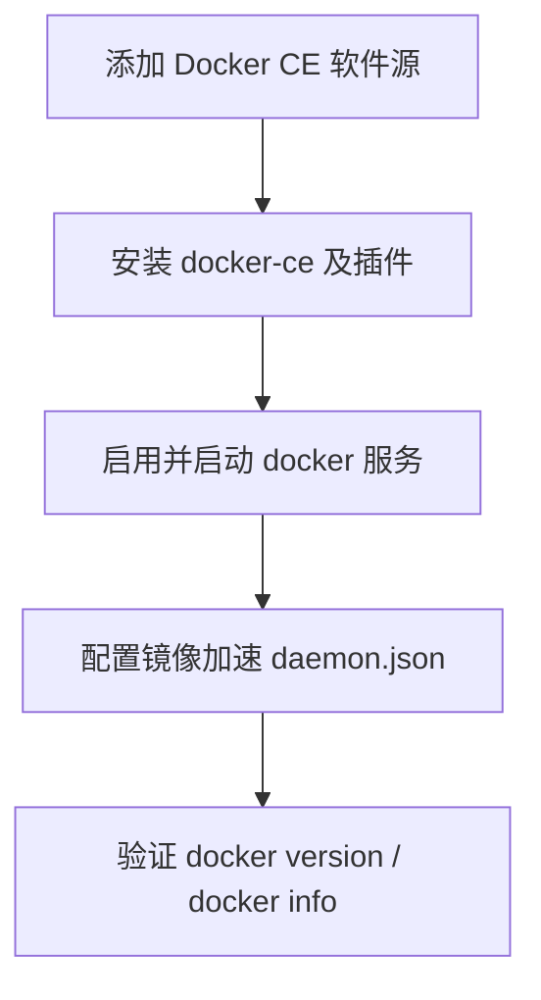

# Docker Installation and Common Commands

Docker CE 的安装（RHEL 系与 Ubuntu）、镜像加速配置，以及容器/镜像日常运维常用命令速查。

> 官方安装文档：
> - RHEL 系：<https://docs.docker.com/engine/install/centos/>
> - Ubuntu：<https://docs.docker.com/engine/install/ubuntu/>
>
> 提示：CentOS Linux 7/8 均已 EOL（CentOS 8 于 2021-12-31、CentOS 7 于 2024-06-30 停止维护）。本文的 `yum/dnf` 安装步骤对整个 RHEL 兼容家族通用，生产环境建议使用 **Rocky Linux / AlmaLinux / CentOS Stream** 等替代发行版。

---

## 安装流程概览



## 一、RHEL 系安装（Rocky / AlmaLinux / CentOS Stream）

### 1. 安装前置工具

```bash
yum install -y yum-utils
```

> 旧文档中的 `device-mapper-persistent-data`、`lvm2` 仅用于已废弃的 `devicemapper` 存储驱动。现代 Docker 默认使用 `overlay2`，无需再安装这两个包。

### 2. 添加软件源

官方源：

```bash
yum-config-manager --add-repo https://download.docker.com/linux/centos/docker-ce.repo
```

国内可改用阿里云镜像源加速：

```bash
yum-config-manager --add-repo https://mirrors.aliyun.com/docker-ce/linux/centos/docker-ce.repo
```

### 3. 安装 Docker CE 及官方插件

```bash
yum -y install docker-ce docker-ce-cli containerd.io docker-buildx-plugin docker-compose-plugin
```

> `docker-compose-plugin` 提供 Compose V2（`docker compose` 子命令），一并安装可避免后续再单独装 Compose。

### 4. 设置开机自启并启动

```bash
systemctl enable docker
systemctl start docker
```

## 二、Ubuntu 安装

使用官方仓库安装（推荐，始终获取最新版本）：

```bash
# 1. 安装前置依赖
apt-get update
apt-get install -y ca-certificates curl

# 2. 添加 Docker 官方 GPG key
install -m 0755 -d /etc/apt/keyrings
curl -fsSL https://download.docker.com/linux/ubuntu/gpg -o /etc/apt/keyrings/docker.asc
chmod a+r /etc/apt/keyrings/docker.asc

# 3. 添加软件源
echo \
  "deb [arch=$(dpkg --print-architecture) signed-by=/etc/apt/keyrings/docker.asc] \
  https://download.docker.com/linux/ubuntu $(. /etc/os-release && echo "$VERSION_CODENAME") stable" \
  | tee /etc/apt/sources.list.d/docker.list > /dev/null

# 4. 安装
apt-get update
apt-get install -y docker-ce docker-ce-cli containerd.io docker-buildx-plugin docker-compose-plugin
```

## 三、配置镜像加速

编辑 `/etc/docker/daemon.json`：

```bash
vim /etc/docker/daemon.json
```

```json
{
  "registry-mirrors": [
    "https://docker.mirrors.ustc.edu.cn"
  ]
}
```

重新加载并重启：

```bash
systemctl daemon-reload
systemctl restart docker
docker info
```

> **注意：** 国内公共镜像加速器可用性经常变动，部分（如网易 `hub-mirror.c.163.com`）已停止服务。请以当前实际可用地址为准，或使用自建 registry / 企业内网代理。

---

## 常用命令速查

### 查看版本与信息

```bash
docker version
docker info
```

### 运行容器

常用参数说明：

| 参数 | 说明 |
|------|------|
| `-d` | 后台运行 |
| `-p 主机端口:容器端口` | 端口映射 |
| `-v 主机目录:容器目录` | 目录挂载（数据持久化） |
| `-v /etc/localtime:/etc/localtime` | 容器与宿主机使用相同时间 |
| `-e KEY=VALUE` | 设置环境变量 |
| `--name` | 指定容器别名 |
| `-u 0` | 覆盖容器内置账号，`0` 表示 root |
| `--restart=always` | 无论何时退出都自动重启（可用 `docker update --restart=always <容器>` 补设） |
| `--privileged=true` | 授予容器管理员权限 |
| `-it` | `-i` 交互模式 + `-t` 分配伪终端，用于进入交互式 shell |

示例（Jenkins）：

```bash
docker run -d \
  -p 8082:8080 -p 50000:50000 \
  -v /opt/local/jenkins:/var/jenkins_home \
  -v /etc/localtime:/etc/localtime \
  -e JAVA_OPTS=-Duser.timezone=Asia/Shanghai \
  --restart=always --privileged=true \
  --name jenkins -u 0 \
  jenkins/jenkins:lts
```

示例（以基础镜像常驻运行，配合 `-it` 防止自动退出）：

```bash
docker run -d -it \
  -p 8010:8010 \
  -v /etc/localtime:/etc/localtime \
  --restart=always --privileged=true \
  --name base-util -u 0 \
  rockylinux:9 /bin/bash
```

### 停止 / 重启容器

`-t` 为优雅关闭的等待秒数（默认 10s），超时未关闭则强制 kill，用于容器保存自身状态：

```bash
docker stop -t 10 <容器ID或名称>
docker restart -t 10 <容器ID或名称>
```

### 进入容器 shell

```bash
docker exec -it <容器ID或名称> /bin/bash
```

### 查看日志

```bash
# 查看全部日志
docker logs <容器名称>

# 最近 30 分钟
docker logs --since 30m <容器ID>

# 某时间之后
docker logs -t --since "2024-08-02T13:23:37" <容器ID>

# 某时间段
docker logs -t --since "2024-08-02T13:23:37" --until "2024-08-03T12:23:37" <容器ID>
```

### 删除容器 / 镜像

```bash
docker rm -f <容器ID>
docker rmi -f <镜像ID>
```

### 使用 Dockerfile 构建镜像

`-f` 指定 Dockerfile，`-t` 指定名称与标签，`.` 表示构建上下文为当前目录：

```bash
docker build -f ganglia.dockerfile -t alpine:test .
```

> Dockerfile 编写详见 [Dockerfile Guide](dockerfile-guide.md)。

### 将容器提交为镜像

`-a` 提交人，`-m` 提交信息，`-c` 使用 Dockerfile 指令，`-p` 提交时暂停容器：

```bash
docker commit -a "Marshal" -m "base-util" base-util base-util:latest
```

### 登录镜像仓库

```bash
docker login --username=<账号> ccr.ccs.tencentyun.com
```

### 拉取 / 标记 / 推送镜像

```bash
# 拉取镜像
docker pull nginx:1.27

# 本地重命名（打 tag）
docker tag nginx:1.27 registry.example.com/base/nginx:1.27

# 推送到远端仓库
docker push registry.example.com/base/nginx:1.27
```

### 容器诊断与排障

```bash
# 查看容器详细元数据（挂载、网络、启动参数等）
docker inspect <容器ID或名称>

# 实时查看容器资源使用
docker stats
docker stats <容器ID或名称>

# 查看容器内进程
docker top <容器ID或名称>

# 宿主机与容器间拷贝文件
docker cp ./app.conf <容器ID或名称>:/etc/app/app.conf
docker cp <容器ID或名称>:/var/log/app.log ./app.log
```

### 清理磁盘与无用资源

```bash
# 查看 Docker 磁盘占用明细
docker system df

# 清理停止的容器、悬空镜像、未使用网络、构建缓存
docker system prune

# 同时清理未被任何容器使用的镜像（谨慎）
docker system prune -a

# 分类型清理（按需）
docker image prune
docker container prune
docker network prune
docker volume prune
```

> `prune` 系列命令具有删除性，建议先在测试环境验证，或先用 `docker system df` 评估后再执行。

### 常见运行增强参数

```bash
# 从文件批量加载环境变量
docker run --env-file .env --name app -d myapp:latest

# 在运行中的容器里以指定用户执行命令
docker exec -u root -it <容器ID或名称> /bin/bash
```

### 自定义格式输出容器列表

以表格形式输出 `NAMES` 与 `IMAGE`，制表符分隔：

```bash
docker ps --format "table {{.Names}}\t{{.Image}}"
```

---

> 知识截止 2026-07-20，安装步骤与包名以 Docker 官方文档为准。
