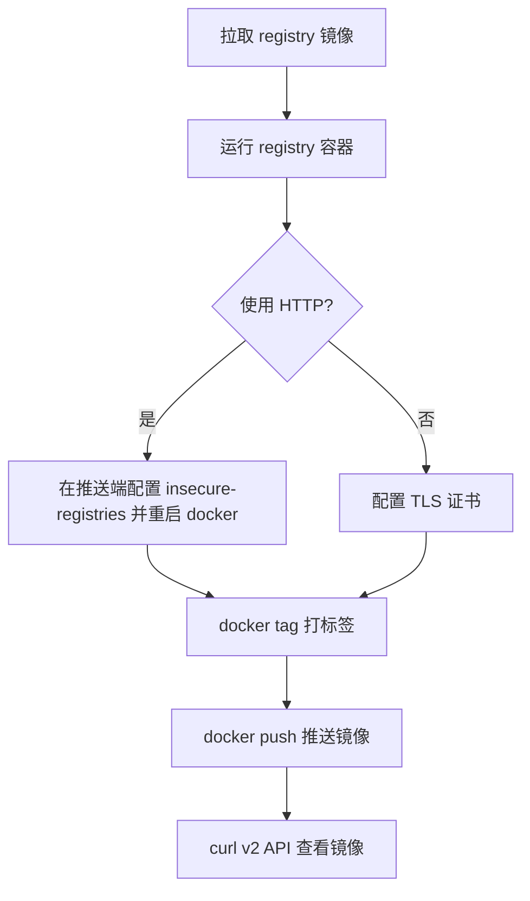

# Docker Registry and Nexus Deployment

使用 Docker 搭建私有镜像仓库（Registry）与私有制品库（Nexus3）的部署与使用说明。

---

## 一、私有镜像仓库 Registry

> 官方镜像：<https://hub.docker.com/_/registry>

### 部署流程



### 1. 拉取镜像

```bash
docker pull registry:2
```

> 推荐显式使用 `registry:2` 标签；`latest` 当前也指向 2.x 系列。

### 2. 运行容器

```bash
docker run -itd \
  -v /opt/local/registry:/var/lib/registry \
  -p 5000:5000 \
  --restart=always \
  --name registry \
  registry:2
```

参数说明：

| 参数 | 说明 |
|------|------|
| `-itd` | 后台运行并保留伪终端 |
| `-v` | 将宿主机目录绑定到容器内镜像存储目录 `/var/lib/registry`，实现数据持久化 |
| `-p` | 端口映射，访问宿主机 `5000` 即访问 registry 服务 |
| `--restart=always` | 容器异常退出后自动重启 |
| `--name registry` | 容器命名 |

### 3. 配置 insecure-registries（HTTP 场景）

若 registry 未启用 TLS，需在**每台推送/拉取的机器**上配置 `/etc/docker/daemon.json`：

```json
{
  "insecure-registries": [
    "10.130.161.19:5000"
  ]
}
```

配置后重启 Docker：

```bash
systemctl restart docker
```

> 生产环境建议为 registry 配置 TLS 证书并启用鉴权（`htpasswd`），而非长期使用 HTTP + insecure。

### 4. 推送镜像

先给镜像打上带仓库地址的标签，再推送：

```bash
# 打标签
docker tag jenkins/jenkins:lts 10.130.161.19:5000/jenkins

# 推送
docker push 10.130.161.19:5000/jenkins
```

### 5. 查看仓库中的镜像

```bash
# 列出所有镜像仓库
curl http://10.130.161.19:5000/v2/_catalog

# 查看某镜像的所有 tag
curl http://10.130.161.19:5000/v2/jenkins/tags/list
```

---

## 二、私有制品库 Nexus3

> 官方文档：<https://help.sonatype.com/en/download.html>
> Docker 镜像：<https://hub.docker.com/r/sonatype/nexus3>

### 1. 拉取镜像

```bash
docker pull sonatype/nexus3:latest
```

### 2. 准备数据目录并授权

Nexus 容器内以 UID `200` 运行，挂载的数据目录需赋予该用户写权限：

```bash
mkdir -p /opt/docker_data/nexus/nexus-data
chown -R 200:200 /opt/docker_data/nexus/nexus-data
```

> 原笔记使用 `chmod 777` 可临时解决写权限问题，但按运行 UID `200` 精确授权（`chown`）更安全、规范。

### 3. 运行容器

```bash
docker run -d \
  -p 8881:8081 \
  --name nexus \
  --restart always \
  -v /opt/docker_data/nexus/nexus-data:/nexus-data \
  sonatype/nexus3
```

### 4. 获取初始密码

初始用户名为 `admin`，初始密码位于数据目录下的 `admin.password`：

```bash
cat /opt/docker_data/nexus/nexus-data/admin.password
```

首次登录后会强制修改密码，随后该文件会被删除。

---

> 知识截止 2026-07-20，镜像标签与运行 UID 以官方文档为准。
