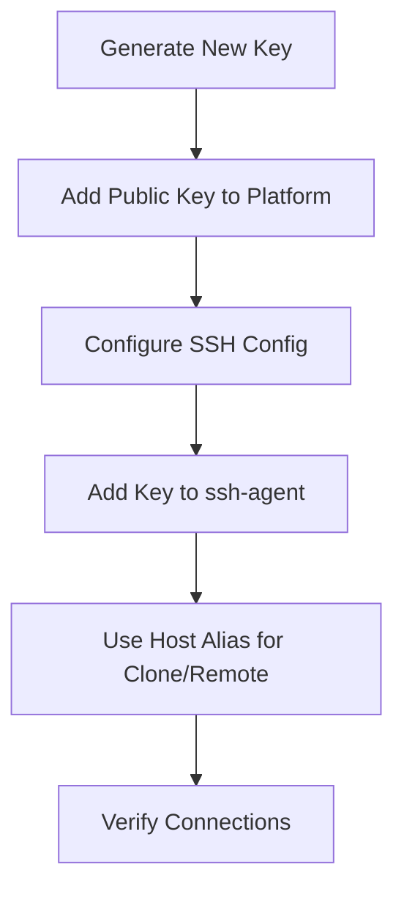

# Git Multiple SSH Keys

Configure multiple SSH keys for different Git accounts on one machine (Windows & Mac).

---

## Setup Flow



## Step 1: Generate New Key

```bash
ssh-keygen -t ed25519 -C "second@example.com" -f ~/.ssh/id_second
```

| Flag | Purpose |
|------|---------|
| `-t ed25519` | Ed25519 algorithm (short key, high security, fast) |
| `-C` | Comment, usually your email |
| `-f` | Output filename, avoids overwriting existing keys |

Example:

```bash
ssh-keygen -t ed25519 -C "xxxxx@gmail.com" -f ~/.ssh/id_xxxxx
```

## Step 2: Add Public Key to GitHub/GitLab

```bash
cat ~/.ssh/id_xxxxx.pub
```

Copy the output and paste it into **Settings > SSH Keys** on your Git platform.

## Step 3: Configure SSH Config

Edit `~/.ssh/config` (create if it doesn't exist):

```ssh-config
# Primary account
Host github.com
  HostName github.com
  User git
  IdentityFile ~/.ssh/id_ed25519

# Second account
Host github-second
  HostName github.com
  User git
  IdentityFile ~/.ssh/id_xxxxx
```

## Step 4: Add Key to ssh-agent

### Mac

```bash
eval "$(ssh-agent -s)"
ssh-add ~/.ssh/id_xxxxx
```

Add `AddKeysToAgent yes` to `~/.ssh/config` for automatic loading.

### Windows (PowerShell as Administrator)

```powershell
Get-Service ssh-agent | Set-Service -StartupType Automatic
Start-Service ssh-agent
ssh-add $env:USERPROFILE\.ssh\id_xxxxx
ssh-add -l  # Verify loaded keys
```

> Keys added via Windows OpenSSH service persist across reboots.

## Step 5: Usage

Clone using the Host alias defined in config:

```bash
git clone git@github-second:username/repo.git
```

Update remote for existing repos:

```bash
git remote set-url origin git@github-second:username/repo.git
```

## Step 6: Verify

```bash
ssh -T git@github.com          # Primary account
ssh -T git@github-second       # Second account
```
