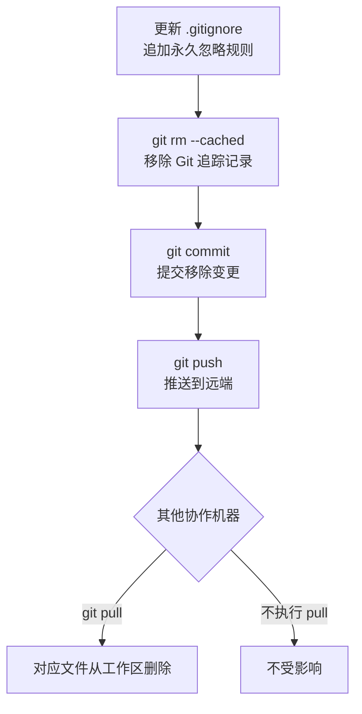

# Git Remove Wrongly Committed Files

已推送的提交中误入了不该入库的文件，如何在不破坏历史的前提下将其移除，并保留本地文件。

---

## 操作流程



---

## 背景

某次提交将不应入库的文件（如编辑器本地配置、未稳定的资源文件）一并提交并推送。
希望先将这些文件从版本库移除，待内容稳定后再重新提交。

**为什么不用 `git rebase` 或 `git reset --hard` + force push？**

已推送的提交进行历史改写（force push）会影响所有基于该提交的分支和协作者，风险高。
更安全的做法是**新增一个提交**向前撤销，不改写已有历史。

---

## Step 1: 更新 .gitignore

将**确定永久不入库**的文件或目录追加到对应 `.gitignore`。

```bash
# 示例：编辑器本地配置目录
# Editor/project local configs (not meant for VCS)
.creator/
settings/
```

> 只有加入 `.gitignore` 的路径，后续 `git add` 才不会再误收录。
> 如果某些文件只是**暂时** untrack（后续内容稳定还要重新提交），则跳过此步，
> 直接进入 Step 2，不加 `.gitignore` 规则。

---

## Step 2: 移除 Git 追踪记录

`git rm --cached` 只删除 Git 的追踪记录，**不删除本地磁盘文件**。

```bash
# 移除整个目录下所有文件的追踪
git rm --cached -r <目录路径>/

# 移除单个文件的追踪
git rm --cached <文件路径>
```

执行后 `git status` 显示这些文件处于暂存区的 `deleted` 状态，但本地文件仍在。

| 命令 | 本地文件 | Git 追踪 |
|------|---------|---------|
| `git rm --cached` | 保留 | 移除 |
| `git rm` | 删除 | 移除 |

> **对其他机器的影响：** `git rm --cached` 在提交历史中记录的是"删除这些文件"。
> 其他机器执行 `git pull` 后，**本地对应文件会被自动删除**。
> 因此，需要保留文件的机器应先完成本操作再推送，其他机器 pull 后即自动清理。

---

## Step 3: 提交变更

```bash
git commit -m "[Remove][Module]Untrack files pending stabilization"
```

---

## Step 4: 推送到远端

```bash
git push origin <branch>
```

---

## Step 5: 验证

```bash
# 确认新提交在顶端
git log --oneline -3

# 应返回空，表示该目录下无追踪文件
git ls-files <目录路径>/

# 本地文件应仍然存在
ls <目录路径>/
```

---

## 后续重新提交

文件内容稳定后，重新入库的方式取决于是否加了 `.gitignore`：

```bash
# 情况一：文件已在 .gitignore 中，需先删除对应规则，或强制添加
git add -f <文件路径>

# 情况二：文件未加入 .gitignore，直接 add
git add <文件路径>

git commit -m "[Add][Module]Re-track stabilized files"
git push origin <branch>
```

> 重新提交后，其他机器执行 `git pull` 会将这些文件重新拉取到本地。
