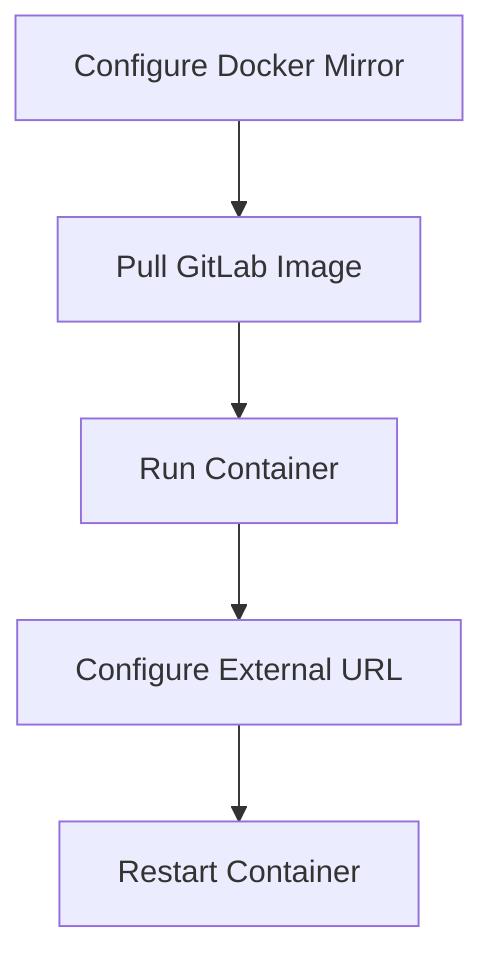

# GitLab Docker Deployment

Deploy GitLab CE using Docker and Docker Compose.

---

## Prerequisites

- Docker installed
- Ports 8443, 8880, 8822 available

## Deployment Flow



## Step 1: Configure Docker Mirror (Optional)

Speed up image pulling by adding a mirror registry:

```bash
vim /etc/docker/daemon.json
```

```json
{
    "registry-mirrors": ["https://docker.mirrors.ustc.edu.cn"]
}
```

Restart Docker:

```bash
systemctl restart docker.service
```

## Step 2: Pull GitLab Image

```bash
docker pull gitlab/gitlab-ce
```

## Step 3: Run GitLab Container

### Option A: Docker Run

```bash
docker run -d \
  -p 8443:443 \
  -p 8880:8880 \
  -p 8822:22 \
  --name gitlab-ce \
  --restart always \
  -v /etc/localtime:/etc/localtime \
  -v /opt/local/docker_data/gitlab/config:/etc/gitlab \
  -v /opt/local/docker_data/gitlab/logs:/var/log/gitlab \
  -v /opt/local/docker_data/gitlab/data:/var/opt/gitlab \
  gitlab/gitlab-ce
```

### Option B: Docker Compose

```yaml
services:
  gitlab:
    image: gitlab/gitlab-ce:latest
    container_name: gitlab-ce
    restart: always
    hostname: 'gitlab.example.com'
    environment:
      TZ: 'Asia/Shanghai'
      GITLAB_OMNIBUS_CONFIG: |
        # Put any other gitlab.rb configuration here, each on its own line
        external_url 'https://gitlab.example.com'
    ports:
      - "8443:443"
      - "8880:8880"
      - "8822:22"
    volumes:
      - /opt/docker_data/gitlab/config:/etc/gitlab
      - /opt/docker_data/gitlab/logs:/var/log/gitlab
      - /opt/docker_data/gitlab/data:/var/opt/gitlab
    shm_size: '256m'
```

```bash
docker compose up -d
```

> `shm_size` 用于加大共享内存，GitLab 官方 Compose 示例建议设置为 `256m`，避免部分组件因共享内存不足报错。`GITLAB_OMNIBUS_CONFIG` 可直接内联 `gitlab.rb` 配置，免去手动改文件后 reconfigure。

## Step 4: Configure External URL

The default URL uses the container hostname (container ID), which needs to be changed:

```bash
vim config/gitlab.rb
```

```ruby
external_url 'http://10.130.161.21:8880'
gitlab_rails['gitlab_ssh_host'] = '10.130.161.21'
gitlab_rails['gitlab_shell_ssh_port'] = 8822
```

> **Note:** `gitlab_shell_ssh_port` must match the host-mapped SSH port, otherwise external SSH clone will not work.

## Step 5: Apply Configuration

Restart the container:

```bash
docker restart gitlab-ce
```

Or reload configuration inside the container:

```bash
gitlab-ctl reconfigure
```

## Step 6: First Login

初始用户名为 `root`，初始密码保存在容器内 `/etc/gitlab/initial_root_password`：

```bash
docker exec -it gitlab-ce cat /etc/gitlab/initial_root_password
```

> 该文件在容器首次启动约 24 小时后会被自动清除，请尽快登录并修改密码。

## Backup and Restore

创建备份（备份文件默认位于 `/var/opt/gitlab/backups`）：

```bash
docker exec -t gitlab-ce gitlab-backup create
```

恢复备份：

```bash
docker exec -it gitlab-ce gitlab-backup restore
```

> **版本差异：** GitLab 12.2 起使用 `gitlab-backup create/restore`；12.1 及更早版本使用旧命令 `gitlab-rake gitlab:backup:create` / `gitlab-rake gitlab:backup:restore`。备份仅包含仓库与数据库，`/etc/gitlab` 下的配置与密钥需另行备份。

## Firewall (Ubuntu ufw, Optional)

若宿主机启用了 ufw 防火墙，需放行对外端口：

```bash
sudo ufw enable
sudo ufw allow 8880
sudo ufw allow 8443
sudo ufw allow 8822
```
