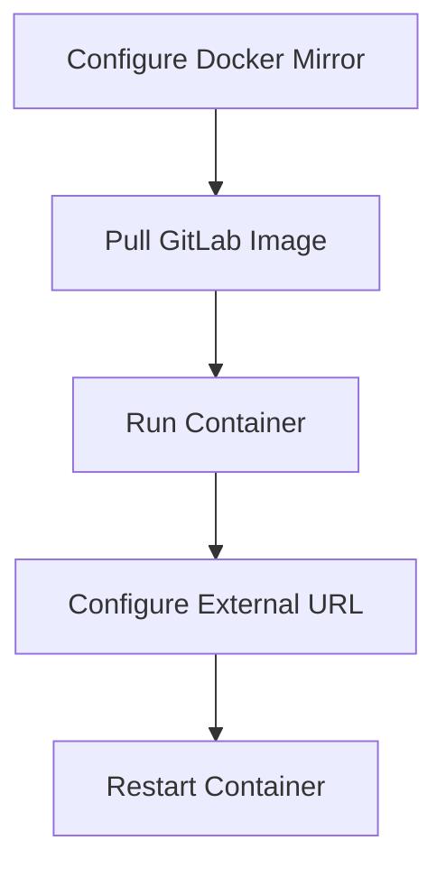

# GitLab Docker Deployment

Deploy GitLab CE using Docker and Docker Compose.

---

## Prerequisites

- Docker installed
- Ports 8443, 8880, 8822 available

## Deployment Flow



## Step 1: Configure Docker Mirror (Optional)

Speed up image pulling by adding a mirror registry:

```bash
vim /etc/docker/daemon.json
```

```json
{
    "registry-mirrors": ["https://docker.mirrors.ustc.edu.cn"]
}
```

Restart Docker:

```bash
systemctl restart docker.service
```

## Step 2: Pull GitLab Image

```bash
docker pull gitlab/gitlab-ce
```

## Step 3: Run GitLab Container

### Option A: Docker Run

```bash
docker run -d \
  -p 8443:443 \
  -p 8880:8880 \
  -p 8822:22 \
  --name gitlab-ce \
  --restart always \
  -v /etc/localtime:/etc/localtime \
  -v /opt/local/docker_data/gitlab/config:/etc/gitlab \
  -v /opt/local/docker_data/gitlab/logs:/var/log/gitlab \
  -v /opt/local/docker_data/gitlab/data:/var/opt/gitlab \
  gitlab/gitlab-ce
```

### Option B: Docker Compose

```yaml
version: '2'
services:
  gitlab-ce:
    image: gitlab/gitlab-ce
    restart: always
    ports:
      - "8443:443"
      - "8880:8880"
      - "8822:22"
      - "465:465"
    container_name: gitlab-ce
    volumes:
      - /opt/docker_data/gitlab/config:/etc/gitlab
      - /opt/docker_data/gitlab/logs:/var/log/gitlab
      - /opt/docker_data/gitlab/data:/var/opt/gitlab
    environment:
      - TZ=Asia/Shanghai
```

```bash
docker-compose -f docker-compose.yml up -d
```

## Step 4: Configure External URL

The default URL uses the container hostname (container ID), which needs to be changed:

```bash
vim config/gitlab.rb
```

```ruby
external_url 'http://10.130.161.21:8880'
gitlab_rails['gitlab_ssh_host'] = '10.130.161.21'
gitlab_rails['gitlab_shell_ssh_port'] = 8822
```

> **Note:** `gitlab_shell_ssh_port` must match the host-mapped SSH port, otherwise external SSH clone will not work.

## Step 5: Apply Configuration

Restart the container:

```bash
docker restart gitlab-ce
```

Or reload configuration inside the container:

```bash
gitlab-ctl reconfigure
```
