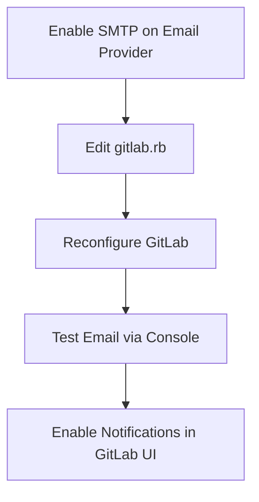
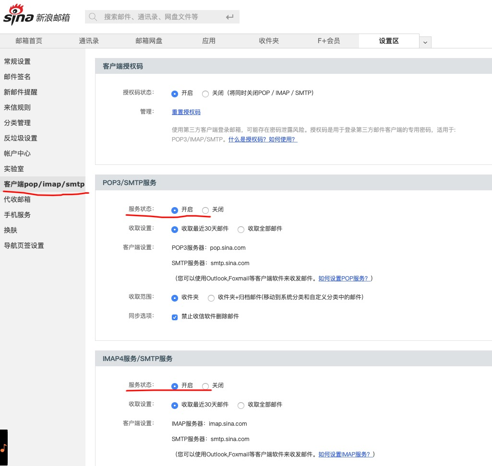
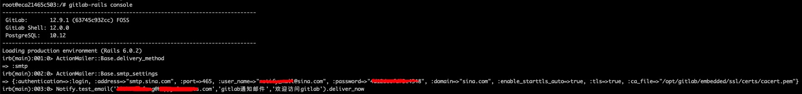
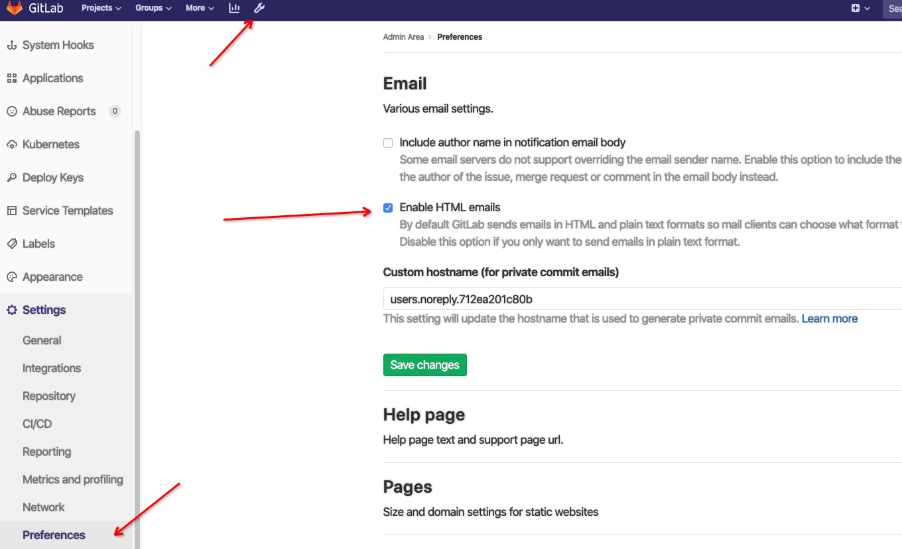
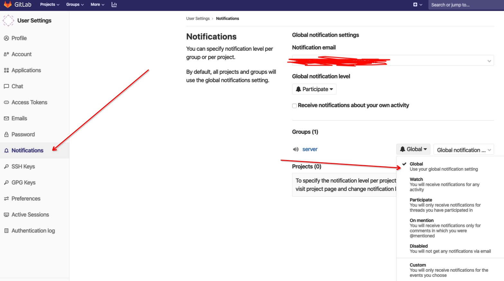
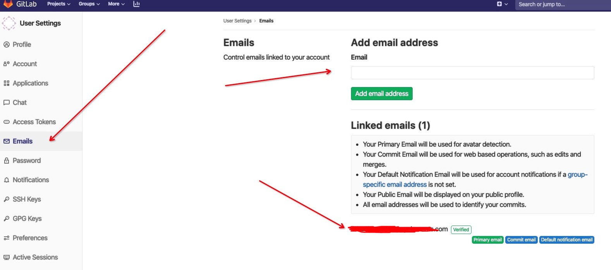

# GitLab SMTP Configuration

Configure SMTP email notifications for GitLab.

---

## Configuration Flow



## Step 1: Enable SMTP on Email Provider

Using Sina Mail as an example: enable SMTP service in the email settings. Record the authorization code shown during activation (it will not be displayed again).



## Step 2: Edit GitLab Configuration

```bash
vim /etc/gitlab/gitlab.rb
```

Sina Mail SMTP settings:

```ruby
gitlab_rails['smtp_enable'] = true
gitlab_rails['smtp_address'] = "smtp.sina.com"
gitlab_rails['smtp_port'] = 465
gitlab_rails['smtp_user_name'] = "XXXX@sina.com"
gitlab_rails['smtp_password'] = "abcdefg"  # Authorization code
gitlab_rails['smtp_domain'] = "sina.com"
gitlab_rails['smtp_authentication'] = "login"
gitlab_rails['smtp_enable_starttls_auto'] = true
gitlab_rails['smtp_tls'] = true  # Required when port is 465

user["git_user_email"] = "XXXX@sina.com"
gitlab_rails['gitlab_email_from'] = 'XXXX@sina.com'
```

> **Important:** `smtp_user_name`, `git_user_email`, and `gitlab_email_from` must be the same address.

For other email providers, refer to [GitLab SMTP Settings](https://docs.gitlab.com/omnibus/settings/smtp.html).

> **Note on 163 Mail:** Only legacy password-based accounts work. Newer accounts using authorization codes will fail unless you CC yourself on every email.

## Step 3: Reconfigure GitLab

```bash
gitlab-ctl reconfigure
```

## Step 4: Test Email Sending

Enter the GitLab Rails console:

```bash
gitlab-rails console
```

Verify settings:

```ruby
ActionMailer::Base.delivery_method
ActionMailer::Base.smtp_settings
```



Send test email:

```ruby
Notify.test_email('XXX@sina.com', 'GitLab Notification', 'Welcome to GitLab').deliver_now
```

If it fails, the error message will be displayed in the console.

## Step 5: Enable Notifications in GitLab

1. Enable email in GitLab admin settings:



2. Configure user notification preferences:



