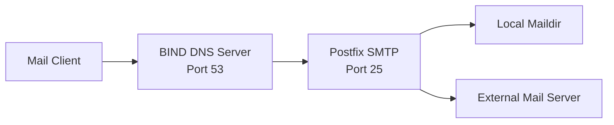
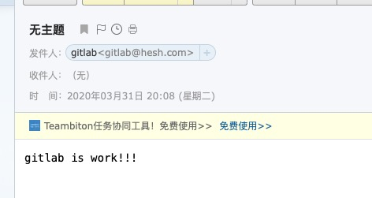

# Postfix Mail Server Setup

Build a Postfix mail system with DNS (BIND) on CentOS 7.

---

## Architecture Overview



---

## Part 1: DNS Configuration (BIND)

### Step 1: Install BIND

```bash
yum -y install bind bind-utils
```

### Step 2: Edit named.conf

```bash
vim /etc/named.conf
```

```conf
options {
    listen-on port 53 { 10.130.161.21; };
    listen-on-v6 port 53 { ::1; };
    directory       "/var/named";
    dump-file       "/var/named/data/cache_dump.db";
    statistics-file "/var/named/data/named_stats.txt";
    memstatistics-file "/var/named/data/named_mem_stats.txt";
    recursing-file  "/var/named/data/named.recursing";
    secroots-file   "/var/named/data/named.secroots";
    allow-query     { any; };
};
```

### Step 3: Add Zone Configuration

```bash
vim /etc/named.rfc1912.zones
```

Add forward and reverse zones:

```conf
# Forward zone
zone "hesh.com" IN {
    type master;
    file "hesh.com.zone";
    allow-update { none; };
};

# Reverse zone
zone "161.130.10.in-addr.arpa" IN {
    type master;
    file "hesh.com.local";
    allow-update { none; };
};
```

### Step 4: Create Zone Data Files

```bash
cd /var/named/
cp -p named.localhost hesh.com.zone
cp -p named.localhost hesh.com.local
```

> **Note:** Use `cp -p` to preserve file permissions.

Edit forward zone:

```bash
vim hesh.com.zone
```

```dns
$TTL 1D
@       IN SOA  @ rname.invalid. (
                    0       ; serial
                    1D      ; refresh
                    1H      ; retry
                    1W      ; expire
                    3H )    ; minimum
        NS      mail.hesh.com.
        MX 10   mail.hesh.com.
mail    IN A    10.130.161.21
```

Edit reverse zone:

```bash
vim hesh.com.local
```

```dns
$TTL 1D
@       IN SOA  hesh.com rname.invalid. (
                    0       ; serial
                    1D      ; refresh
                    1H      ; retry
                    1W      ; expire
                    3H )    ; minimum
        NS      mail.hesh.com.
        MX 10   mail.hesh.com.
10      PTR     mail.hesh.com.
```

### Step 5: Configure Resolver

```bash
vim /etc/resolv.conf
```

```conf
nameserver 10.130.161.21
```

### Step 6: Verify and Start

```bash
named-checkconf
systemctl start named
systemctl enable named
nslookup mail.hesh.com
```

---

## Part 2: Postfix Configuration

### Step 1: Edit Postfix Config

```bash
vim /etc/postfix/main.cf
```

```conf
myhostname = mail.hesh.com
mydomain = hesh.com
myorigin = $mydomain
inet_interfaces = 10.130.161.21, 127.0.0.1
mydestination = $myhostname, $mydomain, localhost
local_recipient_maps =
home_mailbox = Maildir/
```

> **Important:** `local_recipient_maps =` (empty value) is required for the inbox to function correctly.

Verify and restart:

```bash
postfix check
systemctl restart postfix
```

### Step 2: Create Test Accounts

```bash
groupadd mailusers
useradd -g mailusers -s /sbin/nologin gitlab
passwd gitlab
useradd -g mailusers -s /sbin/nologin gitlabInbox
passwd gitlabInbox
```

### Step 3: Test Email Sending

```bash
telnet mail.hesh.com 25
```

```
220 mail.hesh.com ESMTP Postfix
helo mail.hesh.com
250 mail.hesh.com
mail from:gitlab@hesh.com
250 2.1.0 Ok
rcpt to:user@example.com
250 2.1.5 Ok
data
354 End data with <CR><LF>.<CR><LF>
gitlab is work!!!
.
250 2.0.0 Ok: queued as 1526B18460
quit
221 2.0.0 Bye
```

Email received:


