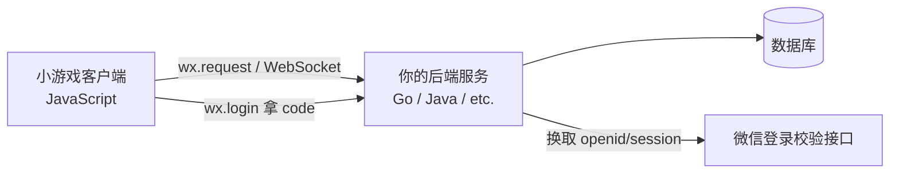

# WeChat Mini Game: Zero to Game Development Framework

一份从零开始构建微信小游戏可复用框架的完整教程——完成本教程后，你可以直接进入游戏逻辑开发，无需再关心任何微信平台本身的框架接入代码。

> **目标读者：** 具备基础 JavaScript 知识、零小游戏开发经验的开发者（若你来自 Java 等强类型后端背景，请先读 [1.6 写给 Java 开发者的 JS 注意点](#16-写给-java-开发者的-js-注意点)）。
> **产出物：** 一个可直接用于生产环境的项目骨架，包含游戏循环、Canvas 渲染、触摸输入、音频管理、资源加载、场景管理和屏幕适配——全部开箱即用，只需填充游戏内容即可。
> **开发环境：** macOS 14 (Sonoma) + Intel MacBook Pro，或 Windows 11 + 微信开发者工具。本教程对两个平台均给出步骤。

---

## 1. 准备工作

### 1.1 开发环境

本教程同时覆盖 **macOS** 与 **Windows 11** 两套环境。框架代码与游戏逻辑完全跨平台，差异只集中在第 1 章的「下载哪个安装包、如何解除系统拦截、Node.js 怎么装、项目路径怎么写」这几点。

| 项目 | macOS | Windows |
|------|-------|---------|
| **硬件** | MacBook Pro（Intel 或 Apple Silicon） | 任意 x64 PC |
| **操作系统** | macOS 14 (Sonoma) 及以上 | Windows 11（Windows 10 亦可） |
| **IDE** | 微信开发者工具（macOS 版） | 微信开发者工具（Windows 64 版） |
| **代码编辑器** | VS Code（推荐） | VS Code（推荐） |

> 💡 **关于微信开发者工具的版本选择：**
> - **Intel Mac（如 2018 款 MacBook Pro）** → 下载 **macOS x64** 版本。
> - **Apple Silicon Mac（M1/M2/M3）** → 下载 **macOS ARM64** 版本。
> - **Windows 11** → 下载 **Windows 64** 版本。
>
> 💡 在 2018 款 Intel MacBook Pro 上，开发者工具的模拟器可能偏慢；建议尽早用「预览 → 手机扫码」在真机上测试，体验更顺畅（见 [13.1](#131-本地测试)）。

### 1.2 账号注册

1. 访问 [微信公众平台](https://mp.weixin.qq.com/) 注册一个**小程序**账号（如果可选类别中有"小游戏"则直接选，否则先注册小程序再添加小游戏）。
2. 注册完成后，进入 **开发 → 开发设置** 获取你的 **AppID**（格式：`wxXXXXXXXXXXXXXXXX`）。
3. （可选但推荐）在 **成员管理** 中将自己添加为开发者。

### 1.3 微信开发者工具安装

无论哪个平台，安装包都来自同一个 [官方下载页面](https://developers.weixin.qq.com/minigame/dev/devtools/download.html)——按 [1.1](#11-开发环境) 的说明选对应版本即可。

#### macOS（含 2018 款 Intel MacBook Pro）

1. 下载 **macOS x64** 版本（Apple Silicon 则下 ARM64）。
2. 打开下载的 `.dmg` 文件，将 `wechatwebdevtools.app` 拖入 `/Applications`。
3. 首次启动时，macOS Gatekeeper 可能会阻止该应用：
   ```
   "wechatwebdevtools.app" cannot be opened because it is from an unidentified developer.
   ```
   **推荐修复方法：** 前往 **系统设置 → 隐私与安全性**，向下滚动找到被拦截的提示，点击旁边的 **"仍要打开"**。这是最安全、最稳妥的方式。
   ```bash
   # 仅当上述方法无效时，对该应用单独移除隔离属性（只影响这一个 App，安全）：
   xattr -cr /Applications/wechatwebdevtools.app
   ```
   > ⚠️ 切勿使用 `sudo spctl --master-disable` 全局关闭 Gatekeeper——它会让系统接受任何来源的应用，存在安全风险，且在较新的 macOS 上已被移除/失效。只针对单个 App 用 `xattr -cr` 即可。

#### Windows 11

1. 下载 **Windows 64** 版本（`.exe` 安装包）。
2. 双击 `.exe`，按向导完成安装（默认安装路径即可）。
3. 首次运行若被 **Microsoft Defender SmartScreen** 拦截，提示"Windows 已保护你的电脑"：点击 **"更多信息" → "仍要运行"** 即可。
   > ⚠️ Windows 上**没有** Gatekeeper，也**不需要** `xattr` / `spctl` 这类命令——那是 macOS 专属，在 Windows 里执行无意义。

#### 共同步骤（两平台一致）

4. 启动开发者工具，用微信**扫码登录**。
5. 创建新项目：
   - 项目类型选择 **小游戏**
   - 选择项目目录（见下方路径建议）
   - 填入你的 AppID（或点击"测试号"按钮，仅用于本地开发）
   - 模板选择 **空白模板（不使用云开发）**——即纯 JavaScript 空项目，无引擎负担、完全可控。我们随后会用本教程的骨架替换掉自动生成的示例代码。

> ⚠️ **重要：项目路径不要包含中文、空格或特殊字符（两平台通用）。**
> - macOS 示例：`~/Documents/Projects/minigame/`
> - Windows 示例：`D:\projects\minigame\`（Windows 没有 `~` 家目录写法，请用盘符绝对路径；注意分隔符是反斜杠 `\`）

### 1.4 Node.js（可选但推荐）

如果你计划使用打包工具（esbuild / webpack / rollup，例如第 10 节的浏览器调试）或游戏引擎 CLI（Cocos Creator、LayaAir），需要安装 Node.js。**仅在微信开发者工具内开发本框架则无需 Node.js**。

**macOS（通过 Homebrew，推荐）：**

```bash
brew install node@20
```

**Windows 11（任选其一）：**

```powershell
# 方式一：从官网 https://nodejs.org 下载 LTS 安装包（.msi），双击安装
# 方式二：用 winget（Win11 自带）
winget install OpenJS.NodeJS.LTS
# 方式三：用 Chocolatey
choco install nodejs-lts
```

安装后**两平台通用**地验证（在 macOS 终端或 Windows PowerShell / cmd 中均可）：

```bash
node -v   # ≥ 20.x
npm -v    # ≥ 10.x
```

### 1.5 预备知识检查

在开始之前，请确保你理解以下概念：
- ES6+ JavaScript（模块、类、箭头函数、Promise）
- HTML5 Canvas 2D 基础（context、绘制、变换）
- 游戏循环的基本概念（`requestAnimationFrame`）

### 1.6 写给 Java 开发者的 JS 注意点

如果你有丰富的 Java 经验、JS 经验较少，本框架代码里有 5 个**高频且对 Java 直觉反常**的写法，提前了解可避免大量困惑：

| JS 写法 | 在 Java 里的对照 / 为什么这样写 |
|---------|------------------------------|
| `const that = this;` | Java 的 `this` 在方法内永远稳定；JS 里 `this` 取决于**函数被怎样调用**，在回调（如 `forEach`、定时器）内部会丢失。先把它存进 `that`，回调里就能继续访问到对象本身。 |
| `this._onTap = this._onTap.bind(this)` | Java 方法引用（`this::onTap`）自带绑定；JS 不会。把方法作为回调传出去前必须 `bind(this)`，否则回调触发时 `this` 会变成 `undefined`，访问 `this.xxx` 直接报错。 |
| `require(...)` / `module.exports = ...` | 相当于 Java 的 `import` 与"导出"。CommonJS 模块里：`module.exports` 决定这个文件对外暴露什么；`require('./X')` 拿到的就是对方 `module.exports` 的值。 |
| `_bgm`、`_onTap` 下划线命名 | Java 有 `private` 关键字真正限制访问；JS 的下划线**只是约定**，表示"这是内部成员，请勿外部调用"，语言层面**并不**阻止你访问。 |
| 无类型声明、`class` 里无 `private/final` | JS 是动态类型，变量不写类型；`class` 语法看着像 Java，但没有访问修饰符、没有重载、字段默认全是公开的。把它当成"带语法糖的对象"即可。 |

> 💡 Canvas 绘图模型也和 Java2D（`Graphics2D`）思路接近：都是"取得一个绘图上下文 `ctx`，调用 `fillRect`/`arc`/`fillText` 往上画"，区别在于游戏每帧都要**先清屏再重画**（本框架已在 `Game._render()` 里统一处理）。

---

## 2. 理解微信小游戏运行时

### 2.1 它与浏览器的区别

微信小游戏运行在 **JavaScript 引擎**（iOS 用 JavaScriptCore，Android 用 V8）上，**而非浏览器**。这意味着：

| 标准浏览器环境 | 微信小游戏环境 |
|----------------|------------------|
| `document.createElement('canvas')` | `wx.createCanvas()` |
| `new Image()` | `wx.createImage()` |
| `new Audio()` | `wx.createInnerAudioContext()` |
| `window.requestAnimationFrame` | 全局 `requestAnimationFrame()`（无 `wx.` 前缀） |
| `localStorage.getItem()` | `wx.getStorageSync()` |
| `XMLHttpRequest` / `fetch` | `wx.request()` |
| `addEventListener('touchstart')` | `wx.onTouchStart()` |

**核心认知：** 微信小游戏运行时没有 DOM、没有 `window`、没有 `document`。适配器层的作用就是抹平这些差异。

> ⚠️ **特别注意：微信小游戏没有 `wx.requestAnimationFrame`。** 官方只提供**全局**的 `requestAnimationFrame()` / `cancelAnimationFrame()`（无 `wx.` 前缀），由 `wx.createCanvas()` 创建主 Canvas 后注入到全局。这是网上大量过时教程的高频错误——调用 `wx.requestAnimationFrame` 会抛 `wx.requestAnimationFrame is not a function`，导致游戏循环根本跑不起来。本教程的适配器直接复用全局 `requestAnimationFrame`，**切勿**用一个包装它的函数去覆盖它。

### 2.2 生命周期

```
应用启动
    │
    ▼
wx.onShow()  ← 游戏进入前台时触发
    │
    ▼
[游戏循环运行中]
    │
    ▼
wx.onHide()  ← 游戏进入后台时触发（务必在此暂停游戏！）
    │
    ▼
[游戏挂起]  ← 用户返回时重新触发 onShow
```

关键原则：你**必须**在 `onShow` / `onHide` 中正确地暂停/恢复游戏，否则游戏切到后台后计时器和音频会出现问题。

### 2.3 适配器层（weapp-adapter）

微信官方提供了一个参考适配器实现，用于模拟浏览器 API。它**不**属于基础库的一部分——你需要将它包含到自己的项目中。在本教程中，我们会内置一个精简但功能完整的适配器。

---

## 3. 项目初始化

### 3.1 创建项目

打开微信开发者工具 → 新建项目 → 选择 **小游戏**（非小程序）。

模板选择：**空白模板（不使用云开发）**（推荐——纯 JavaScript 空项目，无引擎负担，完全掌控）。

创建后，开发者工具会自动生成几个文件，典型如下：

```
game.js                # 入口文件（自动生成，内含示例代码）
game.json              # 运行时配置（自动生成）
project.config.json    # 项目配置（自动生成，appid 等字段已自动填好）
```

接下来按这个原则改造成本教程的骨架（对照 [3.2](#32-项目结构) 的目录树）：

1. **`game.js`**：**整段替换**为本教程 [第 7 节](#7-入口文件gamejs) 的内容（删掉自动生成的示例代码）。
2. **`game.json`**：用 [3.3](#33-配置文件) 的内容**整段替换**。
3. **`project.config.json`**：**只改不覆盖**——`appid`、`projectname` 是工具按你创建项目时的选择自动写好的，**不要手敲覆盖**；只需对照 [3.3](#33-配置文件) 补齐 `setting`、`compileType` 等字段即可。
4. **新建目录与文件**：`src/core/`、`src/scenes/`、`src/utils/`、`src/libs/`、`res/images/`、`res/sounds/` 这些目录**需要你手动创建**（开发者工具左侧资源管理器右键即可新建文件夹/文件），再把第 4～9 节的各 `.js` 逐个放进对应位置。

> 💡 来自 Java/IDEA 的习惯：这里没有 Maven/Gradle 那样的脚手架命令，目录结构是手动搭的。建好后开发者工具会自动编译，保存即热更新。

### 3.2 项目结构

以下是我们将构建的完整项目骨架：

```
your-game/
├── game.js                       # 入口文件——启动整个游戏
├── game.json                     # 小游戏运行时配置
├── project.config.json           # 开发者工具项目配置
├── src/
│   ├── core/
│   │   ├── Game.js               # 主游戏类（生命周期 + 游戏循环）
│   │   ├── SceneManager.js       # 场景生命周期管理
│   │   ├── InputManager.js       # 触摸事件归一化处理
│   │   ├── ResourceLoader.js     # 资源加载与缓存
│   │   ├── AudioManager.js       # 音效与背景音乐
│   │   └── ScreenAdapter.js      # 屏幕/DPI 适配
│   ├── scenes/
│   │   ├── LoadingScene.js       # 初始加载界面
│   │   ├── MenuScene.js          # 主菜单
│   │   └── GameScene.js          # 你的游戏场景（在此扩展）
│   ├── utils/
│   │   ├── utils.js              # 数学辅助函数、精灵绘制工具
│   │   └── constants.js          # 游戏常量
│   └── libs/
│       └── weapp-adapter.js      # 精简适配器层
├── res/                          # 游戏资源
│   ├── images/
│   ├── sounds/
│   └── fonts/
└── index.html                    # 本地浏览器预览（仅调试用）
```

### 3.3 配置文件

**`game.json`**——小游戏运行时配置：

```json
{
  "deviceOrientation": "portrait",
  "showStatusBar": false,
  "networkTimeout": {
    "request": 5000,
    "connectSocket": 5000,
    "uploadFile": 10000,
    "downloadFile": 10000
  },
  "subpackages": []
}
```

- `deviceOrientation`：`"portrait"`（竖屏）或 `"landscape"`（横屏）。本教程的设计分辨率（750×1334）和所有场景均为**竖屏**，因此这里必须填 `"portrait"`，与代码保持一致。
- `showStatusBar`：设为 `false` 以获得全屏游戏体验

> ⚠️ 不要凭空添加 `"workers": "workers"`——该字段仅在项目里**确实存在** `workers/` 多线程目录时才填写，否则微信会因找不到对应目录而报错。本框架不使用 Worker，故省略此字段。同理，`requiredBackgroundModes: ["audio"]` 仅用于**需要切到后台仍持续播放音频**的场景（如音乐类 App）；普通游戏切后台应暂停音频，因此这里也不需要它。

**`project.config.json`**——开发者工具配置：

```json
{
  "description": "My Mini Game",
  "compileType": "minigame",
  "libVersion": "widelyUsed",
  "appid": "wxXXXXXXXXXXXXXXXX",
  "projectname": "my-minigame",
  "setting": {
    "es6": true,
    "enhance": true,
    "postcss": true,
    "minified": true,
    "urlCheck": true,
    "autoAudits": false,
    "compileHotReLoad": true,
    "useStaticServer": true,
    "bigPackageSizeSupport": true,
    "ignoreUploadUnusedFiles": true
  },
  "staticServerOptions": {
    "servePath": "./"
  },
  "condition": {
    "minigame": {
      "current": -1,
      "list": []
    }
  }
}
```

> ⚠️ `compileType` 必须是 `"minigame"`，**不能**是 `"game"` 或 `"miniprogram"`。`libVersion` **不能**填写 `"game"`——应使用 `"widelyUsed"` 或具体版本号如 `"2.32.3"`。

---

## 4. 适配器层

创建 `src/libs/weapp-adapter.js`。这个精简适配器将微信 API 映射为游戏代码所期望的标准浏览器风格 API。

```javascript
// ============================================================
// src/libs/weapp-adapter.js
// Minimal Browser API adapter for WeChat Mini Game runtime.
// Injects global: canvas, document, window, Image, Audio,
// XMLHttpRequest, localStorage, requestAnimationFrame
// ============================================================

// --- System info ---
// 注意：wx.getSystemInfoSync 在新基础库中已标记为「不推荐」，但仍可正常使用；
// 如需更细粒度可改用 wx.getWindowInfo() / wx.getDeviceInfo() / wx.getAppBaseInfo()。
const systemInfo = wx.getSystemInfoSync();

// --- 捕获真正的全局 requestAnimationFrame ---
// 微信小游戏没有 wx.requestAnimationFrame，只有全局 requestAnimationFrame。
// 必须先把它存下来，后面注入全局时才不会用包装函数把它覆盖成死循环/未定义。
const _raf = requestAnimationFrame;
const _caf = cancelAnimationFrame;

// --- Canvas ---
const canvas = wx.createCanvas();
canvas.requestAnimationFrame = function(cb) { return _raf(cb); };
canvas.cancelAnimationFrame = function(id) { _caf(id); };

// --- Window simulation ---
const _window = {
  innerWidth: systemInfo.windowWidth,
  innerHeight: systemInfo.windowHeight,
  devicePixelRatio: systemInfo.pixelRatio,
  requestAnimationFrame: function(cb) { return _raf(cb); },
  cancelAnimationFrame: function(id) { _caf(id); },
  performance: { now: () => Date.now() },
  location: { href: '', protocol: 'https:', host: '' },
  navigator: {
    userAgent: systemInfo.system || '',
    platform: systemInfo.platform || 'ios',
    appVersion: systemInfo.version || '',
    language: systemInfo.language || 'zh_CN'
  },
  addEventListener: function() {},
  removeEventListener: function() {},
  AudioContext: null,
  URL: { createObjectURL: function() { return ''; }, revokeObjectURL: function() {} }
};

// --- document simulation ---
const _document = {
  createElement: function(tagName) {
    tagName = tagName.toLowerCase();
    if (tagName === 'canvas') {
      const c = wx.createCanvas();
      c.getBoundingClientRect = () => ({ top: 0, left: 0, width: c.width, height: c.height });
      c.addEventListener = function() {};
      return c;
    }
    if (tagName === 'img' || tagName === 'image') return wx.createImage();
    if (tagName === 'audio') {
      return {
        play: function() {},
        pause: function() {},
        load: function() {},
        addEventListener: function() {},
        removeEventListener: function() {},
      };
    }
    return {};
  },
  createElementNS: function(ns, tagName) { return _document.createElement(tagName); },
  body: {
    appendChild: function() {},
    removeChild: function() {},
    clientWidth: systemInfo.windowWidth,
    clientHeight: systemInfo.windowHeight,
  },
  documentElement: {
    clientWidth: systemInfo.windowWidth,
    clientHeight: systemInfo.windowHeight,
  },
  addEventListener: function() {},
  removeEventListener: function() {},
  createEvent: function() { return {}; },
};

// --- Image constructor ---
function _Image() {
  const img = wx.createImage();
  return img;
}

// --- Audio constructor ---
function _Audio(src) {
  const audio = wx.createInnerAudioContext();
  if (src) audio.src = src;
  return audio;
}

// --- XMLHttpRequest ---
function _XMLHttpRequest() {
  const that = this;
  this.UNSENT = 0;
  this.OPENED = 1;
  this.HEADERS_RECEIVED = 2;
  this.LOADING = 3;
  this.DONE = 4;
  this.readyState = 0;
  this.status = 0;
  this.response = null;
  this.responseText = '';
  this.responseType = '';
  this._method = 'GET';
  this._url = '';
  this._headers = {};
  this._callbacks = {};
  this._requestTask = null;

  this.addEventListener = function(type, cb) {
    if (!that._callbacks[type]) that._callbacks[type] = [];
    that._callbacks[type].push(cb);
  };
  this._fire = function(type, e) {
    const cbs = that._callbacks[type] || [];
    cbs.forEach(function(cb) { cb.call(that, e || {}); });
    if (typeof that['on' + type] === 'function') that['on' + type](e || {});
  };
  this.open = function(method, url) {
    that._method = method.toUpperCase();
    that._url = url;
    that.readyState = that.OPENED;
    that._fire('readystatechange');
  };
  this.setRequestHeader = function(k, v) { that._headers[k] = v; };
  this.send = function(data) {
    if (/^https?:\/\//.test(that._url)) {
      // Network request
      that._requestTask = wx.request({
        url: that._url,
        method: that._method,
        header: that._headers,
        data: data,
        responseType: that.responseType === 'arraybuffer' ? 'arraybuffer' : 'text',
        success: function(res) {
          that.status = res.statusCode;
          that.response = res.data;
          that.responseText = typeof res.data === 'object' ? JSON.stringify(res.data) : String(res.data);
          that.readyState = that.DONE;
          that._fire('readystatechange');
          that._fire('load');
        },
        fail: function(err) {
          that.status = 0;
          that.readyState = that.DONE;
          that._fire('readystatechange');
          that._fire('error');
        }
      });
    } else {
      // Local file read via file system
      const fs = wx.getFileSystemManager();
      fs.readFile({
        filePath: that._url,
        success: function(res) {
          that.status = 200;
          that.response = res.data;
          that.responseText = typeof res.data === 'object' ? JSON.stringify(res.data) : String(res.data);
          that.readyState = that.DONE;
          that._fire('readystatechange');
          that._fire('load');
        },
        fail: function() {
          that.status = 404;
          that.readyState = that.DONE;
          that._fire('readystatechange');
          that._fire('error');
        }
      });
    }
  };
  this.abort = function() {
    if (that._requestTask) that._requestTask.abort();
  };
}

// --- localStorage ---
const _localStorage = {
  get length() {
    const info = wx.getStorageInfoSync();
    return info.keys ? info.keys.length : 0;
  },
  getItem: function(key) {
    const val = wx.getStorageSync(key);
    // Fix WeChat bug: empty string returned instead of null for missing key
    return val === '' ? null : val;
  },
  setItem: function(key, value) {
    wx.setStorageSync(key, String(value));
  },
  removeItem: function(key) {
    wx.removeStorageSync(key);
  },
  clear: function() {
    wx.clearStorageSync();
  },
  key: function(index) {
    const info = wx.getStorageInfoSync();
    return (info.keys && info.keys[index]) || null;
  }
};

// --- WebSocket ---
const _WebSocket = function(url) {
  const ws = { url: url, readyState: 0 };
  const socket = wx.connectSocket({ url: url });
  socket.onOpen(function() { ws.readyState = 1; if (ws.onopen) ws.onopen({}); });
  socket.onMessage(function(res) { if (ws.onmessage) ws.onmessage({ data: res.data }); });
  socket.onClose(function() { ws.readyState = 3; if (ws.onclose) ws.onclose({}); });
  socket.onError(function(err) { if (ws.onerror) ws.onerror(err); });
  ws.send = function(data) { socket.send({ data: data }); };
  ws.close = function() { socket.close(); };
  return ws;
};

// --- Inject globals ---
globalThis.canvas = canvas;
globalThis.document = _document;
globalThis.window = _window;
globalThis.Image = _Image;
globalThis.Audio = _Audio;
globalThis.XMLHttpRequest = _XMLHttpRequest;
globalThis.WebSocket = _WebSocket;
globalThis.localStorage = _localStorage;
globalThis.navigator = _window.navigator;
globalThis.location = _window.location;
// 用捕获到的原生全局 rAF/cAF 重新挂回 globalThis，保持其为真实实现，
// 不要在这里挂 _window.requestAnimationFrame（那只是同一函数的包装，无意义且易出错）。
globalThis.requestAnimationFrame = _raf;
globalThis.cancelAnimationFrame = _caf;

module.exports = {
  canvas: canvas,
  document: _document,
  window: _window,
  Image: _Image,
  Audio: _Audio,
  XMLHttpRequest: _XMLHttpRequest,
  localStorage: _localStorage,
  WebSocket: _WebSocket
};
```

> **注意：** 以上适配器是精简但功能完整的版本，足以满足纯 Canvas 2D 游戏开发的需求。如果要在生产环境中使用第三方引擎（PixiJS、Three.js），建议参考微信官方提供的 [weapp-adapter 参考实现](https://developers.weixin.qq.com/minigame/dev/guide/runtime/env/adapter.html)（官方文档「适配器」章节）获取功能更完整的版本。

---

## 5. 核心框架模块

### 5.1 屏幕适配器（`src/core/ScreenAdapter.js`）

负责处理设备像素比缩放、设计分辨率映射和安全区域计算。

```javascript
// ============================================================
// src/core/ScreenAdapter.js
// Unified screen adaptation for all device sizes & DPI levels
// ============================================================

class ScreenAdapter {
  /**
   * @param {number} designWidth  - Design base width (logical px)
   * @param {number} designHeight - Design base height (logical px)
   */
  constructor(designWidth, designHeight) {
    const info = wx.getSystemInfoSync();

    this.designWidth = designWidth;
    this.designHeight = designHeight;
    this.windowWidth = info.windowWidth;
    this.windowHeight = info.windowHeight;
    this.pixelRatio = info.pixelRatio || 1;
    this.platform = info.platform;
    this.isIOS = info.system && info.system.indexOf('iOS') >= 0;
    this.safeArea = info.safeArea || { top: 0, bottom: this.windowHeight, left: 0, right: this.windowWidth };

    // Scale factor: design resolution → actual window
    this.scaleX = this.windowWidth / this.designWidth;
    this.scaleY = this.windowHeight / this.designHeight;
    this.scale = Math.min(this.scaleX, this.scaleY);

    // Get menu button rect for top-right capsule avoidance
    try {
      const menuRect = wx.getMenuButtonBoundingClientRect();
      this.menuRect = menuRect;
      this.capsuleTop = menuRect.top;
      this.capsuleBottom = menuRect.bottom;
      this.capsuleHeight = menuRect.height;
    } catch (e) {
      this.menuRect = null;
      this.capsuleTop = 0;
      this.capsuleBottom = 32;
      this.capsuleHeight = 32;
    }

    // Orientation
    this.isLandscape = this.windowWidth > this.windowHeight;
  }

  /** Setup the main canvas for high-DPI rendering */
  setupCanvas(canvas) {
    const dpr = this.pixelRatio;
    canvas.width = this.windowWidth * dpr;
    canvas.height = this.windowHeight * dpr;
    const ctx = canvas.getContext('2d');
    ctx.scale(dpr, dpr);
    return ctx;
  }

  /** Convert design X coordinate to actual X */
  dx(x) { return x * this.scaleX; }
  /** Convert design Y coordinate to actual Y */
  dy(y) { return y * this.scaleY; }
  /** Convert design size to actual size */
  ds(s) { return s * this.scale; }

  /** Get center point of screen */
  get centerX() { return this.windowWidth / 2; }
  get centerY() { return this.windowHeight / 2; }
}

module.exports = ScreenAdapter;
```

### 5.2 输入管理器（`src/core/InputManager.js`）

将触摸事件归一化为干净的游戏接口。支持点按、滑动和多点触控。

```javascript
// ============================================================
// src/core/InputManager.js
// Touch event normalization & gesture detection
// ============================================================

class InputManager {
  constructor(canvas) {
    this.canvas = canvas;
    this._callbacks = {};

    // Current touch state
    this.touchX = 0;
    this.touchY = 0;
    this.isTouching = false;
    this.touchCount = 0;

    // Swipe detection
    this._touchStartX = 0;
    this._touchStartY = 0;
    this._touchStartTime = 0;

    // Bind handlers
    this._onTouchStart = this._onTouchStart.bind(this);
    this._onTouchMove = this._onTouchMove.bind(this);
    this._onTouchEnd = this._onTouchEnd.bind(this);

    wx.onTouchStart(this._onTouchStart);
    wx.onTouchMove(this._onTouchMove);
    wx.onTouchEnd(this._onTouchEnd);
  }

  _onTouchStart(e) {
    this.isTouching = true;
    this.touchCount = e.touches.length;
    if (e.touches.length > 0) {
      this.touchX = e.touches[0].clientX;
      this.touchY = e.touches[0].clientY;
      this._touchStartX = this.touchX;
      this._touchStartY = this.touchY;
      this._touchStartTime = Date.now();
    }
    this._fire('touchstart', e);
  }

  _onTouchMove(e) {
    if (e.touches.length > 0) {
      this.touchX = e.touches[0].clientX;
      this.touchY = e.touches[0].clientY;
    }
    this._fire('touchmove', e);
  }

  _onTouchEnd(e) {
    this.isTouching = false;
    this.touchCount = 0;

    // Detect swipe
    const dx = this.touchX - this._touchStartX;
    const dy = this.touchY - this._touchStartY;
    const dt = Date.now() - this._touchStartTime;
    const dist = Math.sqrt(dx * dx + dy * dy);

    if (dist > 30 && dt < 300) {
      // Determine direction
      if (Math.abs(dx) > Math.abs(dy)) {
        const dir = dx > 0 ? 'right' : 'left';
        this._fire('swipe', { direction: dir, dx, dy, dist });
      } else {
        const dir = dy > 0 ? 'down' : 'up';
        this._fire('swipe', { direction: dir, dx, dy, dist });
      }
    } else if (dist < 10 && dt < 500) {
      this._fire('tap', { x: this.touchX, y: this.touchY });
    }

    this._fire('touchend', e);
  }

  /** Register event listener */
  on(event, callback) {
    if (!this._callbacks[event]) this._callbacks[event] = [];
    this._callbacks[event].push(callback);
  }

  /** Remove event listener */
  off(event, callback) {
    if (!this._callbacks[event]) return;
    const idx = this._callbacks[event].indexOf(callback);
    if (idx >= 0) this._callbacks[event].splice(idx, 1);
  }

  _fire(event, data) {
    const cbs = this._callbacks[event] || [];
    cbs.forEach(function(cb) { cb(data); });
  }

  /** Clean up event listeners */
  destroy() {
    wx.offTouchStart(this._onTouchStart);
    wx.offTouchMove(this._onTouchMove);
    wx.offTouchEnd(this._onTouchEnd);
    this._callbacks = {};
  }
}

module.exports = InputManager;
```

### 5.3 资源加载器（`src/core/ResourceLoader.js`）

提供基于 Promise 的资源加载系统，支持进度追踪。

```javascript
// ============================================================
// src/core/ResourceLoader.js
// Promise-based asset loading with progress events
// ============================================================

class ResourceLoader {
  constructor() {
    this._images = {};   // Image cache
    this._audios = {};   // Audio config cache (paths, not instances)
    this._loaded = 0;
    this._total = 0;
    this._onProgress = null;
    this._onComplete = null;
  }

  /**
   * Load image assets
   * @param {Object} manifest  - { key: 'res/images/sprite.png', ... }
   * @returns {Promise}
   */
  loadImages(manifest) {
    const keys = Object.keys(manifest);
    this._total += keys.length;
    const that = this;

    const promises = keys.map(function(key) {
      return new Promise(function(resolve, reject) {
        const img = wx.createImage();
        img.src = manifest[key];
        img.onload = function() {
          that._images[key] = img;
          that._loaded++;
          that._notify();
          resolve(img);
        };
        img.onerror = function(err) {
          console.warn('Failed to load image:', key, manifest[key], err);
          that._loaded++;
          that._notify();
          resolve(null); // Don't reject — continue loading
        };
      });
    });

    return Promise.all(promises);
  }

  /**
   * Register audio assets (audio is streamed, not preloaded)
   * @param {Object} manifest  - { key: 'res/sounds/bgm.mp3', ... }
   */
  registerAudios(manifest) {
    Object.keys(manifest).forEach(function(key) {
      this._audios[key] = manifest[key];
    }, this);
  }

  _notify() {
    const progress = this._total > 0 ? this._loaded / this._total : 1;
    if (this._onProgress) this._onProgress(progress);
    if (this._loaded >= this._total && this._onComplete) {
      this._onComplete();
    }
  }

  /** Get a loaded image by key */
  getImage(key) {
    return this._images[key] || null;
  }

  /** Get audio path by key (AudioManager handles playback) */
  getAudioPath(key) {
    return this._audios[key] || null;
  }

  onProgress(callback) { this._onProgress = callback; }
  onComplete(callback) { this._onComplete = callback; }

  get progress() {
    return this._total > 0 ? this._loaded / this._total : 1;
  }
}

module.exports = ResourceLoader;
```

### 5.4 音频管理器（`src/core/AudioManager.js`）

统一管理背景音乐和音效，内置 iOS 自动播放限制的解决方案。

```javascript
// ============================================================
// src/core/AudioManager.js
// BGM + SFX management with iOS audio unlock
// ============================================================

class AudioManager {
  constructor() {
    this._bgm = null;            // Background music instance
    this._bgmPath = '';
    this._sfxPool = {};          // Pool of reusable SFX instances
    this._muted = false;
    this._bgmVolume = 0.6;
    this._sfxVolume = 0.8;
    this._audioUnlocked = true; // 现代微信基础库通常无需手动解锁，保留开关以便按需扩展

    // 注册一次全局音频中断恢复监听（不要放在 playBGM 里，否则会重复注册导致泄漏）
    const that = this;
    wx.onAudioInterruptionEnd(function() {
      if (that._bgm && that._bgmPaused) {
        that._bgm.play();
        that._bgmPaused = false;
      }
    });
    this._bgmPaused = false;
  }

  /** Play background music (loops automatically) */
  playBGM(path, volume) {
    if (volume === undefined) volume = this._bgmVolume;
    if (this._bgm && this._bgmPath === path) {
      // Same BGM — resume if paused
      if (this._bgm.paused) this._bgm.play();
      return;
    }
    this.stopBGM();
    this._bgm = wx.createInnerAudioContext();
    this._bgm.src = path;
    this._bgm.loop = true;
    this._bgm.volume = this._muted ? 0 : volume;
    this._bgm.play();
    this._bgmPath = path;
    this._bgmPaused = false;
    // 音频中断（来电等）的恢复逻辑已在构造函数中统一注册，无需在此重复注册。
  }

  /** Pause background music */
  pauseBGM() {
    if (this._bgm) {
      this._bgm.pause();
      this._bgmPaused = true;
    }
  }

  /** Resume background music if it was paused */
  resumeBGM() {
    if (this._bgm && this._bgmPaused) {
      this._bgm.play();
      this._bgmPaused = false;
    }
  }

  /** Stop and destroy background music */
  stopBGM() {
    if (this._bgm) {
      this._bgm.stop();
      this._bgm.destroy();
      this._bgm = null;
      this._bgmPath = '';
    }
  }

  /** Play a one-shot sound effect */
  playSFX(path, volume) {
    if (volume === undefined) volume = this._sfxVolume;
    const audio = wx.createInnerAudioContext();
    audio.src = path;
    audio.volume = this._muted ? 0 : volume;
    audio.loop = false;
    audio.play();
    audio.onEnded(function() { audio.destroy(); });
    audio.onError(function() { audio.destroy(); });
    return audio;
  }

  /** Toggle mute for all audio */
  setMuted(muted) {
    this._muted = muted;
    if (this._bgm) {
      this._bgm.volume = muted ? 0 : this._bgmVolume;
    }
  }

  get isMuted() { return this._muted; }

  setBGMVolume(v) {
    this._bgmVolume = v;
    if (this._bgm && !this._muted) this._bgm.volume = v;
  }

  setSFXVolume(v) {
    this._sfxVolume = v;
  }
}

module.exports = AudioManager;
```

### 5.5 场景管理器（`src/core/SceneManager.js`）

管理游戏场景，提供生命周期钩子：`onEnter`、`onUpdate`、`onRender`、`onExit`。

```javascript
// ============================================================
// src/core/SceneManager.js
// Scene lifecycle management
// ============================================================

class SceneManager {
  constructor() {
    this._scenes = {};
    this._currentScene = null;
    this._currentSceneName = '';
  }

  /**
   * Register a scene
   * @param {string} name   - Scene identifier
   * @param {object} scene  - Scene object with onEnter/onUpdate/onRender/onExit hooks
   */
  register(name, scene) {
    this._scenes[name] = scene;
  }

  /**
   * Switch to a different scene
   * @param {string} name  - Target scene name
   * @param {object} data  - Optional data to pass to the new scene
   */
  switchTo(name, data) {
    if (!this._scenes[name]) {
      console.error('Scene not found:', name);
      return;
    }
    // Exit current scene
    if (this._currentScene && this._currentScene.onExit) {
      this._currentScene.onExit();
    }
    // Enter new scene
    this._currentScene = this._scenes[name];
    this._currentSceneName = name;
    if (this._currentScene.onEnter) {
      this._currentScene.onEnter(data);
    }
  }

  /** Call current scene's update (logic tick) */
  update(dt) {
    if (this._currentScene && this._currentScene.onUpdate) {
      this._currentScene.onUpdate(dt);
    }
  }

  /** Call current scene's render (drawing tick) */
  render(ctx) {
    if (this._currentScene && this._currentScene.onRender) {
      this._currentScene.onRender(ctx);
    }
  }

  get currentName() { return this._currentSceneName; }
  get currentScene() { return this._currentScene; }
}

module.exports = SceneManager;
```

---

## 6. 游戏引擎（`src/core/Game.js`）

这是框架的核心——将各个子系统串联在一起。

```javascript
// ============================================================
// src/core/Game.js
// Main game class — lifecycle, game loop, subsystem wiring
// ============================================================

const ScreenAdapter = require('./ScreenAdapter');
const InputManager = require('./InputManager');
const ResourceLoader = require('./ResourceLoader');
const AudioManager = require('./AudioManager');
const SceneManager = require('./SceneManager');

class Game {
  /**
   * @param {Object} config
   *   - designWidth  {number}  Design resolution width (default: 750)
   *   - designHeight {number}  Design resolution height (default: 1334)
   *   - canvas       {Canvas}  The main canvas element
   *   - scenes       {Object}  { name: SceneClass, ... }
   *   - images       {Object}  { key: path, ... }
   *   - audios       {Object}  { key: path, ... }
   *   - initialScene {string}  First scene to load
   */
  constructor(config) {
    this.config = Object.assign({
      designWidth: 750,
      designHeight: 1334,
      scenes: {},
      images: {},
      audios: {},
      initialScene: 'menu', // 加载完成后进入的首个场景，切勿设为 'loading'
    }, config);

    // Canvas & context
    this.canvas = config.canvas;
    this.adapter = new ScreenAdapter(this.config.designWidth, this.config.designHeight);

    // Initialize rendering context with hi-DPI support
    this.ctx = this.adapter.setupCanvas(this.canvas);

    // Subsystems
    this.input = new InputManager(this.canvas);
    this.resource = new ResourceLoader();
    this.audio = new AudioManager();
    this.scene = new SceneManager();

    // Timing
    this._lastTime = 0;
    this._running = false;
    this._paused = false;
    this._rafId = null;

    // Register scenes from config
    const that = this;
    Object.keys(this.config.scenes).forEach(function(name) {
      that.scene.register(name, new that.config.scenes[name](that));
    });

    // Bind lifecycle
    this._bindLifecycle();
  }

  /** Bind WeChat mini game lifecycle events */
  _bindLifecycle() {
    const that = this;

    // Game enters foreground — RESUME
    wx.onShow(function(options) {
      console.log('[Game] onShow', options);
      that._paused = false;
      // 重置计时基准，避免后台停留期间累积出一个超大 dt
      that._lastTime = Date.now();
      that.audio.resumeBGM();
      if (that.scene.currentScene && that.scene.currentScene.onResume) {
        that.scene.currentScene.onResume();
      }
    });

    // Game goes to background — PAUSE EVERYTHING
    wx.onHide(function() {
      console.log('[Game] onHide');
      that._paused = true;
      if (that.scene.currentScene && that.scene.currentScene.onPause) {
        that.scene.currentScene.onPause();
      }
      // 通过 AudioManager 暂停，使其内部记录暂停状态，便于恢复
      that.audio.pauseBGM();
    });

    // Audio interruption (phone calls) — 中断结束后的恢复由 AudioManager 统一处理
    wx.onAudioInterruptionBegin(function() {
      that._paused = true;
      that.audio.pauseBGM();
    });
  }

  /** Start the game — load assets, then launch first scene */
  start() {
    const that = this;

    // Show loading then switch to initial scene
    this.scene.switchTo('loading', { onComplete: function() {
      that.scene.switchTo(that.config.initialScene);
    }});

    this._running = true;
    this._lastTime = Date.now();
    this._gameLoop();
  }

  /** Main game loop (driven by requestAnimationFrame) */
  _gameLoop() {
    if (!this._running) return;

    const now = Date.now();
    let dt = (now - this._lastTime) / 1000; // Delta time in seconds

    // Cap dt to avoid spiral of death (max 100ms ~ 10 FPS floor)
    if (dt > 0.1) dt = 0.1;
    this._lastTime = now;

    // Update logic (only if not paused)
    if (!this._paused) {
      this.scene.update(dt);
    }

    // Always render (to show pause screen, etc.)
    this._render();

    const that = this;
    this._rafId = requestAnimationFrame(function() {
      that._gameLoop();
    });
  }

  /** Render pass — clear canvas, delegate to current scene */
  _render() {
    const ctx = this.ctx;
    const w = this.adapter.windowWidth;
    const h = this.adapter.windowHeight;

    // Clear entire canvas
    ctx.clearRect(0, 0, w, h);

    // Delegate to current scene
    this.scene.render(ctx);
  }

  /** Stop the game */
  stop() {
    this._running = false;
    if (this._rafId) {
      cancelAnimationFrame(this._rafId);
      this._rafId = null;
    }
  }

  /** Get info for screen adaptation */
  get screen() { return this.adapter; }
}

module.exports = Game;
```

---

## 7. 入口文件（`game.js`）

微信加载的第一个文件。它初始化适配器、创建游戏实例、注册场景、启动循环。

```javascript
// ============================================================
// game.js
// Mini game entry point
// ============================================================

// 1. Load adapter first — must come before any code that
//    references window/document/Image/canvas
require('./src/libs/weapp-adapter');

// 2. Import scenes
const LoadingScene = require('./src/scenes/LoadingScene');
const MenuScene = require('./src/scenes/MenuScene');
const GameScene = require('./src/scenes/GameScene');

// 3. Import engine core
const Game = require('./src/core/Game');

// 4. Create and configure the game
const game = new Game({
  canvas: canvas,           // Global canvas from adapter
  designWidth: 750,
  designHeight: 1334,

  // Register scenes
  scenes: {
    loading: LoadingScene,
    menu: MenuScene,
    game: GameScene,
  },

  // Asset manifest
  images: {
    logo: 'res/images/logo.png',
    background: 'res/images/background.png',
    player: 'res/images/player.png',
    // ... add your image assets here
  },

  audios: {
    bgm: 'res/sounds/bgm.mp3',
    click: 'res/sounds/click.mp3',
    jump: 'res/sounds/jump.mp3',
    // ... add your audio assets here
  },

  // 资源加载完成后进入的第一个场景。注意：不能填 'loading'，
  // 否则加载结束会再次切回加载场景，造成死循环。
  initialScene: 'menu',
});

// 5. Launch!
game.start();
```

---

## 8. 场景模板

### 8.1 加载场景（`src/scenes/LoadingScene.js`）

在资源加载期间显示进度条，加载完成后跳转到初始场景。

```javascript
// ============================================================
// src/scenes/LoadingScene.js
// Asset loading screen with progress bar
// ============================================================

class LoadingScene {
  constructor(game) {
    this.game = game;
    this.progress = 0;
    this._onComplete = null;
  }

  onEnter(data) {
    const game = this.game;
    this._onComplete = (data && data.onComplete) || null;
    this.progress = 0;
    this._done = false;
    this._delayTimer = 0;

    // Register audio first (audio is streamed, not preloaded)
    if (Object.keys(game.config.audios).length > 0) {
      game.resource.registerAudios(game.config.audios);
    }

    // Start loading assets，用 onProgress 回调驱动平滑进度条
    const that = this;
    game.resource.onProgress(function(p) { that.progress = p; });
    if (Object.keys(game.config.images).length > 0) {
      game.resource.loadImages(game.config.images).then(function() {
        that.progress = 1;
      });
    } else {
      this.progress = 1;
    }
  }

  onUpdate(dt) {
    // Check if loading is complete
    if (this.progress >= 1 && !this._done) {
      // Small delay so user sees the loading screen
      if (!this._delayTimer) this._delayTimer = 0;
      this._delayTimer += dt;
      if (this._delayTimer > 0.3) {
        this._done = true; // 只触发一次，避免每帧重复切场景
        const cb = this._onComplete;
        if (cb) cb();
      }
    }
  }

  onRender(ctx) {
    const game = this.game;
    const W = game.adapter.windowWidth;
    const H = game.adapter.windowHeight;

    // Background
    ctx.fillStyle = '#1a1a2e';
    ctx.fillRect(0, 0, W, H);

    // Title
    ctx.fillStyle = '#ffffff';
    ctx.font = 'bold 28px sans-serif';
    ctx.textAlign = 'center';
    ctx.fillText('资源加载中...', W / 2, H / 2 - 60);

    // Progress bar background
    const barW = 300;
    const barH = 20;
    const barX = (W - barW) / 2;
    const barY = H / 2 - barH / 2;

    ctx.fillStyle = '#333366';
    this._roundRect(ctx, barX, barY, barW, barH, 10);
    ctx.fill();

    // Progress bar fill
    ctx.fillStyle = '#00d4ff';
    this._roundRect(ctx, barX, barY, barW * this.progress, barH, 10);
    ctx.fill();

    // Percentage text
    ctx.fillStyle = '#aaaaaa';
    ctx.font = '14px sans-serif';
    ctx.fillText(Math.floor(this.progress * 100) + '%', W / 2, barY + 40);
  }

  /** Helper — draw rounded rectangle */
  _roundRect(ctx, x, y, w, h, r) {
    ctx.beginPath();
    ctx.moveTo(x + r, y);
    ctx.lineTo(x + w - r, y);
    ctx.arcTo(x + w, y, x + w, y + r, r);
    ctx.lineTo(x + w, y + h - r);
    ctx.arcTo(x + w, y + h, x + w - r, y + h, r);
    ctx.lineTo(x + r, y + h);
    ctx.arcTo(x, y + h, x, y + h - r, r);
    ctx.lineTo(x, y + r);
    ctx.arcTo(x, y, x + r, y, r);
    ctx.closePath();
  }

  onExit() {
    // Clean up if needed
  }
}

module.exports = LoadingScene;
```

### 8.2 菜单场景（`src/scenes/MenuScene.js`）

简单的主菜单，点击按钮开始游戏。

```javascript
// ============================================================
// src/scenes/MenuScene.js
// Main menu screen
// ============================================================

class MenuScene {
  constructor(game) {
    this.game = game;
    this._startBtn = { x: 0, y: 0, w: 200, h: 60 };
    this._pulse = 0;
  }

  onEnter(data) {
    const game = this.game;

    // Play background music
    game.audio.playBGM('res/sounds/bgm.mp3');

    // Position the start button at center
    const W = game.adapter.windowWidth;
    const H = game.adapter.windowHeight;
    this._startBtn.x = (W - this._startBtn.w) / 2;
    this._startBtn.y = H * 0.65;

    // Listen for tap
    this._onTap = this._onTap.bind(this);
    game.input.on('tap', this._onTap);
  }

  _onTap(e) {
    const btn = this._startBtn;
    if (e.x >= btn.x && e.x <= btn.x + btn.w &&
        e.y >= btn.y && e.y <= btn.y + btn.h) {
      this.game.audio.playSFX('res/sounds/click.mp3');
      this.game.scene.switchTo('game');
    }
  }

  onUpdate(dt) {
    this._pulse += dt * 3;
  }

  onRender(ctx) {
    const game = this.game;
    const W = game.adapter.windowWidth;
    const H = game.adapter.windowHeight;

    // Background gradient
    const grad = ctx.createLinearGradient(0, 0, 0, H);
    grad.addColorStop(0, '#0f0c29');
    grad.addColorStop(0.5, '#302b63');
    grad.addColorStop(1, '#24243e');
    ctx.fillStyle = grad;
    ctx.fillRect(0, 0, W, H);

    // Title
    ctx.fillStyle = '#ffffff';
    ctx.font = 'bold 48px sans-serif';
    ctx.textAlign = 'center';
    ctx.textBaseline = 'middle';
    ctx.fillText('我的小游戏', W / 2, H * 0.35);

    // Subtitle
    ctx.font = '18px sans-serif';
    ctx.fillStyle = '#aaaaaa';
    ctx.fillText('点击开始游戏', W / 2, H * 0.45);

    // Start button
    const btn = this._startBtn;
    ctx.fillStyle = '#e94560';
    ctx.shadowColor = '#e94560';
    ctx.shadowBlur = 10 + Math.sin(this._pulse) * 5;

    // Round rect button
    this._roundRect(ctx, btn.x, btn.y, btn.w, btn.h, 30);
    ctx.fill();
    ctx.shadowBlur = 0;

    // Button text
    ctx.fillStyle = '#ffffff';
    ctx.font = '24px sans-serif';
    ctx.fillText('开始游戏', btn.x + btn.w / 2, btn.y + btn.h / 2);
  }

  _roundRect(ctx, x, y, w, h, r) {
    ctx.beginPath();
    ctx.moveTo(x + r, y);
    ctx.lineTo(x + w - r, y);
    ctx.arcTo(x + w, y, x + w, y + r, r);
    ctx.lineTo(x + w, y + h - r);
    ctx.arcTo(x + w, y + h, x + w - r, y + h, r);
    ctx.lineTo(x + r, y + h);
    ctx.arcTo(x, y + h, x, y + h - r, r);
    ctx.lineTo(x, y + r);
    ctx.arcTo(x, y, x + r, y, r);
    ctx.closePath();
  }

  onExit() {
    // Unbind input listener
    this.game.input.off('tap', this._onTap);
    // Don't stop BGM — let audio persist across scenes
  }
}

module.exports = MenuScene;
```

### 8.3 游戏场景（`src/scenes/GameScene.js`）

这是你实际游戏逻辑所在的位置。以下模板展示了一个可运行的极小游戏——一个可通过触屏控制移动的玩家角色。

```javascript
// ============================================================
// src/scenes/GameScene.js
// Your game scene — extend this with your game logic!
// ============================================================

class GameScene {
  constructor(game) {
    this.game = game;

    // Game state
    this.entities = [];   // All game objects
    this.score = 0;
    this.timer = 0;
  }

  onEnter(data) {
    const game = this.game;
    const W = game.adapter.windowWidth;
    const H = game.adapter.windowHeight;

    // Reset state
    this.score = 0;
    this.timer = 0;
    this.entities = [];

    // Example: create a player entity
    this.player = {
      x: W / 2,
      y: H / 2,
      w: 40,
      h: 40,
      vx: 0,
      vy: 0,
      speed: 200,
      color: '#00ff88',
    };
    this.entities.push(this.player);

    // Bind input
    this._onTap = this._onTap.bind(this);
    this._onSwipe = this._onSwipe.bind(this);
    game.input.on('tap', this._onTap);
    game.input.on('swipe', this._onSwipe);

    // Pause button
    this._pauseBtn = { x: W - 60, y: 10, w: 50, h: 30 };

    console.log('[GameScene] Entered');
  }

  _onTap(e) {
    // Check pause button
    const btn = this._pauseBtn;
    if (e.x >= btn.x && e.x <= btn.x + btn.w &&
        e.y >= btn.y && e.y <= btn.y + btn.h) {
      this.game.scene.switchTo('menu');
      return;
    }

    // Tap to score
    this.score += 1;
    this.game.audio.playSFX('res/sounds/jump.mp3');
  }

  _onSwipe(e) {
    const speed = 300;
    if (e.direction === 'up') this.player.vy = -speed;
    if (e.direction === 'down') this.player.vy = speed;
    if (e.direction === 'left') this.player.vx = -speed;
    if (e.direction === 'right') this.player.vx = speed;
  }

  onUpdate(dt) {
    this.timer += dt;

    const game = this.game;
    const W = game.adapter.windowWidth;
    const H = game.adapter.windowHeight;

    // Update player position
    const p = this.player;
    p.x += p.vx * dt;
    p.y += p.vy * dt;

    // Apply friction
    p.vx *= 0.95;
    p.vy *= 0.95;

    // Clamp to screen bounds
    if (p.x < p.w / 2) { p.x = p.w / 2; p.vx = 0; }
    if (p.x > W - p.w / 2) { p.x = W - p.w / 2; p.vx = 0; }
    if (p.y < p.h / 2) { p.y = p.h / 2; p.vy = 0; }
    if (p.y > H - p.h / 2) { p.y = H - p.h / 2; p.vy = 0; }
  }

  onRender(ctx) {
    const game = this.game;
    const W = game.adapter.windowWidth;
    const H = game.adapter.windowHeight;

    // Background
    ctx.fillStyle = '#1a1a2e';
    ctx.fillRect(0, 0, W, H);

    // Draw player
    const p = this.player;
    ctx.fillStyle = p.color;
    ctx.shadowColor = p.color;
    ctx.shadowBlur = 15;
    ctx.beginPath();
    ctx.arc(p.x, p.y, p.w / 2, 0, Math.PI * 2);
    ctx.fill();
    ctx.shadowBlur = 0;

    // Draw score (top-left)
    ctx.fillStyle = '#ffffff';
    ctx.font = 'bold 24px sans-serif';
    ctx.textAlign = 'left';
    ctx.textBaseline = 'top';
    ctx.fillText('分数: ' + this.score, 20, 20);

    // Draw timer (top-center)
    ctx.textAlign = 'center';
    ctx.fillText('时间: ' + Math.floor(this.timer) + 's', W / 2, 20);

    // Draw pause button (top-right)
    const btn = this._pauseBtn;
    ctx.fillStyle = 'rgba(255,255,255,0.2)';
    ctx.fillRect(btn.x, btn.y, btn.w, btn.h);
    ctx.fillStyle = '#ffffff';
    ctx.font = '14px sans-serif';
    ctx.textAlign = 'center';
    ctx.fillText('⏸', btn.x + btn.w / 2, btn.y + btn.h / 2);

    // HUD hint (bottom)
    ctx.fillStyle = '#666688';
    ctx.font = '14px sans-serif';
    ctx.textAlign = 'center';
    ctx.textBaseline = 'bottom';
    ctx.fillText('点击得分 | 滑动移动 | 按 ⏸ 返回菜单', W / 2, H - 20);

    // --- 你的游戏渲染逻辑写在这里 ---
    // Draw entities, HUD, effects, maps, etc.
  }

  onPause() {
    console.log('[GameScene] Paused');
    // Optional: show pause overlay, stop timers, etc.
  }

  onResume() {
    console.log('[GameScene] Resumed');
    // Optional: hide pause overlay, resume timers, etc.
  }

  onExit() {
    // Clean up
    this.game.input.off('tap', this._onTap);
    this.game.input.off('swipe', this._onSwipe);
    console.log('[GameScene] Exited, final score:', this.score);
  }
}

module.exports = GameScene;
```

---

## 9. 工具函数

### 9.1 `src/utils/utils.js`

```javascript
// ============================================================
// src/utils/utils.js
// Common math and helper functions
// ============================================================

/** Linear interpolation */
function lerp(a, b, t) { return a + (b - a) * t; }

/** Clamp value between min and max */
function clamp(val, min, max) { return Math.max(min, Math.min(max, val)); }

/** Random float between min and max */
function rand(min, max) { return Math.random() * (max - min) + min; }

/** Random integer between min and max (inclusive) */
function randInt(min, max) { return Math.floor(Math.random() * (max - min + 1)) + min; }

/** Distance between two points */
function distance(x1, y1, x2, y2) {
  const dx = x1 - x2;
  const dy = y1 - y2;
  return Math.sqrt(dx * dx + dy * dy);
}

/** Point-in-rectangle test */
function pointInRect(px, py, rx, ry, rw, rh) {
  return px >= rx && px <= rx + rw && py >= ry && py <= ry + rh;
}

/** Circle-circle collision detection */
function circlesCollide(x1, y1, r1, x2, y2, r2) {
  return distance(x1, y1, x2, y2) < (r1 + r2);
}

/** AABB rectangle collision detection */
function rectsCollide(r1, r2) {
  return r1.x < r2.x + r2.w &&
         r1.x + r1.w > r2.x &&
         r1.y < r2.y + r2.h &&
         r1.y + r1.h > r2.y;
}

/** Convert degrees to radians */
function degToRad(deg) { return deg * (Math.PI / 180); }

/** Draw a sprite from an image (supports sprite sheet sub-rects) */
function drawSprite(ctx, image, dx, dy, dw, dh, sx, sy, sw, sh) {
  if (sx !== undefined && sy !== undefined && sw !== undefined && sh !== undefined) {
    ctx.drawImage(image, sx, sy, sw, sh, dx, dy, dw, dh);
  } else {
    ctx.drawImage(image, dx, dy, dw, dh);
  }
}

/** Center text horizontally */
function drawTextCenter(ctx, text, x, y) {
  const metrics = ctx.measureText(text);
  ctx.fillText(text, x - metrics.width / 2, y);
}

module.exports = {
  lerp, clamp, rand, randInt,
  distance, pointInRect,
  circlesCollide, rectsCollide,
  degToRad, drawSprite, drawTextCenter
};
```

### 9.2 `src/utils/constants.js`

```javascript
// ============================================================
// src/utils/constants.js
// Game-wide constants
// ============================================================

module.exports = {
  FPS_TARGET: 60,
  FIXED_DT: 1 / 60,

  // Physics
  GRAVITY: 980,
  PLAYER_SPEED: 300,
  JUMP_VELOCITY: -500,

  // Sizes
  PLAYER_WIDTH: 40,
  PLAYER_HEIGHT: 40,
  ENEMY_SIZE: 30,

  // Gameplay
  MAX_LIVES: 3,
  SCORE_MULTIPLIER: 1.0,
};
```

> 💡 **如何使用这两个文件：** 它们不会自动生效，需要在用到的地方按 CommonJS 方式 `require` 进来（路径相对于当前文件）。例如在 `src/scenes/GameScene.js` 顶部：
>
> ```javascript
> const { rectsCollide, randInt, clamp } = require('../utils/utils');
> const C = require('../utils/constants');
> // 之后即可调用 rectsCollide(a, b)、randInt(0, 10)、C.GRAVITY 等
> ```

---

## 10. 本地浏览器调试（`index.html`，可选）

> 💡 **首选调试方式仍是微信开发者工具自带的模拟器**——它最贴近真机环境，零额外配置，初学者直接用它即可。本节的浏览器调试属于**进阶可选项**。
>
> ⚠️ **重要前提：** 本教程所有模块都用 CommonJS（`require` / `module.exports`）编写。浏览器**原生无法识别** `require` / `module.exports`，因此**不能**像下面注释里那样用一串 `<script src="...">` 直接加载这些源文件（会立即报 `require is not defined`）。要在浏览器里跑，必须先用打包工具把它们打成一个 bundle。最简单的方式是 [esbuild](https://esbuild.github.io/)：
>
> ```bash
> # 安装（一次即可）
> npm install -g esbuild
> # 将入口 game.js 及其所有 require 依赖打包成单文件
> esbuild game.js --bundle --outfile=dist/game.bundle.js
> ```
>
> 然后在 `index.html` 中**只引入这一个打包产物**：`<script src="dist/game.bundle.js"></script>`。
>
> 微信开发者工具本身会处理模块打包，因此在工具内调试**不需要**这一步——仅当你想在浏览器里跑时才需要。

下面是浏览器调试用的 `index.html`，其中提供了一套最小化的 `wx` API mock：

```html
<!DOCTYPE html>
<html>
<head>
  <meta charset="UTF-8" />
  <meta name="viewport" content="width=device-width, initial-scale=1.0, user-scalable=no" />
  <title>Mini Game Debug</title>
  <style>
    * { margin: 0; padding: 0; }
    body { background: #000; display: flex; justify-content: center; align-items: center; height: 100vh; overflow: hidden; }
    canvas { display: block; }
  </style>
</head>
<body>
  <script>
    // ==========================================================
    // Minimal browser mock for WeChat APIs
    // Only enough to run in a browser for development
    // Remove this block before building for WeChat
    // ==========================================================

    const _canvas = document.createElement('canvas');
    _canvas.width = window.innerWidth;
    _canvas.height = window.innerHeight;
    document.body.appendChild(_canvas);

    // Mock wx APIs
    window.wx = window.wx || {};

    wx.createCanvas = function() { return document.createElement('canvas'); };

    const _sysInfo = {
      windowWidth: window.innerWidth,
      windowHeight: window.innerHeight,
      pixelRatio: window.devicePixelRatio || 1,
      platform: 'devtools',
      system: navigator.userAgent || '',
      language: 'en',
      version: '1.0.0',
    };

    wx.getSystemInfoSync = function() { return _sysInfo; };
    wx.getMenuButtonBoundingClientRect = function() {
      return { top: 4, bottom: 36, height: 32, width: 87, right: window.innerWidth - 8 };
    };

    wx.createImage = function() { return new Image(); };
    wx.createInnerAudioContext = function() { return new Audio(); };
    wx.getFileSystemManager = function() {
      return {
        readFile: function(opts) { opts.fail && opts.fail(); }
      };
    };
    wx.request = function(opts) {
      fetch(opts.url, { method: opts.method || 'GET' })
        .then(function(r) { if (r.ok) return r.text(); throw r; })
        .then(function(t) { opts.success && opts.success({ statusCode: 200, data: t }); })
        .catch(function(e) { opts.fail && opts.fail(e); });
    };
    wx.connectSocket = function(opts) {
      return { onOpen:function(){}, onMessage:function(){}, onClose:function(){}, onError:function(){}, close:function(){}, send:function(){} };
    };

    // Storage mock
    const _store = {};
    wx.getStorageSync = function(k) { return _store[k] !== undefined ? _store[k] : ''; };
    wx.setStorageSync = function(k, v) { _store[k] = v; };
    wx.removeStorageSync = function(k) { delete _store[k]; };
    wx.clearStorageSync = function() { Object.keys(_store).forEach(function(k) { delete _store[k]; }); };
    wx.getStorageInfoSync = function() { return { keys: Object.keys(_store) }; };

    // Touch events
    wx.onTouchStart = function(fn) { document.addEventListener('touchstart', fn); };
    wx.onTouchMove = function(fn) { document.addEventListener('touchmove', fn); };
    wx.onTouchEnd = function(fn) { document.addEventListener('touchend', fn); };
    wx.offTouchStart = function(fn) { document.removeEventListener('touchstart', fn); };
    wx.offTouchMove = function(fn) { document.removeEventListener('touchmove', fn); };
    wx.offTouchEnd = function(fn) { document.removeEventListener('touchend', fn); };

    // Lifecycle stubs
    wx.onShow = function(fn) {};
    wx.onHide = function(fn) {};

    // 浏览器已原生提供全局 requestAnimationFrame / cancelAnimationFrame，
    // 而微信小游戏并没有 wx.requestAnimationFrame，故这里无需 mock 该前缀方法。

    wx.onAudioInterruptionBegin = function() {};
    wx.onAudioInterruptionEnd = function() {};

    // Expose canvas for adapter
    window._wechatCanvas = _canvas;
  </script>

  <!-- Load your game -->
  <script>
    // Override adapter's wx.createCanvas to use our mock canvas
    const _origCreateCanvas = wx.createCanvas;
    wx.createCanvas = function() {
      const c = _origCreateCanvas();
      // Use the main screen canvas for the first call
      wx.createCanvas = _origCreateCanvas;
      return window._wechatCanvas || c;
    };
  </script>
  <!--
    只引入打包后的单文件产物（见本节开头的 esbuild 说明）。
    切勿用多个 <script src="src/...js"> 直接加载 CommonJS 源文件——浏览器无法识别 require/module.exports。
  -->
  <script src="dist/game.bundle.js"></script>
</body>
</html>
```

---

## 11. 从框架到游戏：接下来做什么

此时你已经拥有了一个**功能完整的框架**。所有微信特有的问题（适配器、生命周期、Canvas 初始化、触摸输入、音频、屏幕适配）都已处理完毕。接下来你需要做的是：

### 阶段一：添加游戏资源
将图片放入 `res/images/`，音效放入 `res/sounds/`，然后更新 `game.js` 中的资源清单：

```javascript
images: {
  bg: 'res/images/background.png',
  hero: 'res/images/hero.png',
  enemy: 'res/images/enemy.png',
  bullet: 'res/images/bullet.png',
  // ...
},
```

### 阶段二：在 `GameScene.js` 中实现游戏逻辑

`onUpdate(dt)` 和 `onRender(ctx)` 方法就是你的游戏循环。请在其中填入以下内容：

- **移动：** 根据速度和加速度更新实体位置
- **碰撞检测：** 使用 `rectsCollide()` / `circlesCollide()` 判断实体间碰撞
- **生成逻辑：** 按计时器生成敌人/道具
- **计分：** 在事件发生时更新分数
- **渲染：** 绘制精灵、粒子、HUD 元素
- **状态管理：** 处理胜利/失败条件，切换到 `gameover` 场景

### 阶段三：添加更多场景

在 `game.js` 中注册新场景：

```javascript
scenes: {
  loading: LoadingScene,
  menu: MenuScene,
  game: GameScene,
  gameover: GameOverScene,
  settings: SettingsScene,
},
```

### 阶段四：持久化数据

使用 localStorage 适配器保存最高分和设置：

```javascript
// 保存
localStorage.setItem('highScore', String(this.score));

// 读取
const highScore = parseInt(localStorage.getItem('highScore') || '0', 10);
```

### 阶段五：网络通信（可选）

对于排行榜，可以直接使用 `wx.request`，也可以使用我们的 XMLHttpRequest 适配器以标准方式调用 API：

```javascript
// 微信原生方式
wx.request({
  url: 'https://api.example.com/leaderboard',
  method: 'GET',
  success: (res) => { console.log(res.data); }
});

// 或通过适配器（标准 XHR 风格）
const xhr = new XMLHttpRequest();
xhr.open('GET', 'https://api.example.com/leaderboard');
xhr.onload = () => { console.log(xhr.response); };
xhr.send();
```

### 阶段六：变现接入（可选）

游戏完成后，可以接入广告获取收益。在 `GameScene` 中添加以下代码：

```javascript
// Initialize ad (call in onEnter)
// 初始化广告（在 onEnter 中调用）
this._videoAd = wx.createRewardedVideoAd({ adUnitId: 'adunit-xxxxxxxxxx' });

// Show rewarded video (e.g., revive player)
// 展示激励视频（例如：复活角色）
showRewardedAd() {
  const ad = this._videoAd;
  ad.show().catch(() => {
    ad.load().then(() => ad.show());
  });
  ad.onClose((res) => {
    if (res && res.isEnded) {
      // Player watched full ad → grant reward
      // 用户看完完整广告 → 发放奖励
      this.revivePlayer();
    }
  });
}
```

---

## 12. 后续开发功能时的技术要点

本节集中回答"动手写游戏功能时"最常见的平台层疑问——语言选型、数据存储、网络与边界限制。**这些是写每一个功能都会碰到的底层约束，建议在动手前通读一遍。**

### 12.1 只能用 JavaScript 吗？能用 Go / Java 写吗？

**游戏运行时逻辑只能用 JavaScript（及其编译产物）。** 微信小游戏运行在微信内置的 JS 引擎（iOS 用 JavaScriptCore、Android 用 V8）上，**没有** JVM、**没有** Go runtime，因此：

- ❌ **不能**把 Go / Java 代码直接放进小游戏包里运行。小游戏侧最终执行的必须是 JS。
- ✅ 你可以用**能编译成 JS / WebAssembly** 的语言间接参与：
  - **TypeScript** → 编译成 JS，最常见、最推荐（类型系统对 Java 背景的人很友好）。
  - **C / C++ / Rust** → 编译成 **WebAssembly（WASM）**，微信小游戏支持加载 `.wasm`，适合移植已有的物理引擎、算法库等高性能模块。
  - **Go** → 理论上可编译为 WASM，但产物体积大、与小游戏的胶水层复杂，**不推荐**用于小游戏主体。

**那 Go / Java 到底用在哪？** —— 用在**服务端**。小游戏的典型架构是「JS 客户端 + 自建后端」，你的 Java / Go 经验正好用于写后端：



- 客户端（JS）负责渲染、输入、本地缓存；
- 后端（你熟悉的 Go / Java）负责账号体系、排行榜、对战匹配、防作弊、数据落库；
- 两者通过 `wx.request`（HTTP）或 `wx.connectSocket`（WebSocket）通信——本框架的适配器已把它们封装成标准的 `XMLHttpRequest` 与 `WebSocket`（见 [第 4 节](#4-适配器层)），所以你在客户端可以用熟悉的 Web 风格调用。

> 💡 **与本框架的衔接：** 无论后端用什么语言，客户端这边都只是在 `GameScene` 等场景里调用 `wx.request` / `XMLHttpRequest` 拿数据、再驱动 `onUpdate`/`onRender`。框架本身不关心后端语言。

### 12.2 数据存储：本地缓存（Storage）

微信小游戏提供的本地存储就是**键值对缓存**（类似浏览器 `localStorage`），本框架已在适配器里封装为标准 `localStorage` 接口（见 [第 4 节](#4-适配器层)）。它的关键特性：

| 维度 | 说明 |
|------|------|
| **是否持久化** | ✅ **是持久化的**，不是内存临时缓存。写入后跨会话、跨重启都还在 |
| **容量上限** | **同一用户 + 同一小游戏，上限 10 MB**（所有 key 合计） |
| **单 key 大小** | 官方对单条 value 也有大小限制（约 1 MB 量级）——**未核实精确数值**，存大对象前请实测或查最新官方文档 |
| **隔离性** | 按「用户 × 小游戏」隔离：A 用户读不到 B 用户的数据；不同小游戏之间互不可见 |
| **何时被清理** | **仅当代码包被清理时本地缓存才会被清理**（如用户在微信里手动清理小游戏缓存、长期不用被系统回收代码包、卸载微信等）。正常使用期间不会无故丢失，但**不应当作绝对可靠的存档**——重要数据请同步到服务端 |
| **有无时限** | 官方未规定固定过期时间；数据不会"到期自动删"，但会随上述代码包清理而消失 |

**同步与异步两套 API：**

```javascript
// —— 同步（简单、会阻塞，适合小数据）——
wx.setStorageSync('highScore', 1000);
const score = wx.getStorageSync('highScore'); // 不存在时返回 ''（空字符串），注意判空

// —— 异步（不阻塞主线程，适合较大数据或追求流畅）——
wx.setStorage({ key: 'profile', data: { name: 'Alice', level: 5 } });
wx.getStorage({ key: 'profile', success: res => console.log(res.data) });
```

> ⚠️ **存对象会自动 JSON 序列化**：`wx.setStorageSync('k', {a:1})` 取出来就是对象，无需手动 `JSON.parse`。但本框架适配器里的 `localStorage.setItem` 为贴合浏览器语义做了 `String(value)` 转换——**存复杂对象时请直接用 `wx.setStorageSync`，不要用 `localStorage.setItem`**，否则对象会被存成 `"[object Object]"`。

**在本框架中的推荐用法**（沿用 [第 11 节阶段四](#阶段四持久化数据) 的思路，存档/读档建议直接用 `wx` 原生 API）：

```javascript
// 存最高分（GameScene.onExit 里）
wx.setStorageSync('highScore', this.score);

// 读最高分（GameScene.onEnter 里）
this.highScore = wx.getStorageSync('highScore') || 0;
```

### 12.3 数据存储：云端与好友排行榜

如果需要**跨设备同步**或**好友排行榜**，本地 Storage 不够，需要：

- **自建后端**（推荐，你的 Go/Java 强项）：客户端 `wx.login()` 拿 `code` → 后端换 `openid`/`session_key` → 你的数据库存档。最灵活、可控、能做防作弊。
- **微信开放数据域**：`wx.getOpenDataContext()` 提供一个受限的"开放数据域"，专门用于在**不泄露好友隐私**的前提下渲染好友排行榜（通过 `wx.setUserCloudStorage` 写入用户托管数据）。这是微信特有机制，初期可先跳过，需要好友榜时再深入。

### 12.4 网络请求的硬性限制

写联网功能前必须知道的两条平台规则：

1. **必须 HTTPS**：`wx.request` 只允许 `https://`（WebSocket 只允许 `wss://`），不支持明文 `http://`。
2. **合法域名白名单**：**正式版**只能请求在「小程序后台 → 开发管理 → 开发设置 → 服务器域名」中**预先配置**的域名。未配置的域名在真机正式环境会被拦截。
   > 💡 开发期可在开发者工具里勾选「不校验合法域名」临时绕过，但**上线前必须在后台配好白名单**，否则真机请求全部失败。

### 12.5 其他写功能时的常见约束

| 约束 | 说明 |
|------|------|
| **包体积** | 主包有大小上限（数 MB 量级），超大资源应拆 **分包（subpackages）** 或放 CDN 远程加载 |
| **没有 DOM** | 不能用 `document.getElementById`、HTML 标签、CSS 布局；所有 UI 都靠 Canvas 自己画（按钮、文本都是 `ctx.fillRect`/`fillText` 画出来的，命中检测靠坐标判断，参考 `MenuScene._onTap`） |
| **定时器与后台** | 切后台后 `setTimeout`/`setInterval` 会被节流甚至暂停；游戏时间请用 `onUpdate(dt)` 的 `dt` 累加，而非依赖墙上时钟（框架已在 `onHide/onShow` 正确处理，见 [第 6 节](#6-游戏引擎srccoregamejs)） |
| **文件系统** | 只能通过 `wx.getFileSystemManager()` 读写**用户目录沙箱**内的文件，不能任意访问设备文件系统 |
| **多线程** | 仅支持微信受限的 **Worker**（`game.json` 里声明 `workers` 目录），不是完整的系统线程；CPU 密集任务建议上 WASM 或后端 |

---

## 13. 测试与部署

### 13.1 本地测试
1. 在微信开发者工具中打开项目
2. 使用模拟器快速迭代
3. 点击 **预览** 生成二维码 → 用手机微信扫码进行真机测试

### 13.2 性能检查清单

| 项目 | 说明 |
|------|------|
| **60 FPS 目标** | 使用基于时间差（delta time）的更新逻辑（已在 `Game.js` 中处理），保证不同帧率下速度一致 |
| **内存** | 真机内存吃紧时易被系统回收；用 `wx.onMemoryWarning(res => ...)` 监听内存告警（`res.level` 表示等级），收到告警时主动释放纹理/音频等资源。注意：小游戏运行时**不支持** `performance.memory.usedJSHeapSize`，请勿依赖它 |
| **纹理尺寸** | 使用 2 的幂次方尺寸（256×256、512×512），以获得更好的 GPU 性能 |
| **图集合批** | 将小图片合并为 atlas 图集以减少 draw calls |

### 13.3 上传与提审
1. 在微信开发者工具中点击 **上传**
2. 设置版本号和描述
3. 前往 [mp.weixin.qq.com](https://mp.weixin.qq.com/) → 开发管理
4. 提交版本进行审核

### 13.4 常见问题排查

| 问题 | 解决方法 |
|------|----------|
| `require is not defined`（浏览器中） | 浏览器无法直接加载 CommonJS 源文件，需先用 esbuild/webpack 打包（见第 10 节）；在微信开发者工具内调试则无此问题 |
| `wx.requestAnimationFrame is not a function` | 小游戏没有此 API，只有**全局** `requestAnimationFrame`；删除所有 `wx.` 前缀的 rAF 调用（适配器已处理） |
| `window`/`document` is not defined | 确保 `weapp-adapter.js` 在任何引用浏览器 API 的模块之前加载（`game.js` 第一行即 require 它） |
| `libVersion` 报错 | `libVersion` 应填 `"widelyUsed"` 或具体版本号（如 `"2.32.3"`），切勿填 `"game"` 等非法值 |
| iOS 上音频无法播放 | 现代基础库一般无需手动解锁；若仍有问题，确保首次播放发生在用户触摸事件的回调中 |
| 图片加载失败 | 使用相对路径；确认文件名大小写完全一致（真机区分大小写，模拟器可能不区分） |
| `wx.request` 被拦截 | 在小程序后台将 API 域名添加到 request 合法域名白名单 |
| 低端设备卡顿 | 减少粒子数量、精灵尺寸；通过 `wx.getDeviceInfo().benchmarkLevel`（旧版用 `wx.getSystemInfoSync().benchmarkLevel`）判断设备性能并动态调整画质 |

---

## 14. 关键微信 API 速查表

| 分类 | API | 用途 |
|------|-----|------|
| **Canvas** | `wx.createCanvas()` | 创建上屏或离屏 Canvas |
| **图片** | `wx.createImage()` | 加载并解码图片 |
| **音频** | `wx.createInnerAudioContext()` | 播放音频（BGM 或 SFX） |
| **定时** | 全局 `requestAnimationFrame()` | 游戏循环驱动（优先使用，而非 `setInterval`；**无** `wx.` 前缀） |
| **输入** | `wx.onTouchStart/Move/End()` | 触摸事件 |
| **存储** | `wx.getStorageSync()` / `wx.setStorageSync()` | 持久化键值存储 |
| **网络** | `wx.request()` | HTTP 请求 |
| **WebSocket** | `wx.connectSocket()` | WebSocket 连接 |
| **系统** | `wx.getSystemInfoSync()` | 设备信息（屏幕、平台、性能等级） |
| **生命周期** | `wx.onShow()` / `wx.onHide()` | 前台/后台切换 |
| **用户** | `wx.login()` / `wx.getUserInfo()` | 用户认证 |
| **分享** | `wx.shareAppMessage()` | 生成分享卡片 |
| **广告** | `wx.createRewardedVideoAd()` | 变现——激励视频广告 |
| **广告** | `wx.createInterstitialAd()` | 变现——插屏广告 |
| **开放数据域** | `wx.getOpenDataContext()` | 好友排行榜（开放数据域） |

---

## 15. 总结

你现在已经拥有：

1. 一个**可直接用于生产的项目骨架**，所有微信平台集成代码均已就绪
2. 一个**模块化框架**——`Game`、`SceneManager`、`InputManager`、`AudioManager`、`ResourceLoader`、`ScreenAdapter`
3. 一个**可运行的示例**——加载 → 菜单 → 游戏场景的完整流程，包含触摸控制和音频
4. 一套**本地调试方案**——首选微信开发者工具模拟器；进阶可用 `index.html` + 打包工具在浏览器中调试
5. 一条**清晰的路径**——添加游戏逻辑、资源、变现功能
6. 一份**平台技术约束清单**（[第 12 节](#12-后续开发功能时的技术要点)）——语言选型、本地存储、网络限制等写功能时必碰的底层规则

从此以后，你再也不需要碰任何微信框架接入代码。打开 `GameScene.js`，编写你的 `onUpdate()` 和 `onRender()`，然后专注于做游戏。

---

> **知识截止日期：** 2026-06-21。本教程中关于 `requestAnimationFrame`（无 `wx.` 前缀）、`compileType: "minigame"`、`project.config.json` 字段、本地存储「10 MB / 用户 / 小游戏」「随代码包清理才清空」「按用户隔离」等关键事实已对照官方文档核对；单 key 大小上限（约 1 MB 量级）**未核实精确数值**，已在 [12.2](#122-数据存储本地缓存storage) 标注。请始终查阅 [官方文档](https://developers.weixin.qq.com/minigame/dev/guide/) 获取最新的 API 变更和废弃通知。

> **参考来源：** [微信小游戏官方开发指南](https://developers.weixin.qq.com/minigame/dev/guide/)、[适配器（weapp-adapter）官方说明](https://developers.weixin.qq.com/minigame/dev/guide/runtime/env/adapter.html)、[小游戏 project.config.json 配置](https://developers.weixin.qq.com/minigame/dev/devtools/projectconfig.html)、[小程序/小游戏本地存储能力](https://developers.weixin.qq.com/miniprogram/dev/framework/ability/storage.html)、微信开发者工具文档。
