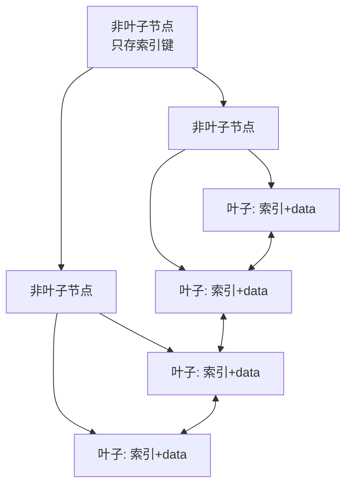

# MySQL Fundamentals and Storage Engine Internals

MySQL 索引结构、存储引擎、锁机制、数据类型与 SQL 注入防护等核心原理梳理，以 MySQL 8.0（InnoDB）为准。

> 索引结构可视化：<https://www.cs.usfca.edu/~galles/visualization/BTree.html>
> InnoDB 官方文档：<https://dev.mysql.com/doc/refman/8.0/en/innodb-storage-engine.html>

---

## 索引数据结构

### B-Tree 与 B+Tree

InnoDB 索引基于 **B+Tree**。理解它先对比 B-Tree：

| 特性 | B-Tree | B+Tree |
|------|--------|--------|
| 数据存放 | 所有节点都存储 data | 仅叶子节点存储 data，非叶子节点只存索引（冗余键） |
| 叶子节点 | 不互相连接 | 叶子节点间用双向指针连接 |
| 范围查询 | 较弱 | 强（沿叶子链表顺序扫描） |
| 索引元素 | 不重复 | 非叶子节点的键在叶子节点冗余出现 |

InnoDB 默认页大小为 16KB（由 `innodb_page_size` 决定），一个 B+Tree 节点对应一个数据页。非叶子节点不存 data，使得单页能容纳更多索引键，树更矮，磁盘 I/O 更少。



> 叶子节点间的双向链表让 `ORDER BY`、范围查询（`BETWEEN`、`>`、`<`）与分页可顺序扫描，无需回到根节点。

### Hash 索引

Hash 索引通过哈希函数定位，等值查询极快（O(1)），但**不支持范围查询**，也不支持排序和最左前缀匹配。InnoDB 不支持用户手动创建 Hash 索引，仅有引擎内部按需构建的“自适应哈希索引”（Adaptive Hash Index）；MEMORY 引擎默认使用 Hash 索引。

---

## 聚簇索引与非聚簇索引

| 类型 | 说明 |
|------|------|
| 聚簇索引（Clustered） | 数据与索引存放在一起，索引 B+Tree 的叶子节点直接保存整行数据。InnoDB 的主键即聚簇索引，表数据按主键顺序组织 |
| 非聚簇索引（Secondary） | 数据与索引分开存放，叶子节点保存的是主键值（InnoDB）或指向数据的地址（MyISAM） |

InnoDB 中通过二级索引查询时，叶子节点拿到的是主键值，需再用主键回聚簇索引查整行，这一步称为**回表**。若查询列已被二级索引覆盖（覆盖索引），则无需回表。

> InnoDB 若未显式定义主键，会选择第一个非空唯一索引作为聚簇索引；都没有时，自动生成一个 6 字节的隐藏 `ROW_ID` 作为聚簇索引。

---

## 主键与索引的区别

| 维度 | 主键（Primary Key） | 普通索引（Index） |
|------|--------------------|-------------------|
| 唯一性 | 唯一且不能为 NULL | 可不唯一、可为 NULL |
| 数量 | 一个表只能有一个 | 可有多个 |
| 作用 | 唯一标识一行；InnoDB 中即聚簇索引 | 加速查询、排序、分组、关联 |
| 列 | 单列或多列 | 单列或多列 |

---

## InnoDB 与 MyISAM 对比

MySQL 8.0 默认存储引擎为 **InnoDB**，系统表也已全部改用 InnoDB。MyISAM 仅在少数只读、无事务场景中出现。

| 维度 | InnoDB | MyISAM |
|------|--------|--------|
| 事务 | 支持（ACID） | 不支持 |
| 外键 | 支持 | 不支持 |
| 锁粒度 | 行级锁（默认）、表级锁 | 仅表级锁 |
| 索引结构 | 聚簇索引：主键索引叶子节点即整行数据；二级索引叶子节点存主键值 | 非聚簇：索引叶子节点存数据行的地址指针 |
| 崩溃恢复 | 支持（redo/undo log） | 不支持 |
| 适用场景 | 事务型、高并发读写 | 只读或读多写少、无事务需求 |

---

## 锁机制

### 按粒度划分

| 锁粒度 | 开销/加锁速度 | 死锁 | 冲突概率 | 并发度 |
|--------|--------------|------|----------|--------|
| 表级锁 | 开销小、加锁快 | 不会死锁 | 高 | 低 |
| 行级锁 | 开销大、加锁慢 | 会死锁 | 低 | 高 |
| 页级锁 | 介于两者之间 | 会死锁 | 一般 | 一般 |

> **说明（MySQL 8.0 修正）**：页级锁历史上属于已移除的 BDB 引擎，现代 MySQL 中并不存在。InnoDB 只有**行级锁**与**表级锁**两种粒度；行锁作用在索引上，若查询未走索引会退化为锁全表。

### InnoDB 行锁的实现

InnoDB 行锁并非锁数据行本身，而是锁**索引记录**，主要形式：

- **Record Lock**：锁定单条索引记录。
- **Gap Lock**：锁定索引记录之间的“间隙”，防止幻读（REPEATABLE READ 隔离级别下）。
- **Next-Key Lock**：Record Lock + Gap Lock 的组合，锁定记录及其前面的间隙。

---

## 整数类型取值范围

| 类型 | 有符号范围 | 无符号最大值 | 存储 |
|------|-----------|-------------|------|
| `TINYINT` | -128 ~ 127 | 255 | 1 字节 |
| `SMALLINT` | -32,768 ~ 32,767 | 65,535 | 2 字节 |
| `MEDIUMINT` | -8,388,608 ~ 8,388,607 | 16,777,215 | 3 字节 |
| `INT` | -2,147,483,648 ~ 2,147,483,647 | 4,294,967,295 | 4 字节 |
| `BIGINT` | -2^63 ~ 2^63-1 | 18,446,744,073,709,551,615 | 8 字节 |

> **MySQL 8.0.17 起，整数类型的显示宽度（如 `INT(11)`）已废弃**：显示宽度不影响存储范围，`INT(11)` 与 `INT` 完全等价（`ZEROFILL` 除外）。新表定义不必再写宽度。

---

## SQL 注入防护

SQL 注入是最常见的攻击方式之一：当用户输入的变量或 URL 参数被直接拼接进 SQL 语句时，攻击者可构造特殊输入绕过认证、篡改甚至删除数据。核心原则是「外部数据不可信任」。

防护要点：

- **使用参数化查询 / 预编译语句（Prepared Statement）**：让数据与 SQL 语义分离，是最根本的防护手段。
- **最小权限**：应用账户只授予必要的库表与操作权限，避免使用 root。
- **输入校验与过滤**：对类型、长度、白名单进行校验。
- **使用 ORM/查询构造器**：正确使用时默认走参数绑定。
- **避免拼接**：任何拼接进 SQL 的外部输入都视为高风险。

```sql
-- 反例：字符串拼接（存在注入风险）
-- "SELECT * FROM users WHERE name = '" + userInput + "'"

-- 正例：参数化查询（占位符由驱动做绑定与转义）
SELECT * FROM users WHERE name = ?;
```

---

## 参考资料

- [InnoDB Storage Engine — MySQL 8.0](https://dev.mysql.com/doc/refman/8.0/en/innodb-storage-engine.html)
- [InnoDB Index Types (Clustered / Secondary) — MySQL 8.0](https://dev.mysql.com/doc/refman/8.0/en/innodb-index-types.html)
- [Comparison of B-Tree and Hash Indexes — MySQL 8.0](https://dev.mysql.com/doc/refman/8.0/en/index-btree-hash.html)
- [InnoDB Locking — MySQL 8.0](https://dev.mysql.com/doc/refman/8.0/en/innodb-locking.html)
- [Integer Types (Numeric Type Storage / Ranges) — MySQL 8.0](https://dev.mysql.com/doc/refman/8.0/en/integer-types.html)
- [Numeric Type Attributes (Display Width Deprecation) — MySQL 8.0](https://dev.mysql.com/doc/refman/8.0/en/numeric-type-attributes.html)
- [B-Tree Visualization — USFCA](https://www.cs.usfca.edu/~galles/visualization/BTree.html)

---

> 知识截止 2026-07-20，内容以 MySQL 8.0 官方文档为准。
